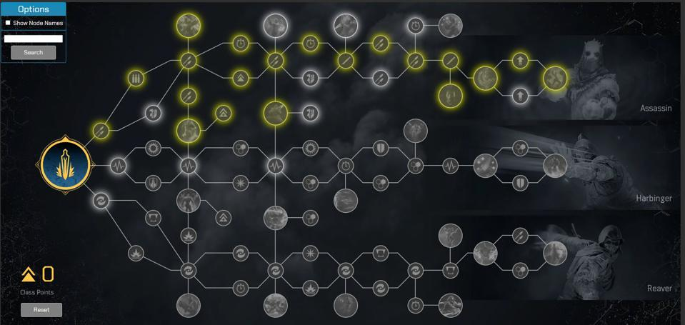
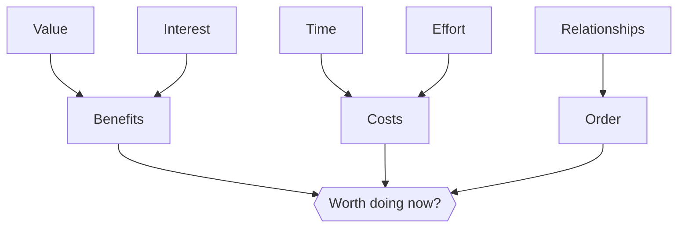
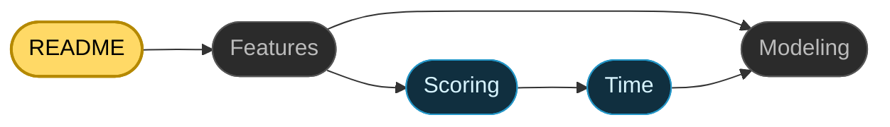

# Skill Tree

  

Skill Tree is a task-prioritization app that models your projects as a graph, scores them by return on investment, and tells you what to work on next -- and why.

## A Skill Tree for Your Life

In a video game, a skill tree gates the powerful abilities behind the basic ones. You master the fundamentals, and new branches open up based on what you've unlocked previously. Every "skill point" you spend is a strategic bet about what will be most valuable, both now and later.

  
   
  <em> A Skill Tree from the video game Outriders</em>

Skill Tree applies this idea to real life. Each project you might take on is a node in a Skill Tree. A game usually lays out 1-3 sensible paths, but real life lays out hundreds. Choosing what to do next, out of everything you could possibly do, is the hard part of productivity. 

## The Five Factors That Make a Project Worth Doing

So which branch do you unlock next? It comes down to five factors. Two are benefits. Two are costs. And one ties everything together.

Starting with the benefits, **value** is how much the results matter, and **interest** is how much you enjoy the work itself. These two often diverge. A project can be important but dull, or a joy but pointless. Score high on one, and a project is a candidate; score high on both, and it is the thing on your mind at 1 a.m. when you should be sleeping.

If those were the only two factors to consider, time management would be easy. But if you have been an adult for more than 5 minutes, you know that it is not. Two more factors complicate the process. The first is **time**: a project might be valuable and interesting, yet still not be worth the hours that it demands. The second is **effort**: a project might be quick and valuable, yet so exhausting that it leaves you too drained for everything else.

Those four factors describe a project in isolation. The fifth, **relationships,** describes how it connects to the bigger picture. Some projects are gates—you literally cannot start one until another is finished. Others block nothing, but drastically multiply the value of the projects they touch. This means a project’s true worth isn't just its standalone metrics; it is also the value of everything it unlocks and amplifies.

Five factors, three roles. Value and interest are the benefits. Time and effort are the costs. Relationships decide the order. 

Each category has its own failure mode. Ignore the benefits, and you will avoid the hard work most worth doing, simply because it asks something of you. Ignore the costs, and every project looks appealing, no matter what it quietly consumes. Ignore the relationships, and you will start each project from scratch, never building the foundation that would make the next project easier

## Judgment Doesn't Scale

Weighing five factors for one project is easy enough. But projects do not live alone. Finishing one changes the value of others. The best move right now depends on a chain of unlocks two or three steps deep — and that chain shifts every time you complete something. If you try to weigh all of that, for every project at once, you will quickly leave the territory that human memory was built for.

My own tree has grown past 750 projects and a thousand relationships between them. I cannot hold that in my head, and before I had Skill Tree, it was painful to try. Left to my own intuition, I simply worked on whatever felt loudest that morning — the most recent, urgent, or alluring. I quickly realized that what I was doing wasn't working, which is why I went in search of tools that could help.

## The Failure of Other Tools

While holding the five factors that make a project worth doing in mind  -- value, interest, time, effort, and relationships -- think about the tools built to help us get things done today. Do *any* of them handle *all* factors adequately? I don't think so. 

At the simple end, to-do lists treat every item as equal. *Buy grapes* sits beside *write a novel* with nothing to tell them apart. A list has no model of value, costs, or relationships. Getting groceries is vital for my short-term needs, and meeting those needs is required for lofty goals like writing a novel. But when, exactly, am I supposed to work on the novel? A to-do list rewards crossing things off, which is why you can check five boxes in a day and still feel like you did nothing that mattered.

The bigger tools — like Jira, Notion, Asana, and Linear — track (simple) dependencies, assign owners, and schedule sprints. But they treat the strategic question of what to do as already settled. 

All of these tools are built for execution, not decision making. They track, schedule, and remind you about work you have already chosen, but do not help with the decision itself. They ask *how* and *when*, but never *what* and *why*. Doing, although not always easy, is comparatively simple, while making decisions -- ones that serve you both now and later -- is hard. 

## Enter Skill Tree

Skill Tree is built for the part other productivity tools leave untouched: deciding what is worth doing.

It is designed to augment your judgment, not replace it. You still decide what matters, how enjoyable each project is, and how it fits into the rest of your life. Skill Tree doesn't make those calls for you; instead, it gives your decisions a place to live.

Once you supply those inputs, that complexity stops living in your head. Your assessment of thousands of projects—with individual value, interest, time, effort, and relationships all considered—becomes a single, unified ranked list, spanning every area of your life, all at once.

This is freeing. You no longer start each day torn between this project and that, unsure which matters more. You can trust the ranking — at least to the extent you trust yourself, because every input and the way they combine, is yours to control.

But trusting the ranking doesn't mean taking it on faith. If you want to know why a project rose to the top, you can ask Skill Tree, and it will tell you.

No other tool offers this level of control or insight into the decision-making process itself. In fact, no other tool has even tried -- not until Skill Tree.

## All Aboard the Magical Mystery Tour

You will meet Skill Tree through five documents. You have already read the first. Everyone should read **Features** next, because it shows what the app can do. After that, the tutorial splits. Take the practical path straight to **Modeling** if you want to start building a better graph, or take the technical path through **Scoring** and **Time** if you want to understand the machinery behind the recommendations. 

The map below shows both routes: the practical path goes straight from **Features** to **Modeling**, while the technical path detours through **Scoring** and **Time** before ending up at Modeling.

  <b>README</b> · <a href="docs/features.md">Features</a> · <a href="docs/scoring.md">Scoring</a> · <a href="docs/time.md">Time</a> · <a href="docs/modeling.md">Modeling</a>

Follow the map at the footer of each page. By the end, you will know how to use Skill Tree, how to model your own graph, and, if you take the technical path, why the recommendations work the way they do.
