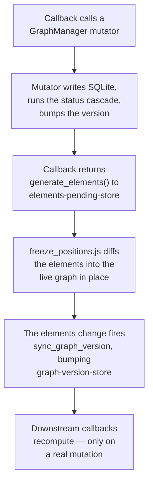

# App Architecture

How the app fits together: the layering, the module map, the `dcc.Store` wiring, and the handful of cross-file flows that are painful to reconstruct from code. Node/edge semantics and must-know rules live in [CLAUDE.md](../CLAUDE.md); the scoring and time math live in [scoring.md](scoring.md) and [time.md](time.md). This doc is the "how do the pieces talk to each other" layer between them.

## The layering

The app is six layers. Each one only knows about the layer below it.

- **Layout** (`layout.py`, `*_layout.py`) — pure structure. Builds the component tree and declares every `dcc.Store`. No callbacks, no behavior. `app.layout` is a *function* (`lambda: build_app_layout(generate_elements(), ...)`) so each page load gets fresh elements.
- **Callbacks** (`callbacks.py`, `*_callbacks.py`) — all behavior. Each tab module attaches its callbacks in one `register_*_callbacks(app)` pass. [`callbacks.py`](../callbacks.py) is *not* a tab — it's the shared core engine (the main canvas, cross-cutting callbacks, and `generate_elements`).
- **State gateway** (`graph_manager.py`, `event_manager.py`) — the only way a callback touches graph/event state. Owns CRUD, the status cascade, version counters, and caches.
- **Config** (`config.py` / `ConfigManager`) — a classmethod-only facade over the `Settings` table. No persistent settings cache; operation-scoped snapshots reduce repeated reads (see Versioning below).
- **Pure compute** (`scoring.py`, `simulation.py`) — data in, rankings/simulations out. No DB access, no globals.
- **Persistence** (`database.py`) — resolves the DB path from `config.ENVIRONMENT` and runs `init_db` on first connect.

Sitting beside all of this: **`assets/`** — raw-served JS/CSS for behavior the Dash callback model can't express (context menus, position-freeze, drag-sortables, the value-setter bridge). It talks to Python only through `dcc.Store` components and hidden inputs.

The one-way rule has a payoff: a tab module sees only `app` and the three managers — never another tab's internals. Tabs coordinate *through the database*, not with each other (a write bumps a version counter; the next tab notices on its next callback).

## Module map

| Module | Role |
|---|---|
| [app.py](../app.py) | Entry point. Sets `config.ENVIRONMENT` from `--sandbox`, configures logging, seeds config types, runs the `recompute_all_statuses` startup safety-net, builds the layout, and registers the core engine + every tab. Also defines the `/open-obsidian` Flask route. |
| [models.py](../models.py) | `Node` / `Event` dataclasses, the `blend_time_estimate` PERT blend, edge/status constants. |
| [database.py](../database.py) | Thin `sqlite3` wrapper. Path from `config.ENVIRONMENT`; `init_db` on first connection. |
| [config.py](../config.py) | Module-level defaults and `ConfigManager`, a classmethod-only facade over the `Settings` key/value table. |
| [graph_manager.py](../graph_manager.py) | **The state gateway.** Node/edge CRUD, alias resolution, `sync_edges`, cycle detection, the status cascade, scoring entry (`calculate_priority_scores`), subtree/completion queries, field migrations, community detection. Holds the class-level version counters and caches. |
| [event_manager.py](../event_manager.py) | Same pattern for the `Events` table: event CRUD, dormant-node activation, trigger-node lookup. |
| [scoring.py](../scoring.py) | Pure functions. `build_adjacency`, `total_value` (forward DAG walk), `score_nodes`, `explain_score`, focus paths. |
| [simulation.py](../simulation.py) | Monte Carlo time simulation. Pure NumPy. |
| [callbacks.py](../callbacks.py) | **The core engine** — the largest non-test module. `register_callbacks(app)` owns the main Cytoscape canvas, `generate_elements` (single source of truth for elements), the graph-version bridge, filter/clear, time calibration, override handling, the undo/done flow, and the parametrized freeze-rerender registration. |
| [callback_helpers.py](../callback_helpers.py) | Stateless helpers extracted from the `*_callbacks.py` files (link parsing, filters, form-state diffs). |
| [layout.py](../layout.py) + `*_layout.py` | Dash layout factories. No callbacks. Declare the `dcc.Store` wiring. |
| [styles.py](../styles.py) | Dash component style dicts. |
| [assets/](../assets) | Served raw. Cytoscape hooks, context menus, position-freeze, sortables, the JS-Dash value-setter bridge. |
| Tab modules | [next_callbacks.py](../next_callbacks.py), [details_callbacks.py](../details_callbacks.py), [analyze_callbacks.py](../analyze_callbacks.py), [event_callbacks.py](../event_callbacks.py), [settings_callbacks.py](../settings_callbacks.py), [review_hub_callbacks.py](../review_hub_callbacks.py), [sidebars_callbacks.py](../sidebars_callbacks.py). Each exposes one `register_*_callbacks(app)`; [app.py](../app.py) calls each once. Adding a tab = one module + one `register_*` line. |

## State flow: stores are the wiring

`dcc.Store` components (declared in the layout layer) are how server callbacks and clientside JS pass data without direct coupling. The load-bearing ones:

- **`graph-version-store`** — mirrors `GraphManager._graph_version`. Downstream callbacks subscribe to it so they recompute only when the graph *actually* changed, not on every cosmetic re-render.
- **`elements-pending-store`** (+ `details-` / `events-` variants) — mutating callbacks write the new element list **here, not directly to the Cytoscape `elements` prop.** The freeze layer (below) sits in between.
- **`freeze-rerender-store`** (+ variants) — per-canvas freeze toggle state.
- **`*-pending-store`, `override-store`, `focus-goal-store`, `selected-suggestion-store`** — carry intermediate state across the steps of confirm/multi-stage flows.

## Key flows

### 1. Startup ([app.py](../app.py))

`--sandbox` sets `config.ENVIRONMENT` **before** any module reads it (the DB path depends on it) → logging configured (separate sandbox/prod log files) → `ConfigManager.ensure_*_type()` seeds type config → `GraphManager().recompute_all_statuses()` repairs any status drift against current `Needs_Hard` edges (catches mutations that bypassed the cascade) → Dash app built → `app.layout` set to a function returning `build_app_layout(generate_elements(), ...)` → `register_callbacks(app)` then the seven `register_*_callbacks(app)`.

### 2. Graph mutation → render (the central loop)

Compound node saves use `database.transaction()`: nested manager/config writes
share one request-local connection, and only the outer scope commits. Validation
reads the proposed graph on that connection. `BEGIN IMMEDIATE` serializes writers;
deferred foreign keys allow atomic renames without disabling integrity checks.
A failed nested operation marks the entire save for rollback, including when a
callback catches the error to display it. Cache-version changes and completion
notifications are deferred until commit; rejected saves publish neither.

This is the path almost every edit takes. Get it wrong and the canvas either doesn't update or jumps around.

1. A callback (node editor in [sidebars_callbacks.py](../sidebars_callbacks.py), node ops in [callbacks.py](../callbacks.py), …) calls a `GraphManager` **mutator** (`add_node`, `update_node`, `add_edge`, `sync_edges`, …).
2. The mutator writes SQLite, runs the status cascade if the change is status-affecting, and calls `_bump_version(scoring=…)`.
3. The callback returns `generate_elements(filters, active_node_id, …)` to **`elements-pending-store`** (with `allow_duplicate`) — *not* to the Cytoscape `elements` prop.
4. A clientside callback (`freeze_positions.js`) consumes the pending elements and **diffs them into the live graph in place** — adding/removing/updating individual elements and preserving existing node positions, seeding new nodes near their neighbors. Replacing the whole `elements` list instead would trigger a full fcose relayout and the graph would jump on every edit. *This indirection is why you can't simply `Output('cytoscape-graph', 'elements')`.*
5. The change to Cytoscape `elements` fires `sync_graph_version`, which bumps `graph-version-store` only if `manager._graph_version` advanced — gating downstream recomputation to real mutations.

`generate_elements` ([callbacks.py:375](../callbacks.py)) is the single source of truth for what Cytoscape sees: it pulls filtered nodes from `GraphManager`, applies depth/neighbor-link controls, and assembles node + edge dicts with their colors, shapes, and classes (`trigger`, `dormant`, `now`).

### 3. Right-click → editor (the JS-Dash bridge)

1. `context_menu.js` shows a menu on node right-click and stashes `_currentNodeData`.
2. "Edit" calls `triggerEdit()`, which routes by source tab: events+dormant → `dormant-edit-trigger-input`; details/events/next → `details-edit-trigger-input` (opens the editor *in place*, no tab switch); main canvas → `edit-trigger-input` (which switches to the canvas tab).
3. It pokes that hidden Dash input via the **value-setter bridge**: the native `HTMLInputElement` value setter plus a synthetic `input` event. A plain `el.value = x` is silently ignored because the input is React-controlled. The value is suffixed with `'|' + Date.now()` so that re-editing the *same* node still changes the value and re-fires the callback.
4. The Dash callback bound to that input opens and populates the editor sidebar.

This bridge pattern recurs across `assets/` (sortables, event/goal context menus) — same setter + `input`-event trick everywhere a server value must land in a controlled component.

### 4. Status cascade

Marking a node Done (or changing a hard prereq) calls `update_node`, which detects the status change and seeds `_cascade_update_states`. That walk goes **forward along `Needs_Hard` out-edges**: each dependent recomputes to Blocked (any incomplete hard prereq) or Open. Goals whose hard children just became all-Done are collected via `_collect_auto_done_candidates` and surfaced through `pop_auto_done_candidates` for the auto-done prompt. `recompute_all_statuses` is the same logic run globally — the startup safety-net.

### 5. Scoring → Next ranking

[next_callbacks.py](../next_callbacks.py) calls `GraphManager.calculate_priority_scores(now_nodes, priority_goals)`. That checks a cache keyed `(_scoring_version, hyperparams)`; on a miss it calls the pure `scoring.score_nodes(...)` (build adjacency → forward `total_value` walk → cost/eligibility → ranked list). The cache survives filter toggles and cosmetic edits and is dropped only when `_scoring_version` advances.

## Versioning & caches

`GraphManager` carries two **class-level** counters (class-level so every per-tab instance sees the same value — a mutation in any callback module invalidates everyone's cache):

- **`_graph_version`** — bumps on any node/edge mutation. Drives UI-level caches: the `graph-version-store` bridge, the goal-subtree cache, and the community-detection cache (all keyed on it).
- **`_scoring_version`** — bumps **only** when a scoring-relevant field changes: `type`, `value`, `interest`, `difficulty`, `time_o/m/p`, `time_mode`, `value_mode`, `status`, `dormant`. Drives the scoring memo and the `calculate_priority_scores` cache.

The list is the `_SCORING_RELEVANT_FIELDS` constant; `update_node` diffs it against the prior node to decide whether to pass `scoring=True` to `_bump_version`. The split is the optimization: cosmetic edits (description, paths, context, aliases) bump `_graph_version` only, so the scoring memo stays warm and the next ranking is near-free. **When you add a new scoring-relevant field, add it to `_SCORING_RELEVANT_FIELDS` or scores will silently go stale.**

`ConfigManager` has no persistent settings cache. Hot read operations use
`database.read_snapshot()` / `@database.snapshot_read` to share detached Nodes,
Edges, Settings and pending-trigger rows across their nested helpers. Four SELECTs
run on one connection/read transaction, which closes before rendering starts.
The snapshot is discarded at the end of the operation; a local write invalidates
it immediately. Subsequent operations read fresh state. Outside a snapshot,
settings getters query SQLite normally. Connection context managers close their
owned connection on both success and failure; nested write leases stay open until
the owning transaction ends.

Community caches retain at most 32 filter/method combinations and subtree caches
at most 128 entries per manager. Both discard entries from older graph versions.
Scoring memoization still survives cosmetic edits. See [performance.md](performance.md)
for the synthetic benchmark and its limits.

All graph-affecting event operations and field migrations participate in the same
transaction/version protocol. Removing relationships repairs the former hard
dependents as well as the new ones. Status cascades invalidate scores when they
change stored status, and may revisit a shared dependent after another prerequisite
changes. Cache reads/publication share the write coordination lock; reads inside
an uncommitted save bypass committed caches. The UI version bridge also observes
event, Details and settings refreshes, independently of the main canvas.

## Next responsiveness

Next and Now content is included in the initial layout, using the same hydrated
filter controls as the sidebar. The shared layout template is copied for each
request. The hidden main canvas starts empty and is populated by the existing
initial core callback, avoiding duplicate element generation during layout.

`next_callbacks.py` owns recommendation refreshes for graph versions, filters,
row count and settings. The core callback's legacy table output returns
`no_update`; it no longer scores and renders Next during unrelated graph work.
Descriptions travel with visible rows as text. `assets/next_selection.js` handles
row/Now-card selection, highlights and description changes clientside. Selection
is State, not Input, for server callbacks. Refreshes retain a still-visible
selection, update its description, and clear it when the row disappears.

## Nodes-tab first paint

The main canvas mounts inside a hidden tab, and two consequences of that used
to be visible. Elements reach Cytoscape well before any layout runs, and until
it runs every position-less node sits stacked at the origin. Meanwhile `fit` is
a no-op while the container is 0x0, so the layout's own fit leaves zoom at 1 and
pan at the origin. Opening the tab inside that window drew the whole graph piled
into the top-left corner, and then it jumped.

Measured on the 568-node sandbox graph: elements land about 3.6 s after load,
the layout starts about 1.6 s later, and fcose itself takes 45 ms. That gap is
not scheduling — calling `layout.run()` the instant the elements land does not
start it any sooner, because it queues behind the same blocked main thread. It
only adds a second randomized pass that reshuffles the graph again.

So the canvas is generated eagerly, as it already was, and held behind an opaque
cover instead. `assets/canvas_first_paint.js` lifts it once the graph is both
laid out (`layoutstop` on a graph with nodes, positions away from the origin, or
an element payload with no nodes to lay out) and framed (the canvas has a real
size, so the fit can land). That fit used to live in `fullscreen.js`, which
framed the graph the moment the canvas had a size but held back none of the
frames before it. The empty-graph check matters because dash-cytoscape runs the
layout prop once at mount, over no elements, and that `layoutstop` says nothing
about the payload still on its way.

Two rules keep the cover from becoming its own defect. The first is that its
caption goes up in the same task that reveals the tab. It first waited 400 ms,
so a nearly-ready graph wouldn't flash a spinner. But a timer can't fire during
the main-thread work it was explaining. Due at 400 ms, it fired at 915 ms, and
arriving just before the payload was ingested left the tab blank until the
graph appeared. A graph that is already laid out still shows nothing, because
the reveal lifts the cover before that frame is painted.

Holding to that at startup took two more changes. The module now waits for Dash
to render the canvas with a `MutationObserver` instead of a 300 ms retry. That
retry was starved as well, so a tab opened early went unwatched until the poll
noticed it, 542 ms after the reveal. With the observer, the caption lands in the
reveal task itself. The caption also appears outright instead of fading in,
because a fade needs rendered frames that a stalled main thread doesn't produce.

The second rule is a backstop timed from the reveal, which lifts the cover no
matter what: an unframed graph beats a canvas stranded behind a spinner. The
cover is first-paint only. Covering the graph the user is looking at would be
worse than any transition it could hide.

### Layout transitions

Filter changes make dash-cytoscape re-run whatever `layout` prop the canvas
holds, on every `add` or `remove`. The graph-settings callback only rewrites
that prop once a control is touched, and the prop in `layout.py` said
`animate: False` while the Smooth switch said on. So Smooth did nothing until a
slider moved, and every filter change also re-randomized the whole graph.

The prop now describes a transition, as Details does for same-root changes. It
keeps the current positions (`randomize: False`) and animates when Smooth is on.
Adding the 127-node STEM context back that way spread it through its own region,
with none of its nodes within 12 px of another. Existing nodes moved 152 px on
average across a 3,200 px graph. In the running sandbox, switching the context
filter to Health (67 nodes) and back to All (568) started fCoSE with
`animate: true` and `randomize: false` both ways.

The one run that can't be a transition is the cold start, from every node
stacked at the origin. Incremental from that pile, fCoSE left 547 of 568 nodes
within 12 px of a neighbor; a randomized seed left none. `canvas_first_paint.js`
wraps `cy.layout` so that run randomizes, and skips its animation while the
cover is still up, since nobody can watch it. Settle passes through untouched,
because its graph is already laid out.

## Hidden-tab and Details responsiveness

All tab layouts remain mounted. Heavy callbacks therefore do not subscribe
directly to every `main-tabs.active_tab` change: Analyze and Events use small
clientside arrival stores that only notify their server callbacks when their
own tab opens. Details dropdown options are hydrated initially and refreshed
from graph/version stores, so opening Details does not resend an unchanged
node list. Empty-state suggestions likewise ignore node selection once hidden.

The Details selection callback returns the summary and selected-node store but
not the large subtasks table. `assets/details_deferred_subtasks.js` observes the
Cytoscape layout lifecycle, ignores superseded layout generations, and writes
the settled root to `details-layout-settled-trigger-input` after a short quiet
window. Only then does the table callback render its rows; a stale root is
rejected server-side. Existing filter and graph refresh inputs still update an
already-visible table immediately. When the canvas is frozen, no layout runs,
so selection renders the table immediately instead of waiting for an event that
cannot occur.

That placeholder makes `details-selected-node-store` load-bearing. Dash re-fires
dependent callbacks on any write, including one whose value is unchanged. Most
of the selection callback's Inputs are refresh signals, so it holds the store
slot at `no_update` unless the selection actually moved. Without that guard a
plain graph refresh looks like a fresh selection, and the table falls back to
its placeholder with no root transition left to release it. The same rule
applies wherever a deferred render is keyed off a store: write the store only
when its value changes. `handle_edit_trigger` in `callbacks.py` guards
`main-tabs.active_tab` for the same reason.

Details layout requests are built by `assets/details_layout.js`. The
dash-cytoscape component echoes its live elements, now carrying positions,
roughly 100 ms after add/remove events. The layout callback must still listen
to `details-mini-graph.elements` so a real topology reaches Cytoscape before
layout starts, but a structural signature filters that position-only echo. A
new root gets one randomized pass; same-root topology changes get one
incremental pass; display-only data changes get none. `autoRefreshLayout`
remains disabled so dash-cytoscape cannot independently start another pass.
The signature is reset when `onCytoReady` reports a replacement Cytoscape
instance; otherwise a remount of the same subtree would be mistaken for an
echo and its nodes would remain stacked at the default origin. Details views
with at most 24 nodes use force-only CoSE, which avoids the collinear spectral
seed fCoSE can produce for small, sparse dependency graphs. Larger views retain
fCoSE for its performance advantage. The selected node is also marked as the
view root inside the elements payload, so a new selection is randomized even
if Dash has not yet propagated the matching selected-node State. Every accepted
layout request also carries a monotonically increasing client sequence. This
keeps the `layout` prop distinct when two views happen to produce identical
CoSE options; without it, `autoRefreshLayout=False` would leave the second
view's new nodes stacked at their default origin.

The Events graph filters the same echo, in `assets/events_layout.js`. Its
layout callback also listens to `events-detail-graph.elements` with
`autoRefreshLayout` disabled. Without the signature, the echo started a second
incremental pass from half-animated positions, and the two tweens finishing
out of step read as a jerk. A new event gets one randomized pass, and same-event
topology changes get one incremental pass. The request sequence keeps two
events' otherwise identical options distinct. Events needs no root marker in
its payload: the selected-event store drives the graph render, so its State
already names the event the elements belong to.

## Simulation requests

`assets/simulation_requests.js` assigns a browser-session ID and increasing
sequence to each Details simulation request. The server reads a detached graph
and settings snapshot, releases database coordination, then calls
`simulation_service.py`. At most two calculations sample concurrently; newer
requests cancel older work between chunks. The client only displays a response
matching its current request, including when server responses arrive out of order.

Inputs that also change the Details graph first issue a node-less cancellation
request. `assets/details_deferred_subtasks.js` releases the real simulation
request only after the newest layout generation has stopped and stayed quiet,
keeping sampling and chart serialization out of the animation-critical window.
The status remains `Calculating…` and stale results stay hidden while waiting.
A frozen canvas bypasses this gate because it intentionally emits no layout
events; simulation-only inputs such as time units and settings remain immediate.

A payload that starts no layout would leave that wait open for good. A filter
change can send back the selected subtree's nodes and edges unchanged, such as
a context with no nodes in it, and `build()` skips that payload like the echo.
So `settleUnchanged()` in `assets/details_layout.js` runs on the same payload,
before `build()` records it, and applies the same signature check. When no
layout will run, it sends the settled token itself. It does nothing on a frozen
canvas, which already bypasses the gate, or on a replacement Cytoscape
instance, which will lay the payload out. It also defers while
`detailsLayoutSettling()` reports an earlier layout still running, because that
layout's own release will clear the wait.

The service retains at most 16 compact histogram/statistic summaries and 128
session sequence records. Cache keys include relevant node times/statuses,
relationships and effective trial count. Sampling uses a private deterministic
generator, so cache eviction does not cause an unchanged estimate to jump.
See [time.md](time.md) for the calculation budget and precision tradeoff.
