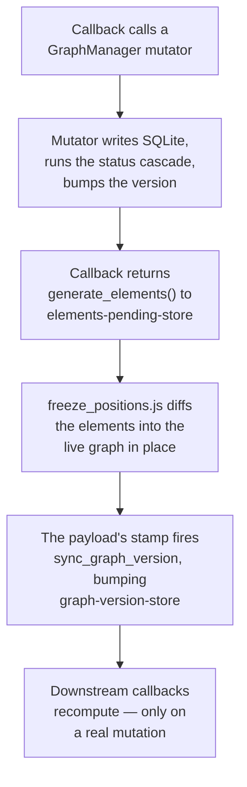

# App Architecture

How the app fits together: the layering, the module map, the `dcc.Store` wiring, and the handful of cross-file flows that are painful to reconstruct from code. Node/edge semantics and must-know rules live in [CLAUDE.md](../CLAUDE.md); the scoring and time math live in [scoring.md](scoring.md) and [time.md](time.md). This doc is the "how do the pieces talk to each other" layer between them.

## The layering

The app is six layers: construction, callbacks, shared operations, the state
gateway, pure compute, and persistence. Each one only knows about the layer below
it. Shared operations sit between the callbacks and the gateway so that graph
logic has a home of its own, rather than living in whichever tab first needed it.

- **Construction and layout** (`app.py`, `app_services.py`, `layout.py`, `*_layout.py`) — explicit startup and fresh component factories. Layout construction reads settings and hydrates Next under one read snapshot; the hidden main canvas starts empty and its initial callback populates it. Imports do not open SQLite or configure logging.
- **Callbacks and shared operations** (`callbacks.py`, `*_callbacks.py`) — Dash trigger routing and registration through `register_*_callbacks(app, services=None)`. Shared ranking, analytics, commands, and view preparation live outside tab registration modules. The core delegates canvas preparation to `canvas_view.py` and returns named `CoreResponse` fields in the existing Dash output order.
- **State gateway** (`graph_manager.py`, `event_manager.py`) — graph/event state access and transaction ownership. `GraphManager` retains CRUD orchestration and status cascades, delegating SQL to `graph_repository.py`, queries to `graph_queries.py`, and scoring orchestration to `graph_scoring.py`. `graph_state.py` owns shared revisions and per-manager caches.
- **Config** (`config.py` / `ConfigManager`) — a classmethod-only facade over the `Settings` table. No persistent settings cache; operation-scoped snapshots reduce repeated reads (see Versioning below).
- **Pure compute** (`scoring.py`, `simulation.py`) — data in, rankings/simulations out. No DB access, no globals.
- **Persistence** (`database.py`) — resolves the DB path from `config.ENVIRONMENT` and runs `init_db` on first connect.

Sitting beside all of this: **`assets/`** — raw-served JS/CSS for behavior the Dash callback model can't express (context menus, position-freeze, drag-sortables, the value-setter bridge). It talks to Python only through `dcc.Store` components and hidden inputs. The one exception is the list of canvases, which the page receives from `canvases.py` before any asset runs.

The one-way rule has a payoff: a tab module sees only `app`, the shared operations
and the managers it is handed — never another tab's internals. Tabs coordinate
*through the database*, not with each other (a write bumps a version counter; the
next tab notices on its next callback). `tests/test_architecture_boundaries.py`
enforces this: no shared module may import a callback module, and no core logic
module may import `callback_helpers`, which would drag in the whole Dash UI stack.

`register_*_callbacks(app, services)` receives the graph/event managers from
`AppServices`, and `generate_elements` is bound to those same managers, so the
canvas renders through the managers the callbacks mutate. Each module keeps a
module-level manager as the default for standalone callers and tests. Every
manager reads one database per process, and the revision counters in
`graph_state.py` are process-wide, so their caches stay coherent with each other.

## Module map

| Module | Role |
|---|---|
| [app.py](../app.py) | Entry point. Sets `config.ENVIRONMENT` from `--sandbox`, configures logging, seeds config types, runs the `recompute_all_statuses` startup safety-net, builds the layout, and registers the core engine + every tab. Its Resource routes use the shared opener. |
| [models.py](../models.py) | `Node` / `Event` dataclasses, the `expected_time_estimate` duration rule, edge/status constants. |
| [database.py](../database.py) | Thin `sqlite3` wrapper. Production/sandbox filename from `config.ENVIRONMENT`, stored beneath the platform's per-user app-data directory; `init_db` on first connection. Schema v10 migrates legacy Resource columns into named sections and ordered links. |
| [resource_links.py](../resource_links.py) | Named Resource settings, per-node ordered links, relative-path storage, and the shared Windows/macOS/Linux file and URI opener. Web URLs use `webbrowser`. |
| [config.py](../config.py) | Module-level defaults and `ConfigManager`, a classmethod-only facade over the `Settings` key/value table. |
| [graph_manager.py](../graph_manager.py) | **The state gateway.** Public graph API, transaction boundaries, node/edge mutation orchestration, status cascades, completion notifications, and field migrations. Delegates row persistence, traversal, and scoring while preserving callers. |
| [app_services.py](../app_services.py) | Graph/event manager ownership for callback registration. |
| [graph_repository.py](../graph_repository.py) | Row reads and node insert/update/rename SQL, including lifecycle history in the same transaction lease. |
| [graph_queries.py](../graph_queries.py), [graph_scoring.py](../graph_scoring.py), [graph_rules.py](../graph_rules.py) | Graph queries, scoring orchestration, and pure prerequisite/endpoint rules respectively. |
| [graph_state.py](../graph_state.py) | Shared commit-published graph/scoring revisions and per-manager `GraphCaches`; compatibility aliases for former private attributes. |
| [event_manager.py](../event_manager.py) | Same pattern for the `Events` table: event CRUD, dormant-node activation, trigger-node lookup. Owns the awake/dormant rule and the one-Event-per-node rule — see [dormant_node_triggering.md](dormant_node_triggering.md). |
| [scoring.py](../scoring.py) | Pure functions. `build_adjacency`, `total_value` (forward DAG walk), `score_nodes`, `explain_score`, `focus_route_data`. |
| [simulation.py](../simulation.py) | Monte Carlo time simulation. Pure NumPy. |
| [callbacks.py](../callbacks.py) | **The core engine** — the largest non-test module. `register_callbacks(app)` owns the main Cytoscape canvas, `generate_elements` (single source of truth for elements), the graph-version bridge, filter/clear, time calibration, the undo/done flow, and the per-canvas freeze and layout-request registrations. |
| [callback_helpers.py](../callback_helpers.py) | Shared component, filter, link, and form-state helpers, plus compatibility exports. |

| [goal_ranking.py](../goal_ranking.py), [graph_analytics.py](../graph_analytics.py) | Shared goal ranking/explanations and analytics data preparation. |
| [node_commands.py](../node_commands.py), [context_rules.py](../context_rules.py), [editor_values.py](../editor_values.py), [next_view.py](../next_view.py) | Editor mutations, pure context rules, editor/calibration values, and Next query/view hydration. |
| [canvas_view.py](../canvas_view.py), [sidebar_state.py](../sidebar_state.py), [core_response.py](../core_response.py) | Canvas view preparation, sidebar/draft decisions, and the core callback's named 28-field response contract. |
| [layout.py](../layout.py) + `*_layout.py` | Dash layout factories. No callbacks. Declare the `dcc.Store` wiring. `layout.py` also builds the page template, which carries the startup cover. |
| [styles.py](../styles.py) | Dash component style dicts. |
| [prerender.py](../prerender.py) | The `@prerendered` marker and the pass that runs marked callbacks' page-load calls into the layout while it is built. See Startup readiness. |
| [canvases.py](../canvases.py) | The Cytoscape canvases, listed once. The hover tooltip, freeze wiring and layout requests loop over `CANVASES`. `install_client_registry` hands the page the same list as `window.SkillTree.canvases`, ahead of every asset script. The assets that act on every canvas (tooltip, freeze, fullscreen, context menu, Now pulse, layout requests, canvas fit) loop over that. |
| [assets/](../assets) | Served raw. Cytoscape hooks, context menus, position-freeze, layout requests, sortables, the JS-Dash value-setter bridge. |
| Tab modules | [next_callbacks.py](../next_callbacks.py), [details_callbacks.py](../details_callbacks.py), [analyze_callbacks.py](../analyze_callbacks.py), [event_callbacks.py](../event_callbacks.py), [settings_callbacks.py](../settings_callbacks.py), [review_hub_callbacks.py](../review_hub_callbacks.py), [sidebars_callbacks.py](../sidebars_callbacks.py). Each exposes one `register_*_callbacks(app)`; [app.py](../app.py) calls each once. Adding a tab = one module + one `register_*` line. |

The editor saves visible Resource sections in the same node transaction. Hidden
sections are omitted from replacement, so their links survive. The old three
Node columns remain as compatibility mirrors during this transition. Electron
uses a context-isolated preload/IPC bridge for its native file dialog; the
standalone-browser mode retains a tkinter subprocess picker. Both feed the same
link storage and opener path. Context-menu opens resolve a saved node/section
link on the Python server rather than accepting an arbitrary path from the page.

## State flow: stores are the wiring

`dcc.Store` components (declared in the layout layer) are how server callbacks and clientside JS pass data without direct coupling. The load-bearing ones:

- **`graph-version-store`** — mirrors `GraphManager._graph_version`. Downstream callbacks subscribe to it so they recompute only when the graph *actually* changed, not on every cosmetic re-render.
- **`elements-pending-store`** (+ `details-` / `events-` variants) — mutating callbacks write the new element list **here, not directly to the Cytoscape `elements` prop.** The freeze layer (below) sits in between.
- **`freeze-rerender-store`** (+ variants) — per-canvas freeze toggle state.
- **`*-pending-store`, `focus-goal-store`, `selected-suggestion-store`** — carry intermediate state across the steps of confirm/multi-stage flows.

## Key flows

### 1. Startup ([app.py](../app.py))

`main()` parses `--sandbox` and calls `create_app(AppSettings(...))`. The factory
selects `config.ENVIRONMENT` before opening SQLite, configures logging if enabled,
initializes the schema, seeds required types, and runs the existing status-repair
safety net. It then constructs Dash, sets the page template that carries the
startup cover, installs the canvas registry, assigns a snapshot-wrapped layout
factory that also prerenders the marked callbacks, and registers callbacks with
`AppServices`. Importing `app` does none
of this. Switching databases after startup is rejected; tests replace
`database.get_db_path` before constructing an app with disposable data. What the
browser does next, and why the page stays covered while it does, is in Startup
readiness below.

### 2. Graph mutation → render (the central loop)

Compound node saves use `database.transaction()`: nested manager/config writes
share one request-local connection, and only the outer scope commits. Validation
reads the proposed graph on that connection. `BEGIN IMMEDIATE` serializes writers;
deferred foreign keys allow atomic renames without disabling integrity checks.
A failed nested operation marks the entire save for rollback, including when a
callback catches the error to display it. Cache-version changes and completion
notifications are deferred until commit; rejected saves publish neither.

This is the path almost every edit takes. Get it wrong and the canvas either doesn't update or jumps around.

1. A callback (node editor in [sidebars_callbacks.py](../sidebars_callbacks.py), node ops in [callbacks.py](../callbacks.py), …) calls a `GraphManager` **mutator** (`add_node`, `update_node`, `add_edge`, `sync_edges`, …).
2. The mutator writes SQLite, runs the status cascade if the change is status-affecting, and calls `_bump_version(scoring=…)`.
3. The callback returns `generate_elements(filters, active_node_id, …)` to **`elements-pending-store`** (with `allow_duplicate`) — *not* to the Cytoscape `elements` prop.
4. A clientside callback (`freeze_positions.js`) consumes the pending elements and **diffs them into the live graph in place** — adding/removing/updating individual elements and preserving existing node positions, seeding new nodes near their neighbors. Replacing the whole `elements` list instead would trigger a full fcose relayout and the graph would jump on every edit. *This indirection is why you can't simply `Output('cytoscape-graph', 'elements')`.*
5. The same pending payload is stamped by a clientside bridge into `canvas-payload-stamp`: whether the canvas has loaded, its node count, and when. The stamp fires `sync_graph_version`, which bumps `graph-version-store` only if `manager._graph_version` advanced — gating downstream recomputation to real mutations. Server callbacks listen to the stamp, not to the elements, which as an Input would send the whole canvas back to the server on every render.

Until the Nodes canvas loads on its first visit, the core engine writes a deferred marker (`canvas_view.CANVAS_DEFERRED`) in place of the elements. The freeze bridge skips anything that isn't a list, and the stamp still fires, so the graph version stays current. See Nodes-tab first paint.

`generate_elements` ([callbacks.py](../callbacks.py)) decides what the Nodes canvas shows. It pulls filtered nodes from `GraphManager` and keeps the edges between them. Details and Events choose their own nodes, in `_build_graph_elements` and `render_event_graph`.

All three canvases build their elements with `build_node_element` and `build_edge_element` in [callback_helpers.py](../callback_helpers.py). So a node gets the same fill color, shape, classes (`trigger`, `dormant`, `now`) and data fields on every canvas. The hover tooltip, context menu, stylesheet and Now pulse all read that payload, whichever canvas raised them. A canvas passes only what is its own: its selection state, Events' "attached to this event" dormant flag, or Details' view-root marker. The data fields are the list `CANVAS_NODE_FIELDS`, which names each field's reader. Elements used to carry every `Node` field so that no canvas could miss one, but nothing read most of them, and a test now checks the list covers the tooltip and the context menu. `canvas_node_styles` reads the colors, shapes and trigger names together, so no canvas can paint without one.

### 3. Right-click → editor (the JS-Dash bridge)

1. `context_menu.js` shows the node menu on right-click and stashes `_currentNodeData`. On a canvas the data is the Cytoscape node's; on a Next row, Now card or goal card it comes from the `node_menu_attributes` data attributes. `menus.js` positions and closes it, as it does every floating menu.
2. "Edit" calls `triggerEdit()`, which routes by source: the Nodes canvas → `edit-trigger-input` (which switches to the canvas tab); anywhere else, the Events canvas included → `details-edit-trigger-input` (opens the editor *in place*, no tab switch). Dormant nodes take the same route; there is one node editor.
3. It pokes that hidden Dash input via the **value-setter bridge**: the native `HTMLInputElement` value setter plus a synthetic `input` event. A plain `el.value = x` is silently ignored because the input is React-controlled. The value is suffixed with `'|' + Date.now()` so that re-editing the *same* node still changes the value and re-fires the callback.
4. The Dash callback bound to that input opens and populates the editor sidebar.

[`00_browser_bridge.js`](../assets/00_browser_bridge.js) loads before feature assets
and owns `SkillTree.setInputValue`, used by menus, sortables, and context pickers.
It also owns `SkillTree.getCy`, the single boundary for Cytoscape's private DOM
registration, and `SkillTree.wrapLayout`, which composes cold-start, fit, and request
hooks once per live instance. The latest registered hook remains outermost, matching
the former wrappers; a remounted canvas gets its own hook chain.

### Dormancy in the node editor

Dormant is a form field of the one node editor, saved with Save.

- `populate_node_dormancy` ([event_callbacks.py](../event_callbacks.py)) fills the Dormant switch and the Event section from the database whenever `node-original-name` changes or `events-refresh-trigger` fires. It also writes the `dormancy` key of `editor-pristine-snapshot`, so the unsaved-changes check compares against what it just drew.
- A clientside callback collects the switch, the event and its wake settings into `node-dormancy-form`. `core_engine`, `populate_editor`, `toggle_unsaved_modal` and `sync_original_name_after_save` read that one store. Its shape is documented beside `NEW_NODE_DORMANCY` in [callback_helpers.py](../callback_helpers.py).
- On Save, `core_engine` runs `handle_save`, then `node_commands.apply_dormancy`, in one transaction. A refusal (no event chosen, a node its event already woke) raises `ValueError` and rolls back the whole save. Choosing a different event for a dormant node calls `move_node_to_event`.
- `refresh_events_after_save` bumps `events-refresh-trigger` once the save message appears, which is after the commit. That redraws the Events tab table and refills the section from the database.
- `sync_original_name_after_save` rewrites `node-original-name` only on a rename or a new node. A rewrite on every save would refill the section from the database, and after a refused save that would throw away the user's Dormant switch.
- The Events tab's **+** opens a floating menu (`assets/dormant_add_menu.js`) that writes `new|<ms>` or `existing|<ms>` to `dormant-add-choice-input`. **New node** writes `editor-dormant-preset` and clicks `btn-editor-new`; the populator applies the preset to the next blank form. **Existing nodes…** opens the **Add to Event** modal (`build_add_to_event_modal`), which puts nodes with no event to sleep in bulk. The context menu's "Add to Event…" opens the same modal through `dormant-existing-trigger-input`.
- The Details Subtasks **+** uses the same menu pattern (`assets/details_add_menu.js`). **New node** opens the shared editor with the selected node in Supports > Hard and includes that relationship in the pristine snapshot. **Existing node…** opens a focused Hard/Soft linking modal. Both paths refresh Details after saving through the normal graph version or Details refresh signals.

### 4. Status cascade

Marking a node Done (or changing a hard prereq) calls `update_node`, which detects the status change and seeds `_cascade_update_states`. That walk goes **forward along `Needs_Hard` out-edges**: each dependent recomputes to Blocked (any incomplete hard prereq) or Open. Goals whose hard children just became all-Done are collected via `_collect_auto_done_candidates` and surfaced through `pop_auto_done_candidates` for the auto-done prompt. `recompute_all_statuses` is the same logic run globally — the startup safety-net.

`Nodes.start_date` and `Nodes.done_date` remain latest-state snapshots for the existing UI and reports. `NodeLifecycleEvents` is the append-only history: `update_node` records crossings into and out of Now plus completion and reopen transitions as UTC Unix seconds. Positive-to-positive Now changes are ordering only and produce no event. The v7 migration records when complete coverage began and gives nodes already in Now a `migration_snapshot` start at that boundary; it does not invent earlier cycles. Rename updates the event owner in the same deferred-FK transaction, and node deletion cascades its history.

### 5. Scoring → Next ranking

[next_view.py](../next_view.py), shared by layout and Next callbacks, calls
`GraphManager.calculate_priority_scores(now_nodes, priority_goals)`. The gateway
delegates to `graph_scoring.py`, whose memo key includes database identity, scoring
revision, and hyperparameters. On a miss it calls pure `scoring.score_nodes(...)`
(adjacency → value propagation → cost/eligibility → variety → ranking).
`score_nodes` scores the whole graph even for a requested subset so filtering cannot
change a node's number. `GraphManager.get_priority_normalizer()` supplies the common
base for UI scores. Cosmetic edits retain these scoring caches.

## Versioning & caches

`graph_state.revisions` owns two process-wide counters. `GraphManager` exposes the
former names as compatibility descriptors, so every manager sees the same revisions.
Changes publish through deduplicated commit callbacks; rollback publishes neither.

- **`_graph_version`** — bumps on any node/edge mutation. Drives UI-level caches: the `graph-version-store` bridge, the goal-subtree cache, and the community-detection cache (all keyed on it).
- **`_scoring_version`** — bumps **only** when a scoring-relevant field changes: `type`, `value`, `interest`, `difficulty`, `time_o/m/p`, `time_mode`, `value_mode`, `status`, `dormant`, `now`, `context`, `subcontext`. Drives the scoring memo and the `calculate_priority_scores` cache. `now` earns its place because Now membership is what the variety pool and the priority normalizer are built from — flipping one node moves its context peers' numbers too.

The list is the `_SCORING_RELEVANT_FIELDS` constant; `update_node` diffs it against the prior node to decide whether to pass `scoring=True` to `_bump_version`. The bulk remappers (`apply_migration`, `apply_node_migration`) test their `field` against the same constant; `apply_taxonomy_migration`, which carries the Contexts editor's renames and moves onto nodes, only ever writes `context` and `subcontext`, so it always bumps both. The split is the optimization: cosmetic edits (description, paths, aliases) bump `_graph_version` only, so the scoring memo stays warm and the next ranking is near-free. **When you add a new scoring-relevant field, add it to `_SCORING_RELEVANT_FIELDS` or scores will silently go stale.**

`ConfigManager` has no persistent settings cache. Hot read operations use
`database.read_snapshot()` / `@database.snapshot_read` to share detached Nodes,
Edges, Settings and pending-trigger rows across their nested helpers. Four SELECTs
run on one connection/read transaction, which closes before rendering starts.
The snapshot is discarded at the end of the operation; a local write invalidates
it immediately. Subsequent operations read fresh state. Outside a snapshot,
settings getters query SQLite normally. Connection context managers close their
owned connection on both success and failure; nested write leases stay open until
the owning transaction ends.

Each manager owns one `GraphCaches` object. Community caches retain at most 32 filter/method combinations and subtree caches
at most 128 entries per manager. Both discard entries from older graph versions.
Scoring memoization still survives cosmetic edits. See [performance.md](performance.md)
for the synthetic benchmark and its limits.

All graph-affecting event operations and field migrations participate in the same
transaction/version protocol. Removing relationships repairs the former hard
dependents as well as the new ones. Status cascades invalidate scores when they
change stored status, and may revisit a shared dependent after another prerequisite
changes. Cache reads/publication share the write coordination lock; reads inside
an uncommitted save bypass committed caches. The UI version bridge also observes
event, Details and settings refreshes, independently of the main canvas.

## Startup readiness

The Home tab is part of the initial layout, so it paints about 0.4 s after
load. The app behind it isn't ready for a few seconds more. Startup is a
cascade of callbacks, and Dash stays busy from the moment the layout renders
until the last of them finishes. The core engine's first response is the heavy
step. It carries the canvas payload, the editor's search options and every
other dropdown the core engine fills. Cytoscape then spends most of a second
ingesting that payload.

That window used to be on screen, looking ready. A click on a Home row waited
behind the cascade. In the first two seconds it could be dropped outright,
because the Next table re-rendered and replaced the row under it. The Node
Editor's search opened empty. Tab switches took up to 650 ms instead of 200.

So the page opens behind a cover. `layout.build_index_string` adds it to Dash's
page template, ahead of the entry point. That puts it in the first paint, and
React never re-renders it. `assets/startup_cover.js` makes the app beneath it
`inert` and lifts the cover once two things hold:

- The core engine's first response has landed. It writes the Nodes canvas's
  pending store: the elements once that canvas has loaded, a deferred marker
  before. Dash applies every output of a response together, so the dropdowns
  it fills are in place. The canvas bridge in `callbacks.py` reports it.
- Dash has then had nothing pending for 150 ms, confirmed once the browser is
  idle. Dash renders `._dash-loading-callback` as a child of the entry point
  while any callback is requested, blocked or in flight. That marker is the
  busy signal.

The payload has to come first, because the marker is also absent before the
layout loads. On the 774-node sandbox, Dash never went idle mid-startup. The
quiet window is a margin for a chain that continues through a timer, such as
dash-cytoscape's element echo about 100 ms after an ingest. A 20 s backstop
lifts the cover regardless. The lift fades over 200 ms, and clicks reach the
app from its first frame.

### What startup costs

Startup is bound by the browser's main thread, not the server. Before the work
below, the main thread was busy without a break from 0.5 s until the cover
lifted, so reordering work could not help. Only removing it could.

The largest cost was dash-renderer itself. Each mounted component subscribes to
Dash's Redux store, and every store update re-checks all of them. The layout
mounts about 2,150 components. One callback costs about a dozen updates:
requested, dispatched, loading, applied and so on. With 82 startup callbacks
that came to about 1,600 updates and roughly 3 s of main-thread time. The same
arithmetic taxes every later interaction, so a callback that doesn't need to
run is worth removing even when it is fast on the server.

Everything the cover waits for adds to the wait, so startup work changed:

- Callbacks marked `@prerendered` ([prerender.py](../prerender.py)) run their
  page-load call on the server while the layout is built. Each is called as
  Dash would call it on load, with the layout's own values and nothing
  triggered, and its outputs go into the layout. They register with
  `prevent_initial_call=True`, so the browser never repeats them. That covers
  tab styles, trigger hints, subcontext options, the empty alias and link rows,
  the Details dropdown and suggestions, the Events list and the editor's Now
  switch. A callback qualifies when every input is in the initial
  layout and none is pattern-matched. `create_app` fails at startup if a marked
  callback would also run in the browser.
- `populate_editor` no longer runs on load. Every path that opens the editor
  runs it, and that run sends the relationship options. Its load-time run sent
  about 230 KB of those options and set off a dozen follow-on callbacks.
- A mounting `dcc.Store` no longer reports a change. Each in-memory Store gets
  a fresh, empty backing store, so its mount code always called `setProps`:
  with a timestamp when it had data, with `data: undefined` when it started as
  `None`. That was 53 store updates, and the `None` ones woke their listeners
  even under `prevent_initial_call`. `assets/store_mount.js` replaces the mount
  for a memory Store with nothing stored. It records the initial data and
  stops. Every other case runs Dash's own code, and so does a Dash whose Store
  no longer matches the guards.
- The core engine's page-load answer leaves out the message, the clear timer
  and the undo and calibration modals. Nothing has run, and the layout already
  holds them closed and empty. Restating them woke six callbacks.
- Analyze renders on its first visit, not at startup. See Hidden-tab and
  Details responsiveness.
- So does the Nodes canvas. Its ingest and cold fCoSE layout were about a
  second of main-thread work. See Nodes-tab first paint.
- The Next table and Now section don't rebuild on load. The table also held
  up the core engine. It feeds `selected-suggestion-store`, a State of the core
  engine, and Dash won't dispatch a callback while a pending callback can still
  reach one of its Inputs.
- The Goals prewarm starts when the core payload lands, not after the canvas
  ingest and an idle wait. It stays: it costs about 0.17 s, and without it the
  first open of the Goals sidebar would slide in over a spinner.

Two costs weren't Dash's. Dash loads a core-js 2 polyfill that replaces the
browser's `trim`, `parseFloat` and `parseInt` with versions 13 to 60 times
slower, while reporting "[native code]". Cytoscape calls them constantly as it
reads styles. `assets/native_builtins.js` reinstalls the native ones from a
fresh iframe realm; they return primitives, so that is safe across realms.
And the core engine's view build opened a SQLite connection per node, to name
the community filter's options. It now runs under one read snapshot, which
took a core render from about 350 ms to about 60 ms on the server.

The server boots before any of this, and the desktop window waits for it.
NetworkX is only needed for community detection in the first canvas render, so
it is imported where it is used. `app.main` warms it on a background thread
while the window opens. That took about 0.15 s off a warm 0.85 s boot, and more
from a cold disk, since NetworkX is hundreds of modules.

Measured in headless Chrome with a warm cache, on a copy of the 774-node
sandbox, the cover now lifts at 1.4 s instead of 4.7 s. Startup requests fell
from 82 to 13. After the lift, a Home row selects in about 40 ms, as before,
and no long task runs. The first Nodes visit takes about 1.4 s behind its
cover; later visits show the graph at once and send nothing.

What remains at startup is mostly fixed cost: loading and evaluating the
scripts, rendering the ~2,150-component layout, dash-renderer's store updates,
and about 0.25 s for Plotly, which loads because the Details simulation chart is
mounted from the start.

## Next responsiveness

Next and Now content is included in the initial layout, using the same hydrated
filter controls as the sidebar. Layout factories construct fresh components for each
request. The hidden main canvas starts empty and loads on its first visit.
Because the layout carries both, their refresh callbacks don't run on page load.
The layout fills the Home tab's scoring-time caption too, since that load-time
rebuild was its first update.

`next_callbacks.py` owns recommendation refreshes for graph versions, filters,
row count and settings. The core callback's legacy table output returns
`no_update`; it no longer scores and renders Next during unrelated graph work.
Descriptions travel with visible rows as text. `assets/next_selection.js` handles
row/Now-card selection, highlights and description changes clientside. Selection
is State, not Input, for server callbacks. Refreshes retain a still-visible
selection, update its description, and clear it when the row disappears.

## Nodes-tab first paint

The main canvas mounts inside a hidden tab, and two consequences of that used
to be visible. Elements reach Cytoscape well before any layout runs, and until
it runs every position-less node sits stacked at the origin. Meanwhile `fit` is
a no-op while the container is 0x0, so the layout's own fit leaves zoom at 1 and
pan at the origin. Opening the tab inside that window drew the whole graph piled
into the top-left corner, and then it jumped.

Measured on the 568-node sandbox graph: elements land about 3.6 s after load,
the layout starts about 1.6 s later, and fcose itself takes 45 ms. That gap is
not scheduling — calling `layout.run()` the instant the elements land does not
start it any sooner, because it queues behind the same blocked main thread. It
only adds a second randomized pass that reshuffles the graph again.

So the canvas is held behind an opaque cover instead. It also loads on its
first visit, not at startup: `canvas_view.canvas_wanted` sends the elements
when the Nodes tab is open or the canvas has loaded, and a deferred marker
otherwise. After that first load every render keeps it current in the
background, and returning to the tab needs no render at all. A first visit
takes about 1.4 s on the sandbox, behind the cover's caption. Locate from
another tab navigates to an unloaded canvas and waits for its first paint
before pulsing the node. `assets/canvas_first_paint.js` lifts it once the graph is both
laid out (`layoutstop` on a graph with nodes, positions away from the origin, or
an element payload with no nodes to lay out) and framed (the canvas has a real
size, so the fit can land). That fit used to live in `fullscreen.js`, which
framed the graph the moment the canvas had a size but held back none of the
frames before it. The empty-graph check matters because dash-cytoscape runs the
layout prop once at mount, over no elements, and that `layoutstop` says nothing
about the payload still on its way.

Two rules keep the cover from becoming its own defect. The first is that its
caption goes up in the same task that reveals the tab. It first waited 400 ms,
so a nearly-ready graph wouldn't flash a spinner. But a timer can't fire during
the main-thread work it was explaining. Due at 400 ms, it fired at 915 ms, and
arriving just before the payload was ingested left the tab blank until the
graph appeared. A graph that is already laid out still shows nothing, because
the reveal lifts the cover before that frame is painted.

Holding to that at startup took two more changes. The module now waits for Dash
to render the canvas with a `MutationObserver` instead of a 300 ms retry. That
retry was starved as well, so a tab opened early went unwatched until the poll
noticed it, 542 ms after the reveal. With the observer, the caption lands in the
reveal task itself. The caption also appears outright instead of fading in,
because a fade needs rendered frames that a stalled main thread doesn't produce.

The second rule is a backstop timed from the reveal, which lifts the cover no
matter what: an unframed graph beats a canvas stranded behind a spinner. The
cover is first-paint only. Covering the graph the user is looking at would be
worse than any transition it could hide.

### Layout transitions

Filter changes make dash-cytoscape re-run whatever `layout` prop the canvas
holds, on every `add` or `remove`. The graph-settings callback only rewrites
that prop once a control is touched, and the prop in `layout.py` said
`animate: False` while the Animate switch said on. So Animate did nothing until a
slider moved, and every filter change also re-randomized the whole graph.

The prop now describes a transition, as Details does for same-root changes. It
keeps the current positions (`randomize: False`) and animates when the Animate switch is on.
Adding the 127-node STEM context back that way spread it through its own region,
with none of its nodes within 12 px of another. Existing nodes moved 152 px on
average across a 3,200 px graph. In the running sandbox, switching the context
filter to Health (67 nodes) and back to All (568) started fCoSE with
`animate: true` and `randomize: false` both ways.

A Settle writes `randomize: true` into that same prop. Every later add or
remove re-ran it as is, so each filter change after a Settle reshuffled the
whole graph. `assets/layout_requests.js` now randomizes a request only on its
first run. The re-runs are transitions.

The one run that can't be a transition is the cold start, from every node
stacked at the origin. Incremental from that pile, fCoSE left 547 of 568 nodes
within 12 px of a neighbor; a randomized seed left none. `canvas_first_paint.js`
wraps `cy.layout` so that run randomizes, and skips its animation while the
cover is still up, since nobody can watch it. Settle passes through untouched,
because its graph is already laid out.

## Hidden-tab and Details responsiveness

All tab layouts remain mounted. Heavy callbacks therefore do not subscribe
directly to every `main-tabs.active_tab` change: Analyze and Events use small
clientside arrival stores that only notify their server callbacks when their
own tab opens. Analyze renders on its first visit, not at startup. Its charts
cost the browser about 0.6 s of main-thread work, and the startup cover waited
for them. `assets/analyze_prewarm.js` writes `analyze-prewarm-store` when the
pointer or keyboard focus reaches the Analyze tab, so the render starts before
the click. Dash drops the earlier request's response when the click
re-requests, so the server shares one render between the two. A click that
arrives mid-render waits for it instead of computing again. Each render records a
signature in `analyze-rendered-store`: the graph version, the context list, and
the date. An arrival that finds the signature current makes no recompute. Until
the first render, the sections sit hidden behind a spinner. Its charts are
responsive graphs with pinned heights, so charts drawn while hidden re-measure
their width when the tab opens. The three Analyze subtabs render together, and a
switch only shows and hides their panes. `assets/analyze_first_paint.js` treats
a pane being shown like the tab opening, and sizes its charts before they paint. Details dropdown options are hydrated initially and refreshed
from graph/version stores, so opening Details does not resend an unchanged
node list. Empty-state suggestions likewise ignore node selection once hidden.

The Details selection callback returns the summary and selected-node store but
not the large subtasks table. `assets/details_deferred_subtasks.js` observes the
Cytoscape layout lifecycle, ignores superseded layout generations, and writes
the settled root to `details-layout-settled-trigger-input` after a short quiet
window. Only then does the table callback render its rows; a stale root is
rejected server-side. Existing filter and graph refresh inputs still update an
already-visible table immediately. When the canvas is frozen, no layout runs,
so selection renders the table immediately instead of waiting for an event that
cannot occur.

That placeholder makes `details-selected-node-store` load-bearing. Dash re-fires
dependent callbacks on any write, including one whose value is unchanged. Most
of the selection callback's Inputs are refresh signals, so it holds the store
slot at `no_update` unless the selection actually moved. Without that guard a
plain graph refresh looks like a fresh selection, and the table falls back to
its placeholder with no root transition left to release it. The same rule
applies wherever a deferred render is keyed off a store: write the store only
when its value changes. `handle_edit_trigger` in `callbacks.py` guards
`main-tabs.active_tab` for the same reason.

Selecting an event does not emit a data refresh. A clientside ALL callback
updates card styles without remounting the list or rebuilding search
suggestions and trigger-node options alongside the animation. Actual event
mutations still emit the shared refresh.

## Layout requests

Every canvas's `layout` prop comes from `assets/layout_requests.js`.
`callbacks.py` registers one clientside callback per canvas in `CANVASES`, and
the module builds the prop each one returns. The canvases share its rules and
differ only in a small policy table.

Nodes leaves element updates to dash-cytoscape's `autoRefreshLayout`, which
re-runs the current prop on every add or remove (see Layout transitions).
Details and Events turn it off and lay out their own element updates. The
dash-cytoscape component echoes its live elements, now carrying positions,
roughly 100 ms after add/remove events. Their layout callbacks must still
listen to `elements`, so a real topology reaches Cytoscape before layout
starts. A structural signature filters the position-only echo. Without it, the
echo started a second incremental pass from half-animated positions, and the
two tweens finishing out of step read as a jerk. A new view gets one
randomized pass. Same-view topology changes get one incremental pass.
Display-only data changes get none. The signature is reset when `onCytoReady`
reports a replacement Cytoscape instance. Otherwise a remount of the same view
would be mistaken for an echo, and its nodes would stay stacked at the default
origin.

Every layout asks Cytoscape to fit the graph, and Cytoscape fits against the
canvas size it has cached. That cache lags a revealed tab by 100 ms, and at 0x0
the fit does nothing. So a context menu's View Details, which opens the Details
tab and selects the node in one step, could draw the graph in the canvas's
top-left corner. Explain Priority does the same from another tab, since Details
lays out a selection while hidden. `assets/canvas_fit.js` refreshes the cached
size before every layout. A layout that still finds no size owes its fit, and
pays it when the canvas gets a size and the layout has stopped. Nothing else
moves the viewport, so returning to a tab keeps its pan and zoom.

Details marks the selected node as the view root inside the elements payload.
A new selection is then randomized even if Dash has not yet propagated the
matching selected-node State. Events needs no marker, because the
selected-event store drives its graph render. Its State already names the
event the elements belong to.

Views without cross-links, trees or forests of them, use force-only CoSE.
Everything else uses fCoSE, with an iteration budget scaled to node count.
fCoSE seeds its layout from the top two eigenvectors of the view's squared
graph distances. A chain's distances run along one dimension, so the second
eigenvector is nearly zero and every node lands on one line. fCoSE's
refinement adds no randomness, so the chain stays there. A spine with a short
branch comes out nearly as flat. Nodes shows the whole graph, a single
cross-linked component, so it keeps fCoSE and its full 2,500 iterations at
every size.

The rule comes from measuring the sandbox's 182 default Details views, three
layouts each per algorithm. A layout counted as flat when its narrow side was
under 20% of its long side. 44% of fCoSE's chain layouts were flat, against 5%
of CoSE's. Two near-chains were flat in every fCoSE run. No view with a
cross-link was ever flat. On those views fCoSE crossed fewer edges up to 24
nodes, 0.31 against CoSE's 1.15 per layout at 11–24 nodes. Above 24 nodes it
ran two to four times faster. A read-only check of production found the same
profile. Its 56 chains are all 3–7 nodes, and no tree has more than 20 nodes.
No cross-linked view there has a seed flatter than ones fCoSE drew in two
dimensions in the sandbox. The earlier cutoff of 24 nodes sent small
cross-linked views to CoSE, and it would have left a chain of 25 to fCoSE.

Every layout tweens to its final positions over 1000 ms. CoSE has to be asked
for that tween with `animate: 'end'`, but dash-cytoscape declares
`layout.animate` a boolean. In debug mode Dash checks prop types, and the
string tore the Details and Events canvases down on every page load. So the
prop carries a boolean plus `skillTreeTween`, and a `cy.layout` hook swaps in
`'end'` as dash-cytoscape starts the layout. The same hook lets a randomized
request randomize only its first run.

Every accepted request carries a monotonically increasing client sequence. It
keeps the `layout` prop distinct when two requests happen to produce identical
options. Without it, `autoRefreshLayout=False` would leave a second view's new
nodes stacked at their default origin.

While a canvas is frozen, control changes wait. The freeze store is an input
of each layout request, so the freeze-off transition lays the graph out with
the canvas's current controls. `freeze_positions.js` used to run its own
relayout there, with one hard-coded set of physics for every canvas.

## Simulation requests

`assets/simulation_requests.js` assigns a browser-session ID and increasing
sequence to each Details simulation request. The server reads a detached graph
and settings snapshot, releases database coordination, then calls
`simulation_service.py`. At most two calculations sample concurrently; newer
requests cancel older work between chunks. The client only displays a response
matching its current request, including when server responses arrive out of order.

Inputs that also change the Details graph first issue a node-less cancellation
request. `assets/details_deferred_subtasks.js` releases the real simulation
request only after the newest layout generation has stopped and stayed quiet,
keeping sampling and chart serialization out of the animation-critical window.
The status remains `Calculating…` and stale results stay hidden while waiting.
A frozen canvas bypasses this gate because it intentionally emits no layout
events; simulation-only inputs such as time units and settings remain immediate.

A payload that starts no layout would leave that wait open for good. A filter
change can send back the selected subtree's nodes and edges unchanged, such as
a context with no nodes in it, and the layout request skips that payload like
the echo. So `settleUnchanged()` in `assets/layout_requests.js` runs on the
same payload, before the request records it, and applies the same signature
check. When no
layout will run, it sends the settled token itself. It does nothing on a frozen
canvas, which already bypasses the gate, or on a replacement Cytoscape
instance, which will lay the payload out. It also defers while
`detailsLayoutSettling()` reports an earlier layout still running, because that
layout's own release will clear the wait.

The service retains at most 16 compact histogram/statistic summaries and 128
session sequence records. Cache keys include relevant node times/statuses,
relationships and effective trial count. Sampling uses a private deterministic
generator, so cache eviction does not cause an unchanged estimate to jump.
See [time.md](time.md) for the calculation budget and precision tradeoff.
