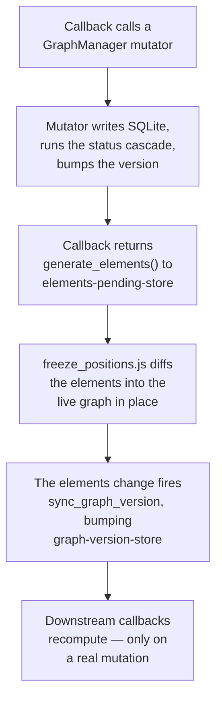

# App Architecture

How the app fits together: the layering, the module map, the `dcc.Store` wiring, and the handful of cross-file flows that are painful to reconstruct from code. Node/edge semantics and must-know rules live in [CLAUDE.md](../CLAUDE.md); the scoring and time math live in [scoring.md](scoring.md) and [time.md](time.md). This doc is the "how do the pieces talk to each other" layer between them.

## The layering

The app is six layers. Each one only knows about the layer below it.

- **Layout** (`layout.py`, `*_layout.py`) — pure structure. Builds the component tree and declares every `dcc.Store`. No callbacks, no behavior. `app.layout` is a *function* (`lambda: build_app_layout(generate_elements(), ...)`) so each page load gets fresh elements.
- **Callbacks** (`callbacks.py`, `*_callbacks.py`) — all behavior. Each tab module attaches its callbacks in one `register_*_callbacks(app)` pass. [`callbacks.py`](../callbacks.py) is *not* a tab — it's the shared core engine (the main canvas, cross-cutting callbacks, and `generate_elements`).
- **State gateway** (`graph_manager.py`, `event_manager.py`) — the only way a callback touches graph/event state. Owns CRUD, the status cascade, version counters, and caches.
- **Config** (`config.py` / `ConfigManager`) — a classmethod-only facade over the `Settings` table. No in-process cache, which is *why* the per-tab manager instances stay coherent (see Versioning below).
- **Pure compute** (`scoring.py`, `simulation.py`) — data in, rankings/simulations out. No DB access, no globals.
- **Persistence** (`database.py`) — resolves the DB path from `config.ENVIRONMENT` and runs `init_db` on first connect.

Sitting beside all of this: **`assets/`** — raw-served JS/CSS for behavior the Dash callback model can't express (context menus, position-freeze, drag-sortables, the value-setter bridge). It talks to Python only through `dcc.Store` components and hidden inputs.

The one-way rule has a payoff: a tab module sees only `app` and the three managers — never another tab's internals. Tabs coordinate *through the database*, not with each other (a write bumps a version counter; the next tab notices on its next callback).

## Module map

| Module | Role |
|---|---|
| [app.py](../app.py) | Entry point. Sets `config.ENVIRONMENT` from `--sandbox`, configures logging, seeds config types, runs the `recompute_all_statuses` startup safety-net, builds the layout, and registers the core engine + every tab. Also defines the `/open-obsidian` Flask route. |
| [models.py](../models.py) | `Node` / `Event` dataclasses, the `blend_time_estimate` PERT blend, edge/status constants. |
| [database.py](../database.py) | Thin `sqlite3` wrapper. Path from `config.ENVIRONMENT`; `init_db` on first connection. |
| [config.py](../config.py) | Module-level defaults and `ConfigManager`, a classmethod-only facade over the `Settings` key/value table. |
| [graph_manager.py](../graph_manager.py) | **The state gateway.** Node/edge CRUD, alias resolution, `sync_edges`, cycle detection, the status cascade, scoring entry (`calculate_priority_scores`), subtree/completion queries, field migrations, community detection. Holds the class-level version counters and caches. |
| [event_manager.py](../event_manager.py) | Same pattern for the `Events` table: event CRUD, dormant-node activation, trigger-node lookup. |
| [scoring.py](../scoring.py) | Pure functions. `build_adjacency`, `total_value` (forward DAG walk), `score_nodes`, `explain_score`, focus paths. |
| [simulation.py](../simulation.py) | Monte Carlo time simulation. Pure NumPy. |
| [callbacks.py](../callbacks.py) | **The core engine** — the largest non-test module. `register_callbacks(app)` owns the main Cytoscape canvas, `generate_elements` (single source of truth for elements), the graph-version bridge, filter/clear, time calibration, override handling, the undo/done flow, and the parametrized freeze-rerender registration. |
| [callback_helpers.py](../callback_helpers.py) | Stateless helpers extracted from the `*_callbacks.py` files (link parsing, filters, form-state diffs). |
| [layout.py](../layout.py) + `*_layout.py` | Dash layout factories. No callbacks. Declare the `dcc.Store` wiring. |
| [styles.py](../styles.py) | Dash component style dicts. |
| [assets/](../assets) | Served raw. Cytoscape hooks, context menus, position-freeze, sortables, the JS-Dash value-setter bridge. |
| Tab modules | [next_callbacks.py](../next_callbacks.py), [details_callbacks.py](../details_callbacks.py), [analyze_callbacks.py](../analyze_callbacks.py), [event_callbacks.py](../event_callbacks.py), [settings_callbacks.py](../settings_callbacks.py), [review_hub_callbacks.py](../review_hub_callbacks.py), [sidebars_callbacks.py](../sidebars_callbacks.py). Each exposes one `register_*_callbacks(app)`; [app.py](../app.py) calls each once. Adding a tab = one module + one `register_*` line. |

## State flow: stores are the wiring

`dcc.Store` components (declared in the layout layer) are how server callbacks and clientside JS pass data without direct coupling. The load-bearing ones:

- **`graph-version-store`** — mirrors `GraphManager._graph_version`. Downstream callbacks subscribe to it so they recompute only when the graph *actually* changed, not on every cosmetic re-render.
- **`elements-pending-store`** (+ `details-` / `events-` variants) — mutating callbacks write the new element list **here, not directly to the Cytoscape `elements` prop.** The freeze layer (below) sits in between.
- **`freeze-rerender-store`** (+ variants) — per-canvas freeze toggle state.
- **`*-pending-store`, `override-store`, `focus-goal-store`, `selected-suggestion-store`** — carry intermediate state across the steps of confirm/multi-stage flows.

## Key flows

### 1. Startup ([app.py](../app.py))

`--sandbox` sets `config.ENVIRONMENT` **before** any module reads it (the DB path depends on it) → logging configured (separate sandbox/prod log files) → `ConfigManager.ensure_*_type()` seeds type config → `GraphManager().recompute_all_statuses()` repairs any status drift against current `Needs_Hard` edges (catches mutations that bypassed the cascade) → Dash app built → `app.layout` set to a function returning `build_app_layout(generate_elements(), ...)` → `register_callbacks(app)` then the seven `register_*_callbacks(app)`.

### 2. Graph mutation → render (the central loop)

This is the path almost every edit takes. Get it wrong and the canvas either doesn't update or jumps around.

1. A callback (node editor in [sidebars_callbacks.py](../sidebars_callbacks.py), node ops in [callbacks.py](../callbacks.py), …) calls a `GraphManager` **mutator** (`add_node`, `update_node`, `add_edge`, `sync_edges`, …).
2. The mutator writes SQLite, runs the status cascade if the change is status-affecting, and calls `_bump_version(scoring=…)`.
3. The callback returns `generate_elements(filters, active_node_id, …)` to **`elements-pending-store`** (with `allow_duplicate`) — *not* to the Cytoscape `elements` prop.
4. A clientside callback (`freeze_positions.js`) consumes the pending elements and **diffs them into the live graph in place** — adding/removing/updating individual elements and preserving existing node positions, seeding new nodes near their neighbors. Replacing the whole `elements` list instead would trigger a full fcose relayout and the graph would jump on every edit. *This indirection is why you can't simply `Output('cytoscape-graph', 'elements')`.*
5. The change to Cytoscape `elements` fires `sync_graph_version`, which bumps `graph-version-store` only if `manager._graph_version` advanced — gating downstream recomputation to real mutations.

`generate_elements` ([callbacks.py:375](../callbacks.py)) is the single source of truth for what Cytoscape sees: it pulls filtered nodes from `GraphManager`, applies depth/neighbor-link controls, and assembles node + edge dicts with their colors, shapes, and classes (`trigger`, `dormant`, `now`).

### 3. Right-click → editor (the JS-Dash bridge)

1. `context_menu.js` shows a menu on node right-click and stashes `_currentNodeData`.
2. "Edit" calls `triggerEdit()`, which routes by source tab: events+dormant → `dormant-edit-trigger-input`; details/events/next → `details-edit-trigger-input` (opens the editor *in place*, no tab switch); main canvas → `edit-trigger-input` (which switches to the canvas tab).
3. It pokes that hidden Dash input via the **value-setter bridge**: the native `HTMLInputElement` value setter plus a synthetic `input` event. A plain `el.value = x` is silently ignored because the input is React-controlled. The value is suffixed with `'|' + Date.now()` so that re-editing the *same* node still changes the value and re-fires the callback.
4. The Dash callback bound to that input opens and populates the editor sidebar.

This bridge pattern recurs across `assets/` (sortables, event/goal context menus) — same setter + `input`-event trick everywhere a server value must land in a controlled component.

### 4. Status cascade

Marking a node Done (or changing a hard prereq) calls `update_node`, which detects the status change and seeds `_cascade_update_states`. That walk goes **forward along `Needs_Hard` out-edges**: each dependent recomputes to Blocked (any incomplete hard prereq) or Open. Goals whose hard children just became all-Done are collected via `_collect_auto_done_candidates` and surfaced through `pop_auto_done_candidates` for the auto-done prompt. `recompute_all_statuses` is the same logic run globally — the startup safety-net.

### 5. Scoring → Next ranking

[next_callbacks.py](../next_callbacks.py) calls `GraphManager.calculate_priority_scores(now_nodes, priority_goals)`. That checks a cache keyed `(_scoring_version, hyperparams)`; on a miss it calls the pure `scoring.score_nodes(...)` (build adjacency → forward `total_value` walk → cost/eligibility → ranked list). The cache survives filter toggles and cosmetic edits and is dropped only when `_scoring_version` advances.

## Versioning & caches

`GraphManager` carries two **class-level** counters (class-level so every per-tab instance sees the same value — a mutation in any callback module invalidates everyone's cache):

- **`_graph_version`** — bumps on any node/edge mutation. Drives UI-level caches: the `graph-version-store` bridge, the goal-subtree cache, and the community-detection cache (all keyed on it).
- **`_scoring_version`** — bumps **only** when a scoring-relevant field changes: `type`, `value`, `interest`, `difficulty`, `time_o/m/p`, `time_mode`, `value_mode`, `status`, `dormant`. Drives the scoring memo and the `calculate_priority_scores` cache.

The list is the `_SCORING_RELEVANT_FIELDS` constant; `update_node` diffs it against the prior node to decide whether to pass `scoring=True` to `_bump_version`. The split is the optimization: cosmetic edits (description, paths, context, aliases) bump `_graph_version` only, so the scoring memo stays warm and the next ranking is near-free. **When you add a new scoring-relevant field, add it to `_SCORING_RELEVANT_FIELDS` or scores will silently go stale.**

`ConfigManager` is deliberately the opposite — classmethod-only, every read round-trips through the `Settings` table, no in-process cache. That's what lets a value written by the Settings tab be immediately visible to every other tab's next read, without a cache-invalidation dance.
