# Features

This document walks you through the UI of Skill Tree and introduces key concepts along the way. By the end you'll know how to use the app, and where to look when you want more depth. All examples use a sandbox dataset derived from my real graph.

# Node Editor
The Node Editor is where you create new projects and update existing ones. It is a single scrollable sidebar — too tall to show neatly here — so we'll walk through it in sections, going from top to bottom. You can access the node editor from anywhere in the app by clicking this icon in the top left corner. 

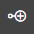
 

## General Section
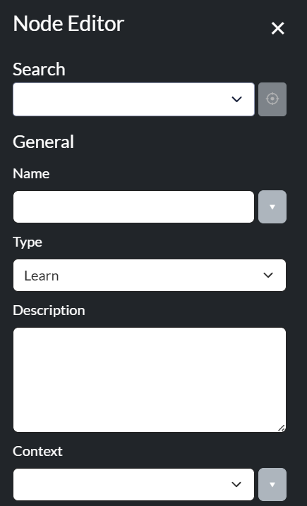

### Search Bar
As you type, an autocomplete feature suggests names in a dropdown menu. Select one, and the editor loads that node, ready to edit. Next to the search bar is a **crosshair** button. It's your bridge from the editor back to the canvas — a quick way to find the node you just pulled up. We'll cover what it does in full [later](#search--locate).

### Names
A node's name is how you find it (using the search bar) and reference it from other nodes (to create relationships). **Each name in Skill Tree must be unique.** Type a name that matches another — exactly, or after stripping connector words like *the,* *of,* and *is* — and the editor surfaces a *duplicate warning*. Unique doesn't have to mean singular, though. 

**Aliases** let a node answer to more than one name. This means you don't have to remember the exact title you saved it under. For example, I had a book in my graph called *4000 Weeks* that I'd sometimes search for as *Four Thousand Weeks.* With the alias feature on, both work. Add an alias by clicking the dropdown menu next to the name field.

### Node Type
There are five node types in Skill Tree. Each answers a different question that guides your project.

| Type | Core Question |
|---|---|
| **Learn** | What do I want to understand? |
| **Action** | What do I want to do? |
| **Resource** | What do I want to consume? |
| **Goal** | What domain or capacity am I developing? |
| **Milestone** | What measurable benchmark do I want to hit? |

Each type also behaves differently under the hood, so picking the right one matters more than it sounds. The [modeling guide](modeling.md) has the full decision tree for choosing between them. For now, just know that you set the type here, in the node editor.

### Description
A space for notes to your future self — scope, motivation, and anything else worth remembering. Whatever you write surfaces alongside the recommendations on the Next tab, and in the node information panel on the Details tab.

### Context

Every project belongs to a context (and optionally, a subcontext). Contexts do three things for you: they power the filters that let you examine sub-graphs, they drive the per-context views on the Analyze tab, and they shape your recommendations by influencing [scoring.md](scoring.md).

The taxonomy below is the one I use. The goal is not philosophical elegance, but a pragmatic classification system that makes it clear where each project should go. You, of course, probably want a different system.

  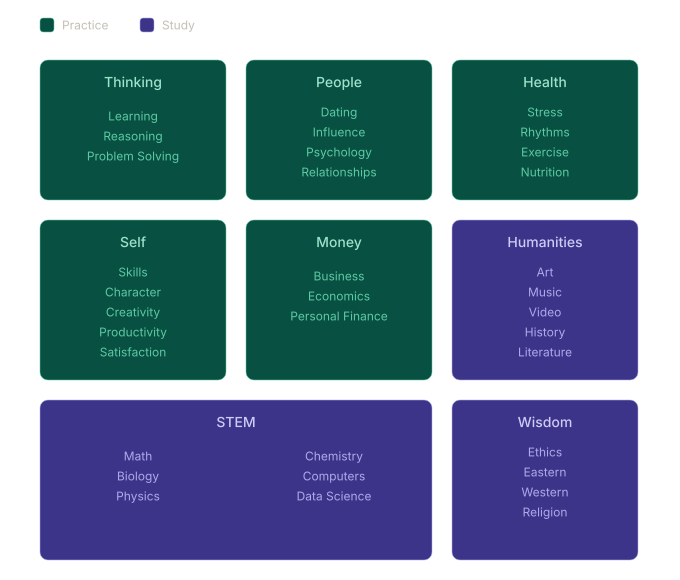
   
  <em>The eight contexts I use to organize my graph.</em>

## Status
The Status section of the node editor has three toggles: **Now**, **Done**, and **Dormant**.

  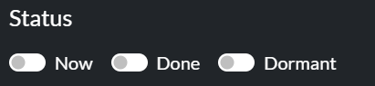
   

| Toggle | What it does |
|---|---|
| Now | Flags the node as one of your currently-active projects. |
| Done | Marks the node complete. May unblock downstream work, depending its [relationships](#relationships).|
| Dormant | Puts the node into hibernation until an [event](#eventst) wakes it up. Since a dormant node without an Event almost always gets lost, flipping this toggle opens an **Add to Event** modal where you can bind the node to an existing event, or create a new one. |

## Ratings
Value, interest, and effort are collectively called **Ratings**. Score each on a 1–10 scale, and the algorithm uses them to recommend work with the highest return on investment (along with other factors).

<table>
  <tr>
    <td valign="top">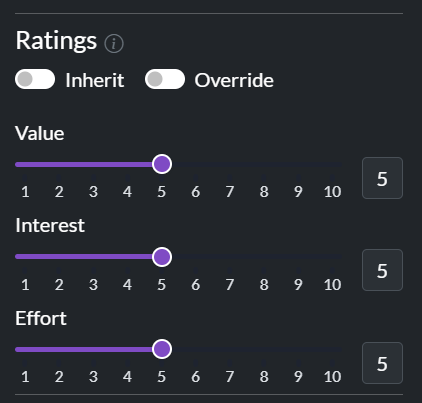</td>
    <td valign="top">

| Rating | Meaning |
|---|---|
| Value | How much this contributes to your broader goals |
| Interest | How much you enjoy the work itself |
| Effort | How hard the task is |

 

Their relative weight isn't fixed. [Scoring profiles](scoring.md#scoring-profiles) let you lean into curiosity (Interest first), ambition (Value first), or whatever fits the mood — more on those later.

</td>
  </tr>
</table>

### Ratings Toggles
Above the sliders sit two toggles.

**Inherit** turns the node into a pure container. Its value, interest, and effort stop being its own and instead flow up from its children. Reach for it when a node exists only to group other work, not as a project in its own right. [Containers](#containers) covers this in depth.

**Override** manually boosts a node's priority, pinning it near the top of the Next tab no matter what it scores. Click the toggle for scope options. It's the escape hatch for when you know something matters more than the algorithm thinks.

### Ratings Table
In order to standardize the rating process, there is a table that describes what each rating means. Open it by clicking the info icon next to the Ratings header in the Node Editor. Every cell is editable, so you can personalize your experience over time. 

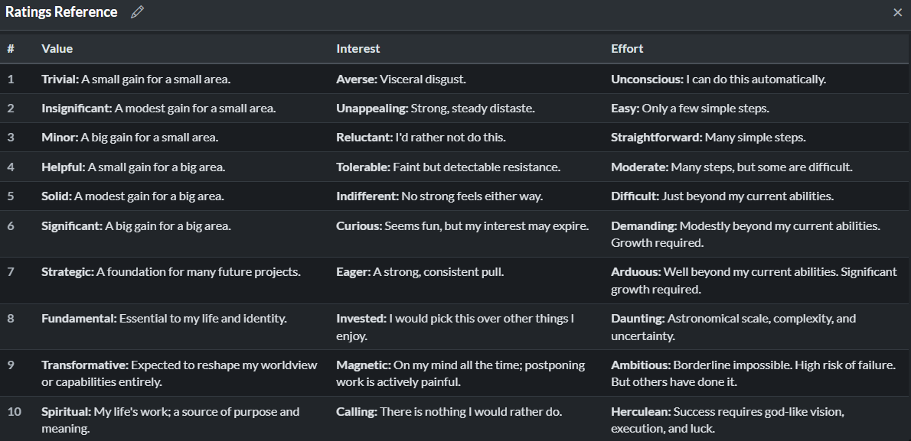

## Time
Time estimation is the most valuable thing in project management to get right — and the hardest. An entire [document](time.md) walks through how Skill Tree solves it. For here, the short version: you can estimate a project's duration with one, two, or three inputs. The more you provide, the better the result.

| Inputs | Values | Time Estimation Method |
|---|---|---|
| One | Expected duration | **Identity.** The app uses your number as-is. Skip this option when you can — the methods below are sharper. |
| Two | Lower and upper bound | **Geometric Mean.** A better default than the arithmetic average, because it corrects for the way humans systematically underestimate time. See [time.md](time.md) for why. |
| Three | Expected, lower, and upper bound | **Custom Algorithm**. A weighted blend of your three estimates based on PERT -- a technique developed by the US navy for estimating the duration of long projects. |

### Habits

The methods above assume total time is all that matters. For a book, it is — three one-hour sessions and one three-hour session land in the same place. Habits are different. "Run three times a week for eight weeks" doesn't translate cleanly into total hours, and the translation hides the things you actually care about: cadence. **Habit Mode** swaps total time for duration, intensity, and frequency.

  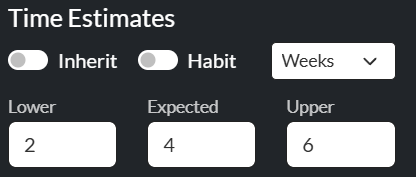
  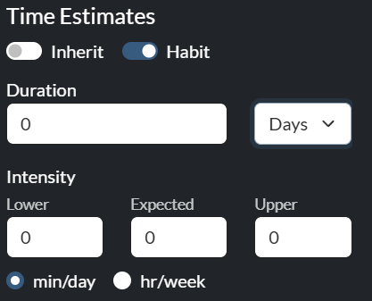
   
  <em>Standard estimation (left) and Habit Mode (right).</em>

### Inherit Time
The **Inherit** toggle makes a node's duration the sum of its children's, rather than a number you set yourself. Reach for it on a container whose only work is finishing the things beneath it. Goals and Milestones lock it on — their duration should be nothing more than the total of their subtasks — while for the other types it's optional.

### Containers

You've now met both Inherit toggles — one for ratings, and one for time. Together they're what turn an ordinary node into a **container**: a node that groups related work, and draws its numbers from the nodes beneath it.

A container is still just a node on the canvas, but it helps you organize projects better, as discussed in [modeling](modeling.md). Because the two toggles are independent, they combine four ways.

| Inherit Time | Inherit Ratings | What you get | Example |
|---|---|---|---|
| Off | Off | Standard node — own ratings and own time. | -- |
| On | Off | Own ratings, but time sums from incoming nodes. | *Sleep Theory* — I care about the topic enough to rate it directly, but its duration is just whatever the sub-Learns add up to. |
| Off | On | Own time, but the score comes from what its children contribute. I've never found a use for it — let me know if you have. | — |
| On | On | Pure container — no time or ratings of its own. Like a self-less parent, its all about the children. | A *Transcendentalism* Learn that groups *Walden* and *Emerson Essays*. |

Of the two toggles, Inherit Time is the one I reach for far more often.

## Relationships

There are three types of relationships in Skill Tree.

| Edge Name | Meaning | Example |
| --- | --- | --- |
| Hard Need | You can't do the destination until the source is Done. | `Algebra → Calculus` — calculus won't make sense without algebra first. |
| Soft Need | Nice to have, but not strictly required. | `UX Design → Personal Website` — the site is better with UX, but possible without. |
| Helps | Two tasks that mutually amplify each other. | `Rhetoric ↔ Writing` — each makes the other more useful. |

**Direction matters** for hard and soft prerequisites. $A \rightarrow B$ means $A$ unlocks / supports $B$. Synergistic edges, in contrast, have no direction. $A$ helps $B$, and $B$ helps $A$. 

In the editor, those directional edges are split into a **Needs** section and a **Supports** section. Both add the same kind of edge — they just describe it from opposite ends. **Needs** points *inward*: it lists the prerequisites that unlock the node you're editing. **Supports** points *outward*: it lists the nodes that this one unlocks. The split means you can always build an edge from whichever node you happen to be on, without opening the other one (which is annoying). **Helps** stands apart, because a synergy points both ways and has no end to choose from.

    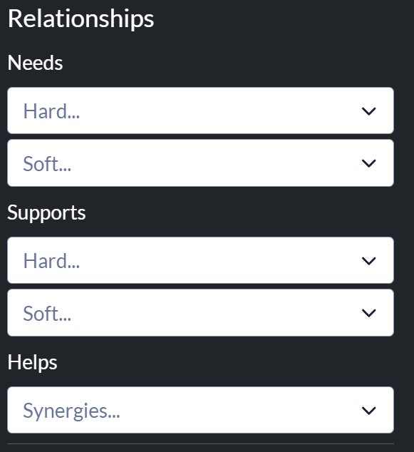
     
    <em> Node editor relationships section </em>

## State
Every node sits in one of four states at any moment. Some the app derives for you from a node's relationships, and others you set yourself.

| State | Meaning | Automatic |
|---|---|:---:|
| Open | Eligible to work on. All its hard prerequisites are Done (or it has none). | ✅ |
| Blocked | At least one hard prerequisite isn't Done yet. | ✅ |
| Done | Finished. Counts toward unblocking its dependents and contributes Synergy multipliers to its partners. | ❌ |
| Dormant | Hidden and not scored. It is waiting on an [event](#events) to wake it up. | ❌ |

When you mark a node Done, that change can ripple outward — unblocking its dependents and re-deriving their states in turn. The [status cascade](scoring.md#eligibility-and-the-status-cascade) walks through exactly how that propagation works.

### Re-opening a Done Node

Done is sticky. The app will never silently un-finish work you told it you'd completed. The only way out of Done is to actively un-mark it. 

When you do that, the change cascades. Anything downstream that depended on this node re-derives to **Blocked** because one of its prerequisites just became incomplete. The ripple can reach as far as the Hard-prereq subgraph extends. 

Because that cascade is destructive, the app gates it behind a confirmation modal that tells you exactly how many downstream nodes will flip to Blocked and lists them by name. If there are no Done dependents, the toggle proceeds silently, as there is nothing to confirm.

## External Resources

When a book, course, or article is substantial enough that you want to track and rate it, give it its own **Resource** node and wire it into the graph like anything else. More often, though, you just want to staple a reference to a node. That's what **external resources** are for: lightweight links to material that lives outside the app.

    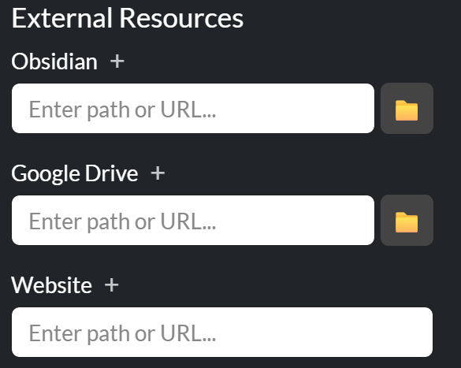
     

There are three kinds of link. A **Website** link is any URL. An **Obsidian** link points to a note in your vault by its path. A **Google Drive** link opens a synced file, given a Drive URL or a path if it's locally mounted. For the path-based links, the file icon beside the field opens a file explorer, so you can browse to the file instead of typing the path by hand.

You aren't limited to one of each — click the **+** beside a link's title to add as many as you want. Once a link is set, its field gains an open button, so you can jump straight to the resource from the editor. The same links are also reachable from a node's [right-click context menu](#context-menu), wherever it appears on a graph.

Website links are universal. Obsidian and Google Drive are more niche — they fit my workflow, but I wouldn't expect everyone to share it, so if this ever becomes a "real" app I'll make them optional.

# Next Tab

This is the tab the app opens on. If you only ever look at one screen, this is the one. It reminds you of your current priorities, and suggests new ones (these are [containers](#containers)). 

## The Next Section

    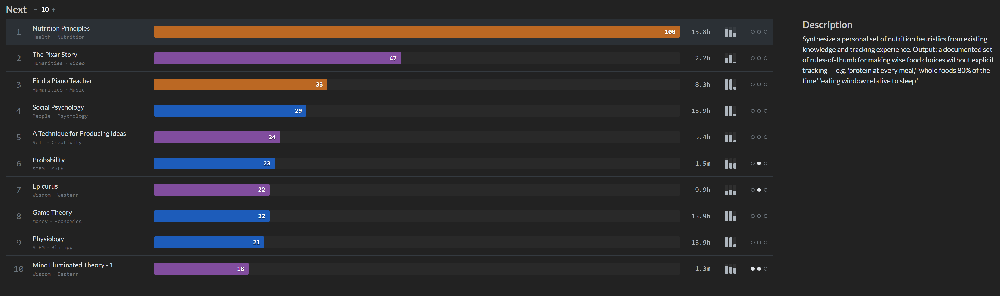
     

Reading a row from left to right:

| Element | What it tells you |
|---|---|
| Rank | The node's place in the ranking — 1 is the top recommendation. |
| Name | The node's name, with its context · subcontext below. |
| Bar color | The node type - we'll discuss the meaning of each color in the [visual code](#the-visual-code). |
| Bar length | Proportional to the priority score. The #1 task is always a full bar; everything else is drawn as a fraction of it. The number at the bar's right end is the score. |
| Time | Expected duration, using the intelligent methods discussed in [time](time.md) |
| Ratings glyph | Three small bars showing your Value, Interest, and Effort ratings, so you can eyeball them without opening the node. |
| Link dots | Three dots for Obsidian · Drive · Website. A dot lights up when the node has at least one link of that type, regardless of how many. |

Left-click any row to see the node's description beside the table. Right click it to open the [context menu](#context-menu). 

Importantly, only Learn, Action, and Resource nodes appear as suggestions. Goals and Milestones are excluded — you'll complete them naturally by clearing their subtasks.

## The Now Section

If you have any nodes marked "Now," a small *Now* section appears above the suggestions table.

    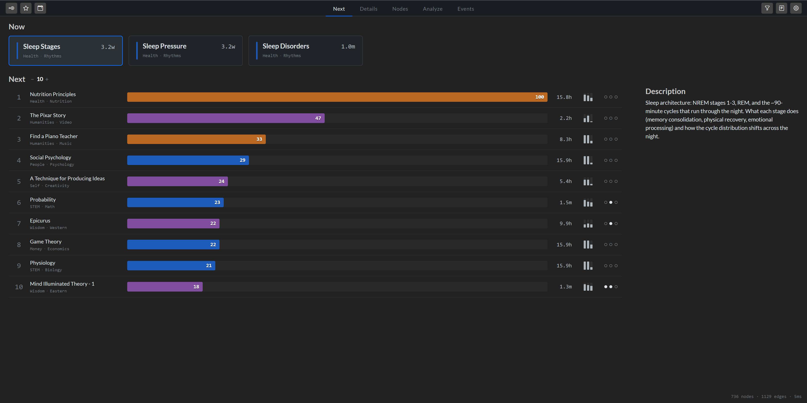
     
    <em> The whole Next Tab </em>

Each card shows a type-colored accent bar, name, context, and time estimate. Once a node graduates to the Now section, it no longer competes for a slot in the recommendation table, because you are already committed to it.

## Context Menu
Right-click any node — on this tab or anywhere else a node appears — to open the context menu. The menu is the same everywhere, except the [goals sidebar](#goals-sidebar), which has additional functionality.

<table>
  <tr>
    <td valign="top" style="padding-right: 30px;">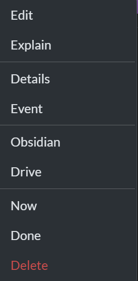</td>
    <td valign="top">

| Option | What it does |
|---|---|
| Edit | Opens the node editor. |
| Explain | Opens the score breakdown. |
| Details | Jumps to the Details tab pre-loaded with this node. |
| Event | Adds the node to an Event. |
| Obsidian | Opens the linked Obsidian note. Only shown when the link is set. |
| Drive | Opens the linked Google Drive file. Only shown when the link is set. |
| Done | Toggles Done — marks complete, or re-opens if already Done. |
| Delete | Deletes the node (with confirmation). |

</td>
  </tr>
</table>

# Nodes Tab

Click **Nodes** to see your entire task network as one graph — every node, every edge, all at once. A physics engine arranges it automatically, pulling connected nodes together so related work clusters visually.

    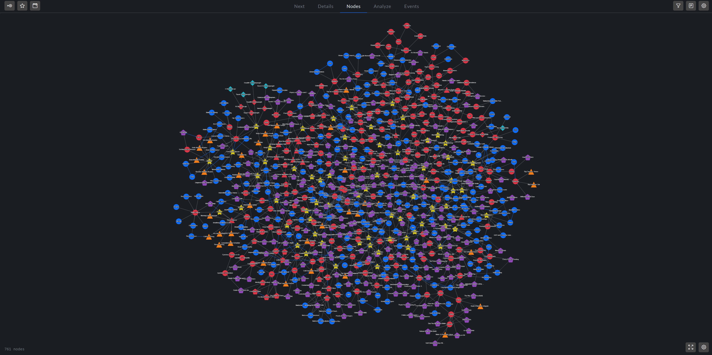
     
    <em> My Entire Network</em>

Obviously, there is a lot going on here. We will cover tools for how to work with such a large graph soon.

## The Visual Code

### Nodes

Every node's shape and color has meaning. Shape tells you type, and color tells you [state](#state).

    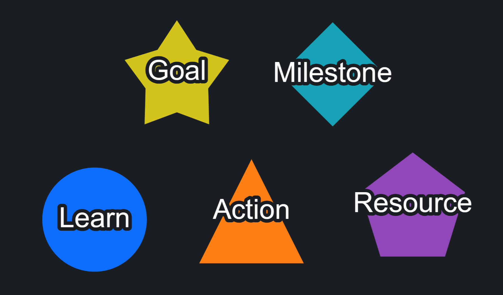

Regardless of type, Done nodes are green and Blocked nodes are red. The colors shown in the image above are the default colors for an open node of the indicated type. You can adjust both the shape and color of nodes in [settings](#settings)

There is one exception to the rule: goals are never red. Goals are [containers](#containers) that almost always have incomplete hard tasks, so painting them red would mean every Goal looks blocked all the time — hard to distinguish from work actually waiting on something. In the image of the the entire network, you can clearly see the yellow stars on the canvas. That is intentional. Goals should be your north star, in a sense.

### Edges

[Relationships](#relationships) are encoded with arrows between nodes. From top to bottom, the relationships are hard, soft, and helps. 

  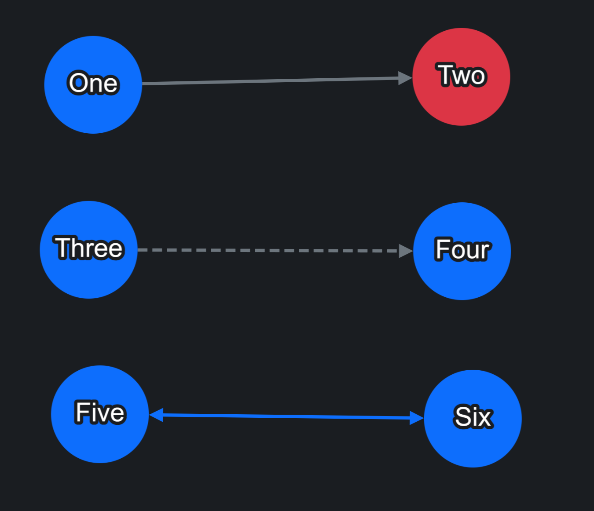
    
  <em> Relationship Types </em>

## Interacting with the Graph
The canvas supports the usual graph interactions, and they work the same way on every tab that shows a network — Nodes, Details, and Events.

### Mouse & Keyboard Interactions

#### Working with Nodes

| Gesture | Effect |
|---|---|
| Hover | Tooltip with key stats — contents vary by node type. |
| Left-click | Select the node (white halo). If the node editor is open, it loads with this node's data. |
| Ctrl + left-click | Multi-select. Enables bulk move, delete, and Done toggling. |
| Drag | Reposition on the canvas. |
| Right-click | Open the [Context Menu](#context-menu). The quickest way to load this node into the editor. |
| Delete / Backspace | Remove the selected node(s) with a confirmation prompt. |

#### Navigating the Canvas

| Gesture | Effect |
|---|---|
| Left-click empty canvas | Deselect everything |
| Left-click + drag, starting on the canvas | Group select with a box, like your OS desktop |
| Right-click + drag (on empty canvas) | Pan the viewport |
| Scroll wheel | Zoom in and out |

### Graph Layout Controls
The gear icon in the bottom right corner of the canvas opens the **Graph Settings** panel. It controls how the physics engine arranges the graph. 

<table>
  <tr>
    <td valign="top" style="padding-right: 30px;">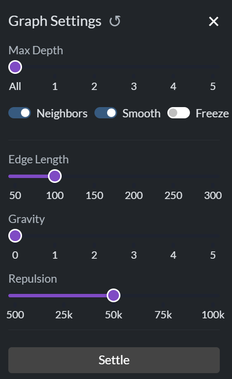</td>
    <td valign="top">

| Control | What it does |
|---|---|
| Max Depth | Limit the view to N hops from the selected node. |
| Neighbors | Show or hide links between the selected node's neighbors. Hiding them leaves a clean subtree radiating from the selection. |
| Smooth | Animate layout changes instead of snapping. Most elegant for smaller networks. |
| Freeze | Pause re-layout so hand-placed nodes stay put (see below). |
| Edge Length | The length of the springs between connected nodes. |
| Gravity | How strongly nodes are pulled toward the center. |
| Repulsion | How hard nodes push away from each other. |
| Settle | Re-run the layout physics to untangle the graph. |

</td>
  </tr>
</table>

The **↺** button beside the panel title restores your saved defaults — set per-tab in Settings.

**Freeze** stops the graph from moving until you turn it off. You'll know it's active because a blue outline surrounds the canvas and a snowflake appears in the top right corner. It's invaluable when editing edges, because without it, the graph re-arranges after each change, making it hard to track the nodes you're working on.

Nodes can still be dragged manually while Freeze is on.

### Fullscreen

The fullscreen button in the bottom right corner, next to the graph settings button, expands the canvas to fill the whole window. Marginal on the Nodes tab (already nearly fullscreen), but helpful on Details and Events. Hit the button again or press Escape to exit.

## Helpful Features for Large Networks
The Nodes tab works fine for small networks — say 250 nodes or fewer. Past that it becomes a "dense hairball" that makes it hard to focus on what you want. You've already seen one tool for taming it: the Max Depth parameter, which carves a local graph around the active node. Three more useful ways to tame the complexity — Locate, Filters, and the Details tab itself.

## Locate

Now its time to talk about what the crosshair button next to the [search](#search-bar) in the [node editor](#node-editor) does. Clicking this button briefly enlarges and highlights the selected node on the canvas, making it easy to spot.

  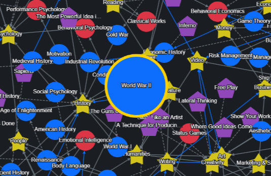
   
  <em> Locate feature active. Node returns to normal size after a few seconds. </em>

# Filters Sidebar

Click the filter icon in the top-right corner to open the filters panel. Filters narrow your graph to the slice you care about, and they apply across every tab except Analyze, which always reports on the graph as a whole. Filters are especially useful on the tabs we just covered. On Nodes, they pare the network down to a subset you can actually focus on. And on Next, they decide which projects compete for the top recommendation slots.

## Filter Controls

<table>
  <tr>
    <td valign="top" style="padding-right: 30px;">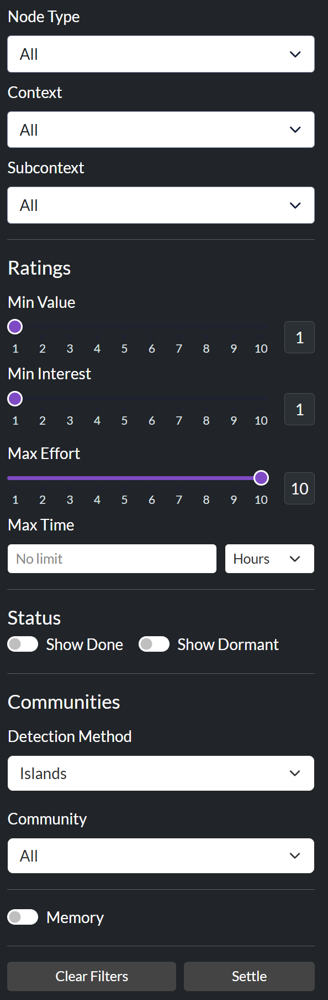</td>
    <td valign="top">

| Filter | Function |
|---|---|
| Node Type | Show only certain node types (e.g. learns + resources) |
| Context-Subcontext dropdowns | Restrict to one or more life areas |
| Min Value | Hide anything rated below a threshold. |
| Min Interest | Hide anything rated below a threshold. |
| Max Effort | Hide anything more difficult than a threshold. |
| Max Time | Hide anything longer than a time limit, using your preferred units |
| Done Toggle | Show or hide complete nodes. Hidden by default. |
| Dormant Toggle | Show or hide dormant nodes. Hidden by default. |
| Communities | Narrow the graph to an algorithmically-detected cluster of related nodes. See [Communities](#communities) below. |
| Memory | When on, your filter selections persist across sessions; when off, they reset on restart. |
| Clear filters | Reset all filters to their default state |
| Settle | Re-run the layout algorithm with selected filters. This happens automatically, but sometimes running it manually gives more aesthetic results. |

</td>
  </tr>
</table>

## Communities
The Communities filter algorithmically groups related nodes together. Three detection methods are available.

| Method | Description |
|---|---|
| Islands | Self-contained groups with no edges to the rest of the graph. Useful for spotting independent projects, or accidentally orphaned clusters. |
| Clusters | Densely connected groups. Useful for spotting cross-context clusters that don't fit your mental taxonomy. |
| Orphans | Nodes with no edges at all. Almost always a missing link, or a candidate for deletion. |

Pick a detection method, then a specific community from the list. Community names auto-generate from the most common context in the group — slightly more descriptive than "Community 1, 2, 3," but you'll still need to click it to see what nodes are members of the community.

## Filter Reminders
When any filter is active, the app reminds you by adding a small "filtered" message to the lower left corner of the tab or canvas. Without these reminders, you could leave Memory on, hammer a context for weeks, and never notice. It happened to someone I know.

Me. 

It was me.

# Details Tab
The Next tab tells you *what* project to work on. The Details tab is where you go to *understand* it.

## Populating the Tab
The Details tab is empty by default — since it doesn't know what you want the details for. There are three ways to load a project:

<table>
  <tr>
    <td valign="top" style="padding-right: 30px;">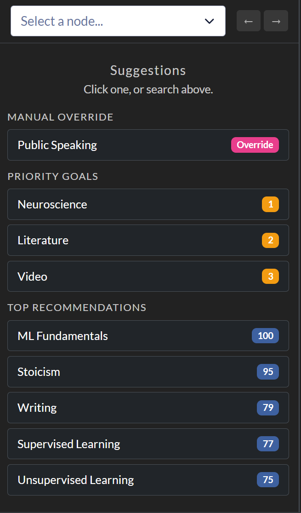</td>
    <td valign="top">

| Path | How it works |
|---|---|
| Search | Type a name into the search bar atop the left panel. Best when you have a specific project in mind. |
| Suggestions | When nothing is selected, the left panel shows a suggestion list. Up to three sections: any active **Manual Override**, your top three **Priority Goals**, and five **Top Recommendations** — the [containers](#containers) with the highest total value. |
| Context Menu |Right-click a node and pick **Details** in the context menu. The app jumps here with the project loaded. Accessible from Next, Nodes, and Details tabs + the Goals Sidebar.|

</td>
  </tr>
</table>

## Overview of the Details Tab
Once a node is loaded, the tab splits into four panels: node information, mini-graph, subtasks, and simulation.

  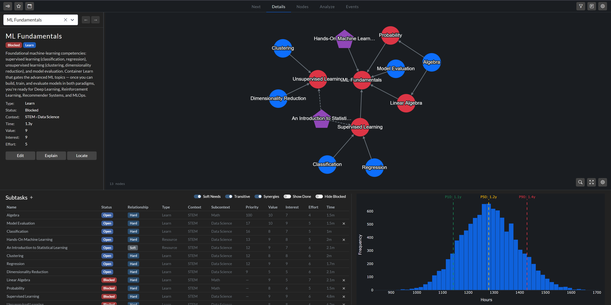
   
  <em> Details Tab with an example project loaded </em>

Now we'll walk through the sections one by one.

## Node Information Panel
The top-left panel summarizes the selected node. Most of it is self-explanatory, but a few things deserve a closer look.

**Badges** appear under the node's name. Every node carries at least two — its **status** and **type**, which you can see in the screenshot above, but nodes connected to a [Priority Goal](#setting-priority-goals) carry more:

- **Top-level Goals** get a rank badge (Priority 1, 2, or 3) and a progress bar below their description tracking completion.
- **Goal dependents** get badges like `Hard 1` or `Soft 2`. The number is which Priority Goal the node feeds; Hard / Soft is whether it does so through a hard or soft chain. `Soft 2` reads as "this node contributes, via a soft path, to your second Priority Goal."

The rest of the panel — node stats and three action buttons — reuses functions introduced elsewhere.

| Button | What it does |
|---|---|
| Edit | Opens the node editor. |
| Explain | Opens the [Explain](scoring.md#attribution) window. |
| Locate | Briefly pulses the node on the mini-canvas — same function as the crosshair beside the search bar in the Node Editor. |

## Canvas Panel
The canvas on the right works like the Nodes tab, except it is scoped to the selected node, and everything related to it. Every gesture and setting from the [Nodes Tab](#nodes-tab) walkthrough applies here too.

There are a couple unique things about the Details canvas though. 

### History
Clicking a node here reloads every panel with that node's information — unlike the Nodes canvas, which only selects the node and fills the editor (if it happens to be open). Because each click swaps out the detailed view, this tab keeps a history. The two arrows beside the search bar in the Node Information Panel step you back and forward through it, just like a browser.

### Focus Mode
There are three buttons in the bottom right corner of the canvas. Two of them were introduced elsewhere: [graph settings](#graph-layout-controls) and fullscreen, but one is unique to this tab: the one with a magnifying glass. Clicking this icon switches you to the Nodes tab with this network highlighted and everything else dimmed — a quick way to see this project in its broader context. 

  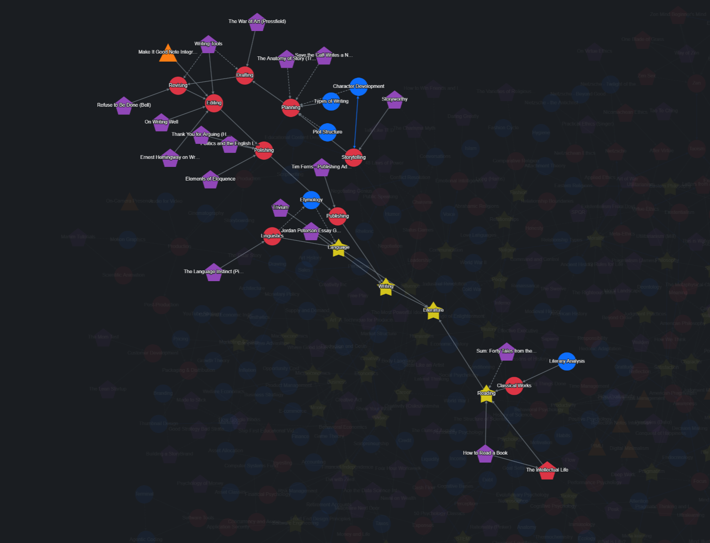
   
  <em> Focus Mode for the Sandbox Literature goal</em>

Hit **Clear Focus** at the top of the canvas to exit.

## Subtasks Panel
The Subtasks table in the lower-left lists every node in the dependency subtree. 

Two columns stand out: the **relationship** to the selected node — Hard, Soft, or Synergy — and the **priority score**. The most important subtask is normalized to 100, and every other score is its share of that — this is a *local* ranking for this subtree only, not the same as what appears on the Next tab. Blocked and Done nodes have no priority since they're not [eligible](#eligibility) for ranking.

  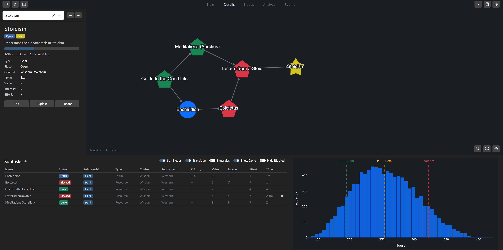
   
  <em> Details Tab with Stoicism Goal. </em>

If a subtask has a *direct* edge to the selected node, an **×** appears at the end of its row. Click it to open the **Remove Subtask** modal: choose **Remove Edge** to sever just the link (the node stays in the graph), or **Delete Node** to remove the node entirely. The **+** next to the "Subtasks" header opens a modal for adding a new subtask — either creating a fresh node or linking an existing one.

If the subtree contains any Milestones, they get their own horizontal strip of tiles above the table. Milestones are checkpoints rather than work, so they're kept visually separate from the subtasks you actually grind through.

### Controlling how much you see
The row of toggles in the top-right, combined with the **Max Depth** slider in the graph settings, lets you dial the view to the level of detail you want. Every panel reacts instantly. (Keep in mind that [filters](#filters-sidebar) from the filters sidebar apply too.)

| Control | What it does |
|---|---|
| Soft Needs | Include or exclude soft prerequisites. |
| Transitive | When off, shows only *direct* children. When on, shows the entire subtree. |
| Synergies | Include or exclude synergy partners. |
| Show Done | Whether completed subtasks appear. Off by default to keep the focus on open work. |
| Hide Blocked | Drop subtasks currently blocked by an incomplete prerequisite. |
| Max Depth | (In graph settings) Caps how many hops out from the selected node the subtree extends. |

For a sprawling Goal with hundreds of descendants, this is the difference between an unreadable wall of rows and a clean list of actionable items.

## Time Simulation Panel
Because most nodes carry three time estimates — optimistic, expected, and pessimistic — the app can simulate how long an entire project will take. The technique is **Monte Carlo Simulation**: each time you adjust a filter, the app runs 10,000 simulations of completing every subtask, sampling from your uncertainty about each one. The whole thing takes milliseconds, so it feels instantaneous; if you ever need it faster, you can lower the trial count in Settings.

The feature shines on large, vague, long-horizon Goals. It lets you say with confidence "there's a 10% chance I'll finish this in 2 months, 50% in 3, and 90% in 4." 

| Output | What it tells you |
|---|---|
| Histogram | The full distribution of how long the chain might take across all 10,000 runs. |
| P10 line | Optimistic case — only 10% of runs finish faster than this. |
| P50 line | The median — half of runs finish faster, half slower. |
| P90 line | Pessimistic case — 90% of runs finish faster than this; a sensible "worst realistic" figure. |

In the two examples we've seen so far, the distributions looked like a normal distribution. That is because the upper and lower time estimates were close to each other. If they are further apart, the distribution will look different (more like a log-normal or beta distribution, with a long right tail). 

  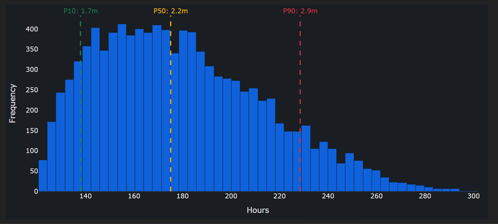
   
  <em> Time Simulation with high uncertainty (a dense book, in this case) </em>

# Goals Sidebar
Most node types — Learn, Action, and Resource — are ranked by the algorithm and bubble up on the Next tab. Goals are different. Because a Goal sits at the top of a subtree rather than being discrete work, the algorithm doesn't recommend Goals directly. Instead, *you* rank them, and the app uses your ranking to influence the priority of other nodes. The mechanics of this are discussed in the next document of the tutorial in the [Goal Priority Boost](scoring.md#goal-priority-boost) section.

Open the sidebar from the star icon in the top-left. 

<table>
  <tr>
    <td valign="top" width="200" style="padding-right: 30px;">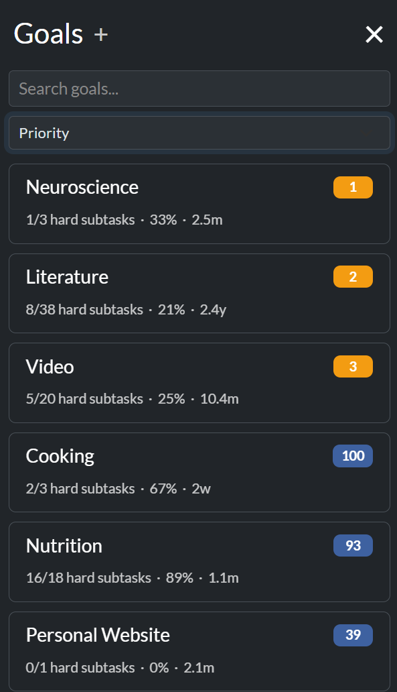</td>
    <td valign="top">

The **+** next to the "Goals" header creates a new Goal and opens it in the node editor. You can search for existing goals underneath that. The goals auto-filter as you type. But if you want to sort goals by specific criteria, you can do that too. The row below the search bar contains a dropdown menu with three modes, each having a unique effect and appearance:

| Mode | Order |
|---|---|
| Priority | Ranks every goal by priority. |
| Time | Longest projects first, shortest projects last. Scroll to the top or bottom to see the extremes.|
| Manual | A custom order you set by dragging the cards. The drag handle appears on each card whenever this mode is active. |
| Alphabetical | A→Z by name. |
</td>
  </tr>
</table>

## Setting Priority Goals

<table>
  <tr>
    <td valign="top" style="padding-right: 30px;">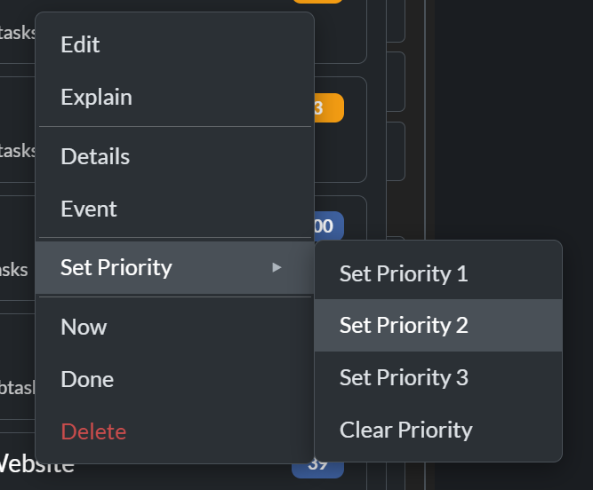</td>
    <td valign="top">

Your top three Goals are the **Priority Goals** — the ones the algorithm boosts. The most direct way to set them is the through the context menu. Right click a card, and a new "set priority" option appears. You can also set a goal's priority through the node editor through a field that appears only for goal-type nodes

</td>
  </tr>
</table>

# Events
Events let you plan for the future without cluttering today. Some things genuinely matter, but you don't want to think about them yet.

Take dog adoption. You want to learn to care for a dog, but you're not ready until your bonus comes in. You expect that bonus on a certain day, so you wrap all the pet-care tasks in an event set to wake up on that date. In the sandbox, this is the **Adopt a Dog** event — a whole pet-care cluster (Dog Care, Canine Behavior, Dog Training, Find a Vet) tucked away until the day a dog could actually come home.

Sometimes the right moment isn't a date but a milestone. Maybe you'd like to train for a half marathon, but only after you've run a 5k under a certain time. There's no calendar date for that — it depends on finishing other work first. So instead of a date, you tie the event to a node: the sandbox's *Train for a Half Marathon* event wakes up the moment *5k in 25 min* is marked Done.

And sometimes there's no condition at all, just a decision you haven't made yet. *Write a Book* is exactly that — an event with no date and no prerequisite, waiting quietly until you personally decide you're ready to commit.

In every one of these cases, the tasks bundled inside the event sit out of sight until it triggers. The app has a name for tasks in that state.

## Dormant Nodes
A dormant node isn't shown on the canvas or scored by the algorithm. It's in hibernation until its Event triggers.

## Trigger Types
Every Event has a trigger — the rule that decides when its dormant nodes wake up.

| Trigger | When it fires | Sandbox example |
|---|---|---|
| Date | Automatically, on or after a date you set. | *Adopt a Dog* — fires on 2027-06-01. |
| Node Completion | Automatically, when a specific node you choose is marked Done. | *Train for a Half Marathon* — fires when *5k in 25 min* is completed. |
| Manual | No automatic condition; fires only when you click the **Trigger** button. | *Write a Book* — fires when you decide. |

Date and Node-Completion events keep their **Trigger** button too, so you can always wake an event early if life moves faster than you planned.

## The Events Tab
The Events tab is where you create, edit, and trigger events. Unlike the other tabs, it can't function on its own — it needs an event loaded, and the only way to load one is through the Events sidebar. The tab's empty state knows this, and offers an **Open Events Sidebar** button to get you started.

**[SCREENSHOT: the Events tab's empty state with the "Open Events Sidebar" button visible.]**

Once an event is loaded, the tab splits in two: the **Event Editor** on the left and the **Event Canvas** on the right.

### Events Sidebar
Open the sidebar from the calendar icon in the top-left, or via the empty-state button on the Events tab. The sidebar lists every event as a card showing its name, a description preview, trigger info, and a node count.

Three controls sit at the top:

| Control | What it does |
|---|---|
| Search | Filters cards by name, with an autocomplete dropdown. |
| Sort | **Manual** (drag-and-drop, your custom order) or **A–Z**. |
| Hide triggered | On by default — hides events that have already fired so the list stays focused on what's still pending. |

The **+** next to the "Events" header creates a new event from scratch. Click any card to load it into the tab.

### Event Editor
The left panel is a straightforward form. At the top: the event **name** with **Save** and **Delete** buttons. Below: a **Description**, a **Trigger Type** selector (which reveals a date picker, a node dropdown, or nothing depending on your choice), and the **Dormant Nodes** table.

The Dormant Nodes table lists every task waiting on this event. Each row shows the node's name, type, **activation delay** (a per-node grace period — the node wakes up N days after the event triggers, not immediately), and its current status. The **+** above the table opens a modal for adding a new dormant node (create or link). The pencil and **×** on each row edit or remove a node. The checkbox on each row feeds the manual trigger flow.

The **Trigger** button fires the event manually. It opens a confirmation modal with two options: **Trigger Checked** (wake only the checked rows) or **Trigger All** (wake everything). Handy when an event has accumulated more dormant nodes than you're ready to release at once.

### Event Canvas
The right side of the tab shows a mini-graph of the selected event's dormant nodes and how they connect to each other and to the live graph. It carries the same gear and fullscreen controls as the other canvases — a quick sanity check that the dormant cluster is wired up the way you intended before it goes live.

## Event Announcements
When an event triggers — automatically (a date arrives, a node is completed) or because you clicked **Trigger** — an **Announcements modal** pops up the next time you open the app, confirming what just woke up and which nodes were activated or scheduled. A gentle nudge rather than a silent change, so you always know when the graph has shifted under you.

# Analyze Tab

The Analyze tab gives you a bird's eye view of your entire network -- goal progress, time allocation, structural patterns, and more. The charts are diagnostic: they help you catch mistakes early and avoid spending time unwisely.

## The Overview Strip

At the top, an Overview strip summarizes the current non-dormant graph

**[SCREENSHOT: the Overview strip across the top of the Analyze tab with all five tiles visible.]**

## Goals
The Goals section puts two views side by side. Importantly, goals are ranked by priority score. The algorithm used for ranking is the same one as the Goals Sidebar priority ranking dropdown. You can learn about this mechanism in [scoring](scoring.md). 

There is a small gear icon by the section title that allows you to control how many goals are shown. 

**Completion** (left) shows each Goal's hard-prerequisite progress as a stacked horizontal bar — Done work in green, remaining work in faint gray. As with every chart on the Analyze Tab, there is a helpful tooltip that shows up when you mouse over a graph element.

**Screenshot: the Completion chart — one stacked horizontal bar per Goal, Done work in green against the remaining work in gray.**

**Shared Prerequisites** (right) is a heatmap over those same Goals, counting their shared hard and soft prerequisites. Bright cells mean two Goals draw from the same body of work — a sign they share foundational skills. You might want to work on these tasks to "double dip."

**Screenshot: the Shared Prerequisites heatmap, with bright cells where two Goals draw on the same prerequisites.**

The gear icon by the section title opens display-limit control for how many top-ranked Goals to render. 

## Contexts

The Contexts section puts three views in one row, each asking a different question: where your time goes, what you expect your work to feel like, and what it actually feels like after you've done it (for this last part, see the [reflection feature](#reflection)). All three visualizations share the same context order, so you can read straight across.

**Hours by Context** (left). One horizontal stacked bar per context; each segment is a subcontext. Hover a segment for its name, node count, and estimated time.

**[SCREENSHOT: Hours by Context bar chart.]**

**Ratings by Context** (middle) — average Value, Interest, and Effort across the live nodes in each context. 

**[SCREENSHOT: Ratings by Context chart.]**

**Reflection Drift by Context** (right) — the same three dimensions, but the *average change* between your original rating and your post-reflection rating. Red cells mean you overrated the work going in; blue cells mean you underrated it.

## Time Estimation Accuracy

When you mark a node Done and complete a [reflection](#reflection), the actual time gets captured alongside your original estimate. These two charts compare them.

**By Node** is a scatter plot with a dashed *y = x* reference line. Each dot is one completed node. Points above the line took longer than expected. Each point below the line was completed faster than expected. Colors are node types, so you can spot whether one type — usually Learn — drifts above the line more than the others.

**Screenshot: the By Node accuracy scatter plot, each dot a completed node against the dashed y = x reference line.**

**By Context** rolls those same ratios up into one box plot per context. A box to the right of the 1× line means that context's tasks routinely take longer than you expect; a box to the left means they don't take as long.

**Screenshot: the By Context box plot, one box per context against the 1× estimate line.**

## Throughput

The Throughput chart shows hours of completed work per calendar bucket, stacked by context. The gear icon opens three controls: **Granularity** (months, quarters, or years) and **Start / End date** to clip the range. The defaults — quarterly buckets covering the full range of your time with Skill Tree -- works for most usese. Use the gear when you want to zoom in.

**[SCREENSHOT: the Throughput gear popover open, showing the Granularity dropdown and the Start / End date inputs.]**

**[SCREENSHOT: the Throughput stacked bar chart with a hover tooltip open on one segment, showing the context name, hours, and the top-five completed nodes.]**

Where Hours-by-Context shows your *intent* (active time you plan to spend per context), Throughput shows your *execution* (time you actually delivered, and where). Big mismatches between the two are usually the most interesting finding.

## Graph Structure

The Graph Structure section answers two structural questions about your network, side by side. The gear icon controls how many nodes each chart shows.

**Bottleneck** ranks nodes by the number of nodes they unlock (through hard edges). The chart distinguishes direct unlocks from the downstream cascade. The colors of the bars show the status, allowing you to separate "high leverage and available" (not red) from "high leverage but waiting on something else" (red). A large bottleneck may not be the highest-ROI item by itself, but clearing it changes the frontier: whole chains become eligible, and the Next tab has better candidates to choose from.

**Screenshot: the Bottleneck chart — nodes ranked by how many others they unlock, with bar color showing status.**

**Hub Nodes** ranks nodes by how integrated they are — concepts with prerequisites feeding in *and* dependents flowing out. The score is calculated as the geometric mean of incoming and outgoing prerequisite edge counts (over Hard and Soft needs), plus a half-point bonus for each synergy partner (Helps edges). Because the prerequisite component drops to zero for pure roots (no prerequisites) and pure leaves (no dependents), this chart surfaces the connective concepts that tie the rest of your graph together. 

**Screenshot: the Hub Nodes chart, ranking the most connected concepts that tie the graph together.**

Where Bottleneck asks *what unlocks the most?*, Hub asks *what is most central to my understanding?*

# Reflection

Once a project is finished, the real work of calibration begins: looking back to find the truth. 

The reflection loop is where you bridge the gap between expectation and reality. For every completed task, you record the actual time it took and how it actually felt in hindsight. Over time, this feedback loop trains your intuition, helping you estimate future tasks with greater accuracy and less bias.

Open the **Reflection Hub** by clicking the journal icon in the top toolbar.

## Pending Queue

This is your backlog of completed work waiting for retrospection. The queue accumulates patiently. You can reflect on projects the moment they finish or batch them every few weeks; the only wrong move is waiting until you have forgotten the details of the work.

Click **Start Reflection** to open a step-by-step walkthrough. For each node, you record:

*   **Actual Time**: Enter your actual duration using the same three-number format (Lower Bound, Best Estimate, Upper Bound, and Unit) to keep your actuals directly comparable to your estimates.
*   **Post-hoc Ratings**: Re-rate the task from 1 to 10 on **Value** (was it as impactful as expected?), **Interest** (did you enjoy it?), and **Effort** (how difficult was it in practice?).

Three actions guide you through the queue:
*   **Submit**: Saves your actuals and advances to the next task.
*   **Skip**: Postpones the node, leaving it in the queue for later.
*   **Don't ask again**: Excludes the node entirely—perfect for minor tasks or resources that defy meaningful retrospection.

**[SCREENSHOT: the reflection walkthrough modal with the progress bar visible.]**

## Review History

A log of your past reflections. This searchable, filterable table displays your original estimates alongside your recorded actuals and the differences between them. If your memory of a task changes later, click the pencil icon on any row to edit its actual (not expected) data.

**[SCREENSHOT: the Review History table with deltas visible.]**

## Excluded

This is your "Don't ask again" archive. Nodes here are quietly bypassed during your reflection cycles. If you ever want to bring an excluded node back into the loop, simply click **Restore** to return it to the pending queue.

# Settings

The Settings modal is where you fine-tune how the app looks and behaves. Open it using the gear icon in the top-right corner. 

| Tab | What lives here |
|---|---|
| **Appearance** | Customize node shapes and colors by type, set status colors, and define default physics parameters for the layout engine. It also houses the **Name Linter** toggle, Next tab table size, and a manual **Repair Graph** utility. |
| **Contexts** | Define your primary contexts and subcontexts. This tab also lets you choose the sorting behavior (None, Length, or Alphabetical) for your context and subcontext dropdown menus. |
| **Scoring** | Tune the priority ranking system. Select an [algorithmic profile](scoring.md#scoring-profiles), adjust individual [scoring hyperparameters](scoring.md#profile-hyperparameters) (such as intrinsic value, cascade weights, and synergies), and run performance benchmarks. |
| **Time** | Set your weekly, monthly, and yearly productive hour budgets. You can also configure default time estimates and units for new nodes, and toggle whether the app prompts you for a reflection immediately when a node is marked Done. |
| **Paths** | Specify local file system paths for Obsidian vault and Google Drive integrations, allowing the app to resolve your external links correctly. |

Feel free to experiment with alternative settings because all the major operations have a "restore to defaults" option.

# Navigation
## Tutorial

  <a href="../README.md">README</a> · <b>Features</b> · <a href="scoring.md">Scoring</a> · <a href="time.md">Time</a> · <a href="modeling.md">Modeling</a>

## Other Resources

| Resource | What's there |
|---|---|
| [app_architecture.md](app_architecture.md) | The code behind the tour: module layout, tab callbacks, the Cytoscape render pipeline, and persistence. |
