# Features
This document walks through the features of Skill Tree, and how they are controlled in the app. This is easily the longest document in the tutorial, but that is only because it lays the foundational knowledge for everything to come, and there are so many cool things to cover.

# Node Editor
The Node Editor is where you create projects and update existing ones. It is a single scrollable sidebar — too tall to show neatly here — so we'll walk through it in sections, going from top to bottom. 

Access the node editor from anywhere in the app by clicking the icon in the top-left corner. 

    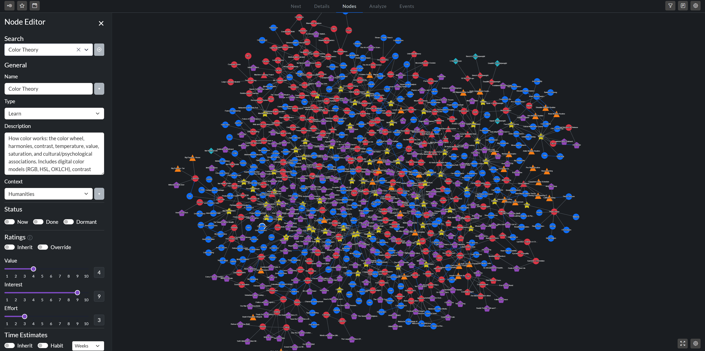
     
    <em> The Node Editor with a project loaded, and the Nodes Tab beside it. </em>

## General Section

 
<em> Top section of the node editor </em>

### Search Bar
As you type, an autocomplete feature suggests names in a dropdown menu. Select one, and the editor loads that node.

### Locate
Next to the search bar is a crosshair button. It's your bridge from the editor back to the canvas — a quick way to find the node you just pulled up. Clicking this button briefly enlarges and highlights the selected node, making it easy to spot. 

  
   
  <em> Locate feature active </em>

### Names
A node's name is how you find it (using the search bar) and reference it from other nodes (in relationships). There are a couple things to know about names in Skill Tree.

**Each name must be unique.** Type a name that matches another — exactly, or after stripping connector words like *the,* *of,* and *is* — and the editor surfaces a *duplicate warning*. 

Unique doesn't have to mean singular, though. 

**Aliases** let a node answer to more than one name. This means you don't have to remember the exact title you saved it under. For example, I had a book in my graph called *4000 Weeks* that I'd sometimes search for as *Four Thousand Weeks.* I actually created two separate projects for the same resource. But now that I have the alias feature, both names direct to the same project. You can add an alias using the gray dropdown arrow next to the name field.

### Node Type
There are five types of nodes in Skill Tree. Each answers a different question that guides your planning.

| Type | Core Question |
|---|---|
| **Learn** | What do I want to understand? |
| **Action** | What do I want to do? |
| **Resource** | What do I want to consume? |
| **Goal** | What domain or capacity am I developing? |
| **Milestone** | What measurable benchmark do I want to hit? |

Each type also behaves differently under the hood, so picking the right one matters more than it sounds. The [modeling guide](modeling.md) has the full decision tree for choosing between them. For now, just know that you set the type here, in the node editor.

### Description
The description area is a space for notes to your future self. Use it to describe a project's scope, motivation, and anything else worth remembering. Whatever you write will surface in many places throughout the app, such as in the recommendations on the [Next Tab](#next-tab), and in the information panel on the [Details Tab](#details-tab).

### Context

Every project belongs to a context (and optionally, a subcontext). Contexts do three things for you: they power [filters](#filters-sidebar), drive [scoring](scoring.md), and [visualizations](#contexts). 

Every user will have their own mental model for how to partition their life, but the taxonomy below is the one I use. The goal is not philosophical elegance, but a pragmatic classification system that makes it clear where each project should go. You, of course, probably want a different system.

  
   
  <em>The eight contexts I use to organize my graph.</em>

## Status
The Status section of the node editor has three toggles: **Now**, **Done**, and **Dormant**. 

  
   
  <em> The Status section's three toggles. </em>

The table below provides a brief overview of each status, but each will be covered more thoroughly later in the tutorial.

| Toggle | What it does |
|---|---|
| Now | Flags the node as one of your currently-active projects. |
| Done | Marks the node complete. May unblock downstream work, depending on its [relationships](#relationships). |
| Dormant | Puts the node into hibernation until an [event](#events) wakes it up. Since a dormant node without an Event almost always gets lost, flipping this toggle opens an **Add to Event** modal where you can bind the node to an existing event, or create a new one. |

## Ratings
Value, interest, and effort are collectively called **Ratings**. Score each on a 1–10 scale, and the algorithm uses them to recommend work with the highest return on investment (along with other factors).

<table>
  <tr>
    <td valign="top"></td>
    <td valign="top">

| Rating | Meaning |
|---|---|
| Value | How much this contributes to your broader goals |
| Interest | How much you enjoy the work itself |
| Effort | How hard the task is |

 

The relative weight of each factor isn't fixed. [Scoring profiles](scoring.md#scoring-profiles), discussed in depth in the [scoring](scoring.md) document, allow you to fine tune how these and other factors influence project rankings.

</td>
  </tr>
</table>

### Ratings Toggles
Above the sliders sit two toggles.

**Inherit** turns the node into a container along the ratings-dimension. That means its value, interest, and effort stop being its own, and instead flow up from its children. Reach for it when a node exists primarily to group other work. The [Containers](#containers) section, coming up soon, covers this in depth.

**Override** manually boosts a node's priority, pinning it to the top of the [Next Tab's](#next-tab) recommendations, no matter what the algorithm says. It's the escape hatch for when you know something matters more than the algorithm thinks. I use this when my life circumstances suddenly change, and something demands immediate attention. 

Once you click the toggle, there are additional options for how thorough the override should be.

  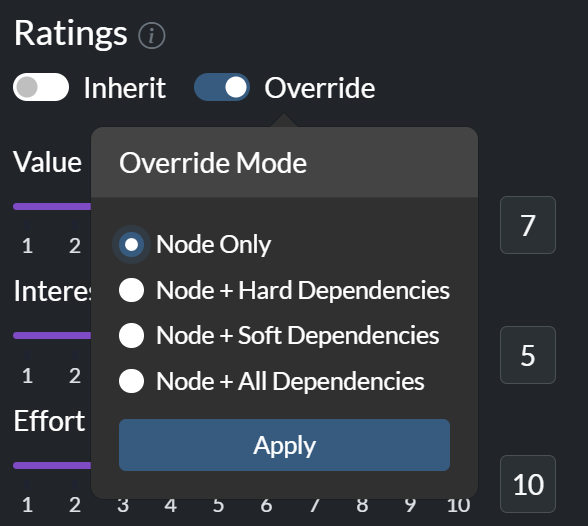
   
  <em> Override popup -- the other options will make more sense after we cover relationships. </em>

### Ratings Table
In order to standardize the rating process, there is a table that describes what each rating means. Open it by clicking the info icon next to the Ratings header. Every cell is editable, so you can personalize the definitions. 

  
   
  <em> The editable ratings rubric. </em>

## Time
Time estimation is the most valuable thing in project management to get right — and the hardest. [Time.md](time.md) walks through Skill Tree's approach to solving this difficult problem. For now, the short version: you can estimate a project's duration with one, two, or three inputs. And the more you provide, the better the result.

| Inputs | Values | Time Estimation Method |
|---|---|---|
| One | Expected duration | **Identity.** The app uses your estimate as-is. Skip this option when you can. The methods below are almost always better. |
| Two | Lower and upper bound | **Geometric Mean.** A better default than the arithmetic ("normal") average. The arithmetic mean gets dragged upward by the worst-case bound. The geometric mean lands on the typical, median-case duration instead. See [time.md](time.md) for why. |
| Three | Expected, lower, and upper bound | **Custom Algorithm**. A weighted blend of your three estimates based on PERT -- a technique developed by the US Navy for estimating the duration of long projects. |

### Habits

The methods above assume total time is all that matters. For a book, it is — three one-hour sessions and one three-hour session land in the same place. Habits are different. "Run three times a week for eight weeks" doesn't translate cleanly into total hours, and the translation hides a more natural way to think about habits: in terms of intensity, frequency, and duration.

  
  
   
  <em>Standard estimation (left) and Habit Mode (right).</em>

### Inherit Time
The **Inherit** toggle makes a node's duration the sum of its children's. Reach for it when a node is used to group work underneath it. Goals and Milestones lock it on — their duration should be nothing more than the total of their subtasks — while for the other types, it's optional.

### Containers

You've now met both Inherit toggles — one for ratings, and one for time. Flipping either one turns an ordinary node into a **container**: a node that groups related work, and draws at least some of its numbers from the nodes beneath it. Depending on which toggles you flip, a container can inherit its time, its ratings, or both. Because the two toggles are independent, they combine four ways. 

| Inherit Time | Inherit Ratings | What you get | Example |
|---|---|---|---|
| Off | Off | Standard node — own ratings and own time. | -- |
| On | Off | Own ratings, but time sums from incoming nodes. | *Sleep Theory* — I care about the topic enough to rate it directly, but its duration is just whatever the sub-Learns add up to. |
| Off | On | Own time, but the score comes from what its children contribute. I've never found a use for it — let me know if you have. | — |
| On | On | Pure container — no time or ratings of its own. | A *Transcendentalism* Learn that groups *Walden* and *Emerson Essays*. This is not enough nodes for the parent to need its own ratings, and the time argument is the same as before. |

Of the two toggles, Inherit Time is the one I reach for more often.

## Relationships

There are three types of relationships in Skill Tree. 

| Edge Name | Meaning | Example | Directional |
| --- | --- | --- | :---: |
| Hard Need | You can't do the destination until the source is Done. | `Algebra → Calculus` — you need algebra to understand calculus. | Yes |
| Soft Need | Nice to have, but not strictly required. | `UX Design → Personal Website` — the site will be better if you know UX design, but it is possible to create a website without that. | Yes |
| Helps | Two tasks that mutually amplify each other. | `Rhetoric ↔ Writing` — each makes the other more useful. | No |

[Modeling](modeling.md) covers how to choose the right relationship type extensively. But for now, the most important thing is to understand that two types of relationships -- hard and soft needs -- are directional, while synergistic relationships are not. **Direction matters** for hard and soft prerequisites. $A \rightarrow B$ means $A$ unlocks or supports $B$. Synergistic edges, in contrast, have no direction. 

In the editor, directional edges (hard and soft needs) are split into a **Needs** section and a **Supports** section. Both add the same kind of edge — they just describe it from opposite ends. **Needs** points *inward*: it lists the prerequisites that unlock the node you're editing. **Supports** points *outward*: it lists the nodes that this one unlocks. The split means you can always build an edge from whichever node you happen to be on, without opening the other one (which is annoying). **Helps** stands apart, because a synergy points both ways and has no end to choose from.

    
     
    <em> Node editor relationships section </em>

## State
At any moment, a node is in one of four states: open, blocked, done, or dormant. Some the app derives for you, and others you set yourself.

| State | Meaning | Automatic |
|---|---|:---:|
| Open | Eligible to work on. All its hard prerequisites are Done (or it has none). | ✅ |
| Blocked | At least one hard prerequisite isn't Done yet. | ✅ |
| Done | Finished. Counts toward unblocking its dependents and contributes Synergy multipliers to its partners. | ❌ |
| Dormant | Hidden and not scored. It is waiting on an [event](#events) to wake it up. | ❌ |

When you mark a node Done, that change can ripple outward — unblocking its dependents and re-deriving their states in turn. The [status cascade](scoring.md#eligibility-and-the-status-cascade) section of the [scoring](scoring.md) document walks through how that works

## External Resources

When a book, course, or article is substantial enough that you want to track and rate it, give it its own **Resource** node and wire it into the graph like anything else. Just as often, though, you want to staple a lightweight reference to a node. That's what **external resources** are for.

    
     
    <em> The External Resources section. </em>

There are three kinds of links. A **Website** is any URL. You know what a website is, right? The other options are more niche, and probably unique to my workflow. An **Obsidian** link points to a note in your vault. If you don't know, Obsidian is a note-taking app. The next link type is **Google Drive.** This field accepts a website URL or a local path if you mounted Google Drive to your computer.

For the path-based links, the file icon beside the field opens a file explorer, so you can browse to the file instead of typing the path by hand.

Also, you aren't limited to one of each type — click the **+** beside a link's title to add as many as you want. Once a link is set, its field gains an open button, so you can jump straight to the resource from the editor. The same links are also reachable from a node's [context menu](#context-menu).

# Next Tab

This is the tab the app opens on. If you only look at one screen, this is the one. It reminds you of your current priorities, and suggests new ones. 

    
     
    <em> The Next Tab </em>

## The Now Section

If you have any nodes marked "Now," a small *Now* section appears above the suggestions table. Each card shows a type-colored accent bar, name, context, and time estimate. Once a node graduates to the Now section, it no longer competes for a slot in the recommendation table, because you have already committed to it.

## The Next Section
This is a simple table of the top project recommendations, as judged by the priority scoring algorithm. 

Reading a row from left to right:

| Element | What it tells you |
|---|---|
| Rank | The node's place in the ranking — 1 is the top recommendation. |
| Name | The node's name, with its context · subcontext below. |
| Bar color | The node type - we'll discuss the meaning of each color in the [visual code](#the-visual-code). |
| Bar length | Proportional to the priority score. The #1 task is always a full bar; everything else is drawn as a fraction of it. The number at the bar's right end is the score. |
| Time | Expected duration, using the intelligent methods discussed in [time](time.md) |
| Ratings glyph | Three small bars showing your Value, Interest, and Effort ratings, so you can eyeball them without opening the node. |
| Link dots | Three dots for Obsidian · Drive · Website. A dot lights up when the node has at least one link of that type, regardless of how many. |

Left-click any row to see the node's description beside the table. Right-click it to open the [context menu](#context-menu).

Importantly, only Learn, Action, and Resource nodes appear as suggestions. Goals and Milestones are excluded — you'll complete them naturally by clearing their subtasks. 

## Context Menu
Right-click any node — on this tab or anywhere else a node appears — to open the context menu. The menu is the same everywhere, except the [goals sidebar](#goals-sidebar), which has additional functionality.

<table>
  <tr>
    <td valign="top" style="padding-right: 30px;"></td>
    <td valign="top">

| Option | What it does |
|---|---|
| Edit | Opens the node editor. |
| Explain | Opens the score breakdown. |
| Details | Jumps to the Details tab pre-loaded with this node. |
| Event | Adds the node to an Event. |
| Obsidian | Opens the linked Obsidian note. Only shown when the link is set. |
| Drive | Opens the linked Google Drive file. Only shown when the link is set. |
| Done | Toggles Done — marks complete, or re-opens if already Done. |
| Delete | Deletes the node (with confirmation). |

</td>
  </tr>
</table>

## Explain

A score on its own doesn't tell you much. Explain tells you where that score came from. Right-click any suggestion and choose **Explain** to open it. It works anywhere a node appears, not just here.

    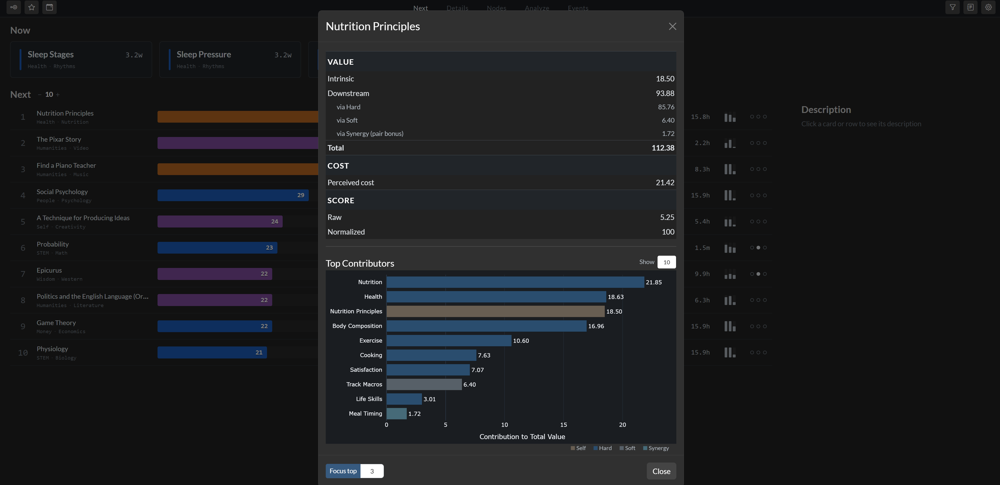
     
    <em> The score breakdown for a node. </em>

The breakdown opens with a summary table, grouped into Value, Cost, and Score. The exact rows that appear in each section depend on the node itself. Some nodes have adjustments to their base ROI score via priority goal multipliers, context weight adjustments, and more. All these nuances are discussed in [scoring](scoring.md).

At the bottom, the score is listed twice: raw and normalized. The bar on the suggestions table shows the normalized score, where every node is measured against the current #1 priority. The raw score is the underlying value before that rescaling. 

Below the table is a contributors chart. It ranks the pieces that drive the recommendation, so you can see what is pulling this node up the list. The node's own intrinsic value is one bar; the rest are the downstream nodes whose value cascades back to it. The bars are colored by where the value comes from — the node itself, or a hard prerequisite, soft prerequisite, or synergy link.

### Focus Top $n$

The contributors chart tells you *what* is lifting a score. The **Focus Top $n$** button shows you *where* those contributors sit on the graph. Choose how many contributors to trace, then click **Focus**, and the Nodes tab dims the rest of the network while highlighting the paths from the selected node to its top score drivers.

This is especially useful when a recommendation is valuable because it feeds a long chain. In the example below, the node does not just point vaguely toward "Writing." The focus view shows the whole route: *Plot Structure* supports *Planning*, which leads through the various stages of writing, before reaching its top contributors (Writing, Career, and Literature, in this case). 

  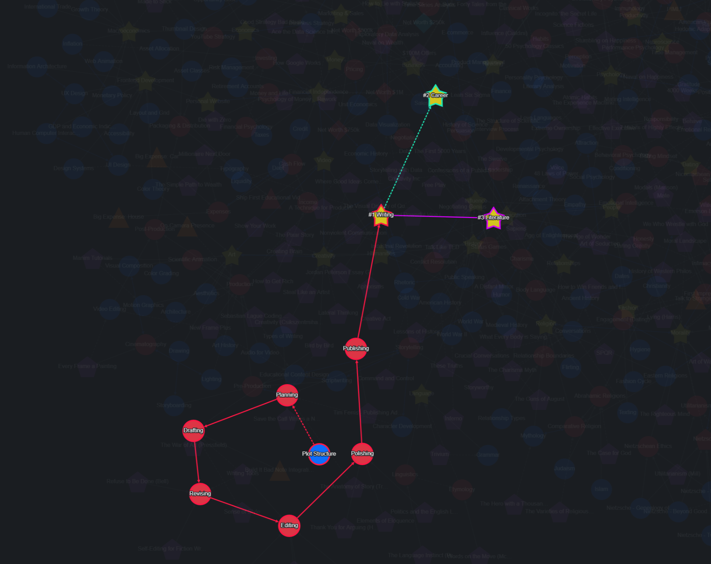
   
  <em> Focus Mode Active on the Plot Structure Node</em>

# Nodes Tab

Click **Nodes** to see your entire network. A physics engine arranges it automatically, pulling connected nodes together, so related work clusters visually. 

    
     
    <em> My Entire Network</em>

Obviously, there is a lot going on here. We will cover tools for how to work with large graphs like mine soon. 

## The Visual Code

### Nodes

Every node's shape and color has meaning. Shape tells you node type, and color tells you node [state](#state).

    
     
    <em> The five node types, their default shapes, and default Open colors. </em>

Regardless of type, **Done** nodes are green and **Blocked** nodes are red. The colors shown in the image above represent the default colors for an **Open** node of each type. 

The only exception to this rule is **Goals**: even when their hard prerequisites are incomplete, they are never red. Instead, they always remain a highly visible yellow, so they stand out as landmarks on the canvas. 

If you prefer a different visual scheme, you can adjust both the shape and color of all nodes in [settings](#settings).

### Edges

[Relationships](#relationships) are encoded with arrows between nodes. From top to bottom, the relationships are hard, soft, and helps. 

  
    
  <em> Relationship Types: hard need, soft need, and helps (synergy) </em>

## Interacting with the Graph

All gestures below work on every tab with a network visualization (Nodes, Details, and Events).

### Mouse & Keyboard Interactions

#### Working with Nodes

| Gesture | Effect |
|---|---|
| Hover | Tooltip with key stats; varies by node type. |
| Left-click | Select the node. A while halo appears around selected nodes. If the node editor is open, it loads with this node's data. |
| Ctrl + left-click | Multi-select. Enables bulk move, delete, and Done toggling. |
| Drag | Reposition on the canvas. |
| Right-click | Open the [Context Menu](#context-menu). The quickest way to load this node into the editor. |
| Delete / Backspace | Remove the selected node(s) with a confirmation prompt. |

#### Navigating the Canvas

| Gesture | Effect |
|---|---|
| Left-click empty canvas | Deselect everything |
| Left-click + drag (on empty canvas) | Group select with a box, like your OS desktop |
| Right-click + drag (on empty canvas) | Pan the viewport |
| Scroll wheel | Zoom in and out |

### Graph Layout Controls
The gear icon in the bottom right corner of each canvas opens the **Graph Layout** panel. It controls how the physics engine arranges the graph that survives the filters.

<table>
  <tr>
    <td valign="top" style="padding-right: 30px;"></td>
    <td valign="top">

| Control | What it does |
|---|---|
| Smooth | Animate layout changes instead of snapping. Most elegant for smaller networks. |
| Freeze | Pause re-layout so hand-placed nodes stay put (more details). |
| Edge Length | The length of the springs between connected nodes. |
| Gravity | How strongly nodes are pulled toward the center. |
| Repulsion | How hard nodes push away from each other. |
| Settle | Re-run the layout physics to untangle the graph. |

</td>
  </tr>
</table>

**Freeze** stops the graph from moving until you turn it off. You'll know it's active because a blue outline surrounds the canvas and a snowflake appears in the top right corner. It's invaluable when editing edges, because without it, the graph re-arranges after each change, making it hard to track the nodes you're working on. Nodes can still be dragged manually while Freeze is on.

The **↺** button beside the panel title restores your saved defaults — set per-tab in Settings.

### Fullscreen

The fullscreen button in the bottom right corner, next to the graph-layout button, expands the canvas to fill the whole window. Marginal on the Nodes tab (already nearly fullscreen), but helpful on Details and Events. Hit the button again or press Escape to exit.

## Helpful Features for Large Networks
The Nodes tab works fine for small networks — say 250 nodes or fewer. Past that it becomes a "dense hairball" that makes it hard to focus on what you want. The Filters sidebar cuts the overview down by attributes; the Details tab gives you a purpose-built local dependency graph around one node.

# Filters Sidebar

Click the filter icon in the top-right corner to open the filters sidebar. Filters apply to every tab except the [Analyze Tab](#analyze-tab) (which always evaluates the network as a whole). They are especially powerful on the screens we just covered: on the Nodes Tab, filtering reduces visual clutter, so the physics engine can group related ideas more effectively. On the [Next Tab](#next-tab), it restricts recommendations to one or more contexts -- giving you added control over the priority ranking algorithm.

## Filter Controls

<table>
  <tr>
    <td valign="top" style="padding-right: 30px;"></td>
    <td valign="top">

| Filter | Function |
|---|---|
| Context | Restrict the app to one or more life areas. |
| Subcontext | Narrow those contexts to more specific domains. |
| Node Type | Show only certain node types (e.g. learns + resources). |
| Min Value | Hide anything rated below a threshold. |
| Min Interest | Hide anything rated below a threshold. |
| Max Effort | Hide anything more difficult than a threshold. |
| Max Time | Hide anything longer than a time limit, using your preferred units |
| Done Toggle | Show or hide complete nodes. Hidden by default. |
| Dormant Toggle | Show or hide dormant nodes. Hidden by default. |
| Communities | Narrow the graph to an algorithmically-detected cluster of related nodes. See [Communities](#communities) below. |
| Memory | When on, your filter selections persist across sessions; when off, they reset on restart. |
| Clear filters | Reset all filters to their default state |

</td>
  </tr>
</table>

  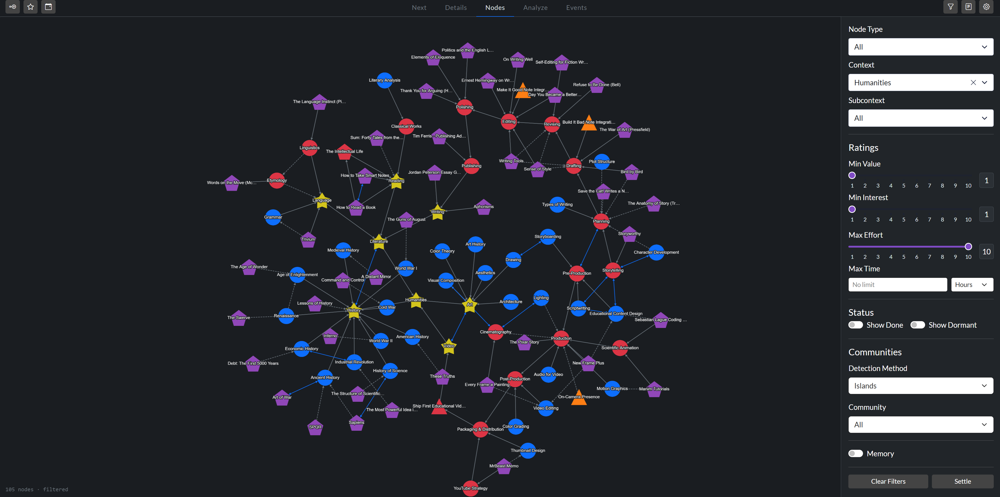
   
  <em> Sandbox Humanities context. You can select multiple contexts & subcontexts at once.</em>

## Communities
The Communities section algorithmically groups related nodes together. Three detection methods are available.

| Method | Description |
|---|---|
| Islands | Self-contained groups with no edges to the rest of the graph. Useful for spotting independent projects, or accidentally orphaned clusters. |
| Clusters | Densely connected groups. Useful for spotting cross-context clusters that don't fit your mental taxonomy. |
| Orphans | Nodes with no edges at all. Almost always a missing link, or a candidate for deletion. |

Pick a detection method, then a specific community from the list. Community names auto-generate from the most common context in the group — slightly more descriptive than "Community 1, 2, 3," but you'll still need to click it to see what nodes are members of the community.

Here is an example. The algorithm identified a cluster named "STEM > Physics," and as you can see, it grabbed a bunch of physics nodes, but also pulled in many chemistry nodes. That is because chemistry is closely related to atomic physics. You will be amazed at how often Skill Tree can find connections between areas that only have one joint edge, but are conceptually related. 

  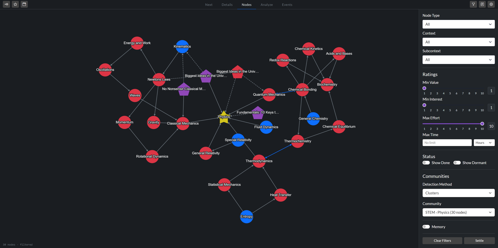
   
  <em> Physics + Chemistry clustering example </em>

## Filter Reminders
When filters are active, the app reminds you by adding a small  message to the lower left corner. You can see this message in the last two screenshots. Without these reminders, you could leave the filter Memory feature on, hammer out a context in the [Next Tab](#next-tab) for weeks, and never notice. It happened to someone I know.

Me. 

It was me.

# Details Tab
The Next Tab tells you *what* project to work on. The Details Tab helps you *understand* it.

## Populating the Tab
The Details tab is empty by default — since it doesn't know what you want the details for. There are three ways to load a project:

<table>
  <tr>
    <td valign="top" style="padding-right: 30px;"></td>
    <td valign="top">

| Path | How it works |
|---|---|
| Search | Type a name into the search bar atop the left panel. Best when you have a specific project in mind. |
| Suggestions | When nothing is selected, the left panel shows a suggestion list. There are up to three sections: any manual overrides, your top three priority goals, and the top five time [containers](#containers) with the highest total value. |
| Context Menu | Right-click a node and pick **Details** in the context menu. The app jumps here with the project loaded.|

</td>
  </tr>
</table>

## Overview of the Details Tab
Once a node is loaded, the tab splits into four panels: node information, a local dependency graph, subtasks, and simulation. These four panels are different views of the same selected project, so changing the dependency controls updates them together.

  
   
  <em> Details Tab with an example project loaded </em>

## Node Information Panel
The top-left panel summarizes the selected node. Most of it is self-explanatory, but a few things deserve a closer look.

**Badges** appear under the node's name. Every node carries at least two — its **status** and **type**, which you can see in the screenshot above, but nodes connected to a [Priority Goal](#setting-priority-goals) carry more:

- **Top-level Goals** get a rank badge (Priority 1, 2, or 3) and a progress bar below their description tracking completion.
- **Goal dependents** get badges like `Hard 1` or `Soft 2`. The number is which Priority Goal the node feeds; Hard / Soft is whether it does so through a hard or soft chain. `Soft 2` reads as "this node contributes, via a soft path, to your second Priority Goal."

The rest of the panel — node stats and three action buttons — reuses functions introduced elsewhere.

| Button | What it does |
|---|---|
| Edit | Opens the node editor. |
| Explain | Opens the [explain](#explain) window. |
| Locate | Briefly pulses the node on the mini-canvas (the same function as the crosshair icon by the node editor search bar). |

## Canvas Panel
Every gesture from the [Nodes Tab](#nodes-tab) is supported on Details too, but the canvas has a different job. Nodes is the overview; Details is the local graph. It starts from the selected node and follows its prerequisites instead of treating every relationship as an undirected hop. Hard Needs are always followed, Soft Needs are optional, and Synergies add only direct partners of the selected node. A synergy partner can bring along its own prerequisites, but synergies never chain endlessly into another part of the network.

The Details canvas also supports two features called History and Focus Mode.

### History
Clicking a node here loads its information into every panel. This is unlike the click behavior on the Nodes canvas, which only selects the node, and fills the node editor with its information if it happens to be open. Because each click swaps out the detailed view, this tab keeps a history. The two arrows beside the search bar in the Node Information Panel let you step forward and backward through your navigation history, like a browser.

### Focus Mode
There are three buttons in the bottom right corner of the canvas. Two of them were introduced elsewhere: [graph layout](#graph-layout-controls) and fullscreen, but one is unique to this tab: the magnifying glass. Clicking this icon switches you to the Nodes Tab, highlights this network, and dims everything else. This is a easy and quick way to see a topic in its broader context.

  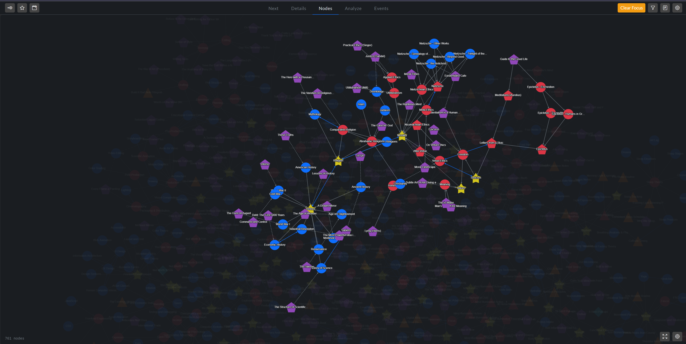
   
  <em> Focus mode: religion goal with synergies on</em>

Hit **Clear Focus** at the top of the canvas to exit.

## Subtasks Panel
The Subtasks table in the lower-left lists every node related to the selected one. 

Two columns stand out: the **relationship** to the selected node — Hard, Soft, or Synergy — and the **priority score**. The most important subtask is normalized to 100, and every other score is its share of that — this is a *local* ranking for this subtree only, not the same as what appears on the Next tab. Blocked and Done nodes have no priority since they're not [eligible](scoring.md#eligibility-and-the-status-cascade) for ranking.

  
   
  <em> Details Tab with Stoicism Goal. </em>

If a subtask has a *direct* edge to the selected node, an **×** appears at the end of its row. Click it to open the **Remove Subtask** modal: choose **Remove Edge** to sever just the link (the node stays in the graph), or **Delete Node** to remove the node entirely. The **+** next to the "Subtasks" header opens a modal for adding a new subtask — either creating a fresh node or linking an existing one.

If the subtree contains any Milestones, they get their own horizontal strip of tiles above the table. Milestones are checkpoints rather than work, so they're kept visually separate from the subtasks you actually grind through.

### Controlling how much you see
The controls in the top-right let you dial the local view from a compact list of immediate prerequisites to the entire project. The graph, Subtasks table, Milestones, and time simulation react together, so they never describe different slices of the project by accident.

| Control | What it does | Default |
|---|---|:---:|
| Soft Needs | Include or exclude soft prerequisites. | On |
| Synergies | Include or exclude synergy partners. | Off |
| Max Depth | Stop after 1–5 relationship steps, or choose **All** for the complete dependency view. | All |
| Show Cross-Links | Reveal additional enabled relationships between nodes already in the view. Turning it off keeps only the links that explain how each node was reached. It never removes nodes. | On |
| Show Done | Whether completed subtasks appear. | Off |
| Hide Blocked | Drop subtasks currently blocked by an incomplete prerequisite. | Off |

  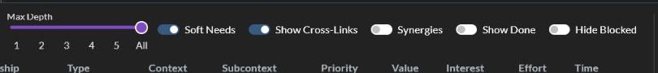
   
  <em>Max Depth limits the dependency view; Show Cross-Links changes only the relationships drawn between nodes already inside it.</em>

For a sprawling Goal with hundreds of descendants, Max Depth is the difference between an unreadable wall of rows and a clean list of actionable items. A depth of 1 is the old "direct children only" view; **All** preserves the complete subtree. Goal progress follows the same depth limit but remains deliberately Hard-only, because soft prerequisites and synergies do not define whether a Goal is complete.

## Time Simulation Panel
Because most nodes carry three time estimates — optimistic, expected, and pessimistic — the app can simulate how long an entire project will take using **Monte Carlo Simulation.** Every time you swap nodes or adjust a filter, the app runs 10,000 simulations of you completing every subtask, keeping in mind your uncertainty about each one. The whole thing takes milliseconds, so it feels instantaneous; if you are ever in a rush and need those few milliseconds, you can lower the trial count in [Settings](#settings).

The feature shines on large, vague, long-horizon Goals. It lets you say with confidence "there's a 10% chance I'll finish this in 2 months, 50% in 3, and 90% in 6." 

| Output | What it tells you |
|---|---|
| Histogram | The full distribution of how long the chain might take across all 10,000 runs. |
| P10 line | Optimistic case — only 10% of runs finish faster than this. |
| P50 line | The median — half of runs finish faster, half slower. |
| P90 line | Pessimistic case — 90% of runs finish faster than this; a sensible "worst realistic" figure. |

In the two screenshots of the Details Tab so far, the simulated distributions looked symmetric. That is because the upper and lower time estimates were close to each other for those particular goals. If they are further apart, the distribution will look different. Here is an example of a project with a long right tail.

  
   
  <em> Time Simulation with high uncertainty (a dense book, in this case) </em>

# Goals Sidebar
Most node types — Learn, Action, and Resource — are ranked by the standard scoring algorithm, and bubble up on the Next tab. Goals are different. Because a Goal sits at the top of a subtree rather than being discrete work, the algorithm doesn't recommend Goals directly. Instead, *you* rank them, and the app uses your ranking to influence the priority of other nodes. The mechanics of this are discussed in the next document of the tutorial.

For now, we can just focus on using the Goals Sidebar. Open it with the star icon in the top-left corner. 

  
   
  <em> Goal Sidebar </em>

The **+** next to "Goals" creates a new one; you can search for existing goals under that. You can also sort them by various criteria. Each one gives the cards a unique visual effect.

| Mode | Order |
|---|---|
| Priority | Ranks every goal by priority. |
| Time | Longest projects first, shortest projects last. Scroll to the top or bottom to see the extremes.|
| Manual | A custom order you set by dragging the cards. The drag handle appears on each card whenever this mode is active. |
| Alphabetical | A→Z by name. |

## Setting Priority Goals

<table>
  <tr>
    <td valign="top" style="padding-right: 30px;"></td>
    <td valign="top">

Your top three goals are your **Priority Goals.** Because Skill Tree respects your autonomy, you must set these explicitly. While the app functions perfectly well without them, designating Priority Goals allows the [scoring](scoring.md#goal-priority-boost) algorithm to apply a priority boost to all tasks in their subtrees.

You can set a goal's priority in two ways: open the context menu in the goal sidebar, as seen on the left, or set the priority field that appears only for goal nodes in the [Node Editor](#node-editor).

</td>
  </tr>
</table>

# Events
Events let you plan for the future without cluttering today. Some things genuinely matter, but you just don't want to think about them yet.

Take dog adoption. You want to learn to care for a dog, but you're not ready until your bonus comes in. You expect that bonus on a certain day, so you wrap all the pet-care tasks in an event set to wake up on that date. In the sandbox, this is the **Adopt a Dog** event — a whole pet-care cluster (Dog Care, Canine Behavior, Dog Training, Find a Vet) tucked away until the day a dog could actually come home.

Sometimes the right moment isn't a date but a milestone. Maybe you'd like to train for a half marathon, but only after you've run a 5k under a certain time. There's no calendar date for that — it depends on finishing other work first. So instead of a date, you tie the event to a node: the sandbox's *Train for a Half Marathon* event wakes up the moment *5k in 25 min* is marked Done.

And sometimes there's no condition at all, just a decision you haven't made yet. *Write a Book* is exactly that — an event with no date and no prerequisite, waiting quietly until you personally decide you're ready to commit.

In every one of these cases, the tasks bundled inside the event sit out of sight until it triggers. The app has a name for tasks in that state: **dormant nodes.** A dormant node isn't shown on the canvas or scored by the algorithm. It's in hibernation until its Event triggers.

## Trigger Types
Every Event has a trigger — the rule that decides when its dormant nodes wake up.

| Trigger | When it fires | Sandbox example |
|---|---|---|
| Date | Automatically, on or after a date you set. | *Adopt a Dog* — fires on 2027-06-01. |
| Node Completion | Automatically, when the nodes you choose are marked Done. | *Train for a Half Marathon* — fires when *5k in 25 min* is completed. |
| Manual | No automatic condition; fires only when you click the **Trigger** button. | *Write a Book* — fires when you decide. |

Date and Node-Completion events keep their **Trigger** button too, so you can always wake an event early if life moves faster than you planned.

### Waiting on Several Nodes
A Node Completion trigger can watch more than one node. When it does, you choose how they combine.

**Any** fires the event as soon as one of the listed nodes is Done. Use it when several different routes should all unlock the same work. Any one of three intro courses might qualify you to start a project.

**All** waits until every listed node is Done. Use it when the work genuinely needs several foundations in place. You might park a whole subject area until writing, a personal website, and a study habit are all finished.

Picking a single node makes the choice moot, so the app just treats it as the plain "when this is done" trigger.

Two details worth knowing. Firing is one-way: once an event fires, un-completing one of its trigger nodes does **not** put the dormant nodes back to sleep. And deleting a trigger node narrows the condition rather than voiding it — the remaining nodes still have to be finished. If you delete the *last* node in the set, the event has nothing left to watch, so it quietly falls back to manual and tells you it did.

## The Events Tab
The Events tab is where you create, edit, and trigger events. Unlike the other tabs, it can't function on its own — it needs an event loaded, and the only way to load one is through the Events sidebar. The tab's empty state knows this, and offers an **Open Events Sidebar** button to get you started.

  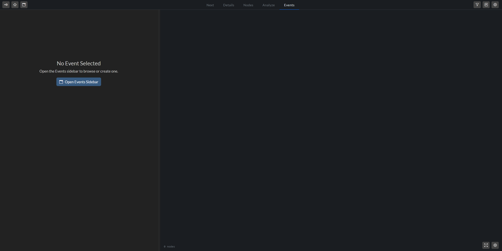
   
  <em> Empty Events tab </em>

### Events Sidebar
Open the sidebar from the calendar icon in the top-left, or via the empty-state button on the Events Tab. 

The sidebar lists every event as a card showing its name, description, trigger, and a node count. Three self-explanatory controls sit at the top. Click any card to load it into the Events Tab. 

Once an event is loaded, the tab splits in two: the **Event Editor** on the left and the **Event Canvas** on the right.

  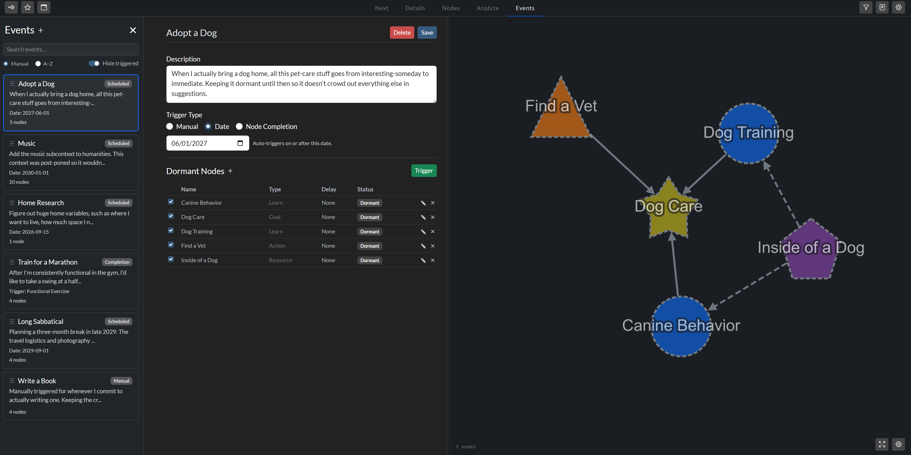
   
  <em>Events tab with an event loaded. </em>

### Event Editor

The event editor lets you manage details about an event. The most useful sections are the trigger type selector and dormant nodes table. Use this table to queue tasks for activation, adjust their activation delay (a post-trigger grace period in days), and select specific nodes to wake up during a manual trigger.

The **Trigger** button fires the event manually. It opens a confirmation modal with two options: **Trigger Checked** (wake only the checked rows) or **Trigger All** (wake everything). Handy when an event has accumulated more dormant nodes than you're ready to release at once.

### Event Canvas
The right side of the tab shows a mini-graph of the selected event's dormant nodes. It works the same way as other canvases. Use it as a sanity check to make sure the nodes are wired how you want them before they go live.

## Event Announcements
When an event triggers — automatically or because you clicked trigger — an announcement message shows up, telling you what nodes just woke up, and which will be waking up soon due to their activation delay.

# Reflection

Once a project is finished, you can reflect on it by clicking the journal icon in the top-right corner. You can do this the moment you finish a project, or batch them every few weeks; the only wrong move is waiting until you have forgotten the details of the work. You have the option to completely disable this feature, but I have found that keeping it on helps train your intuition, making your estimates for future tasks better, and the priority ranking algorithm more effective in turn.

The reflection hub has three tabs:

| Tab | Purpose |
|---|---|
| **Pending Queue** | Completed work awaiting reflection. |
| **Reflection History** | Log of past reflections comparing estimates with actuals. |
| **Excluded** | Archive of nodes permanently bypassed during reflection cycles. |

## Pending Queue

Click **Start Reflection** to open a step-by-step walkthrough. For each project, you record the information shown below.

  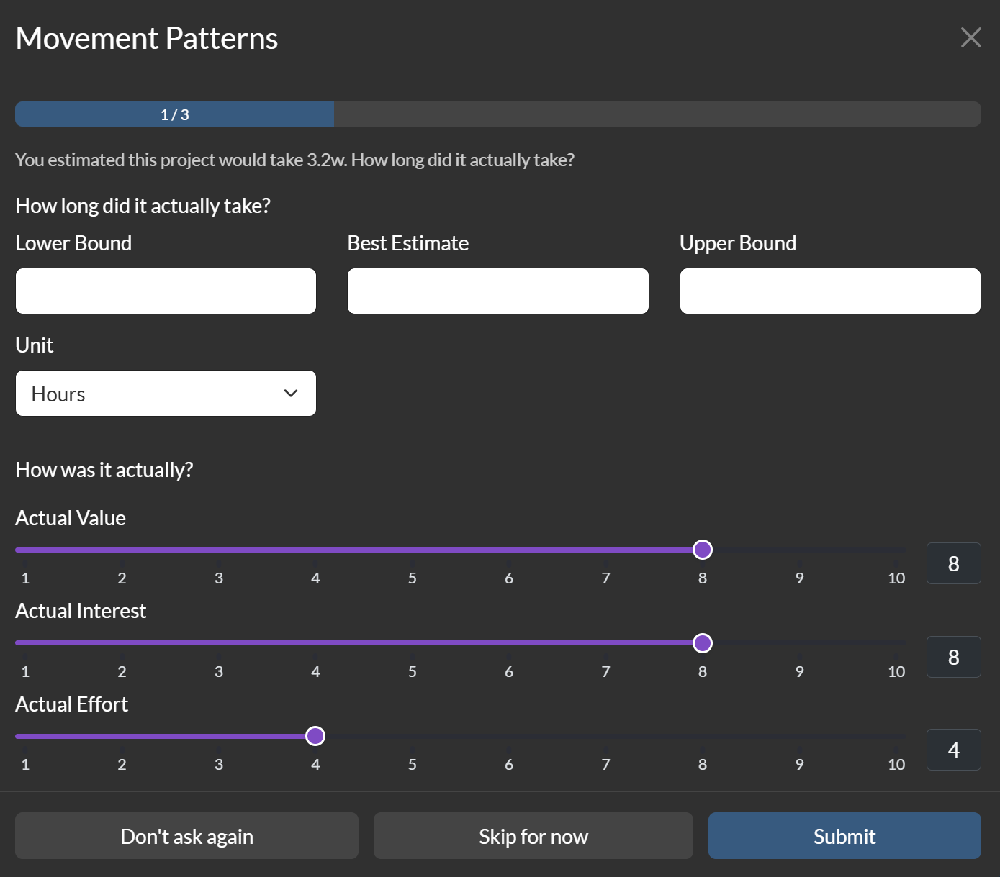
   
  <em>Reflection feature screen after you hit "start reflection" </em>

## Reflection History

A log of your past reflections. The table is searchable and filterable. And it shows estimated vs actual ratings. 

  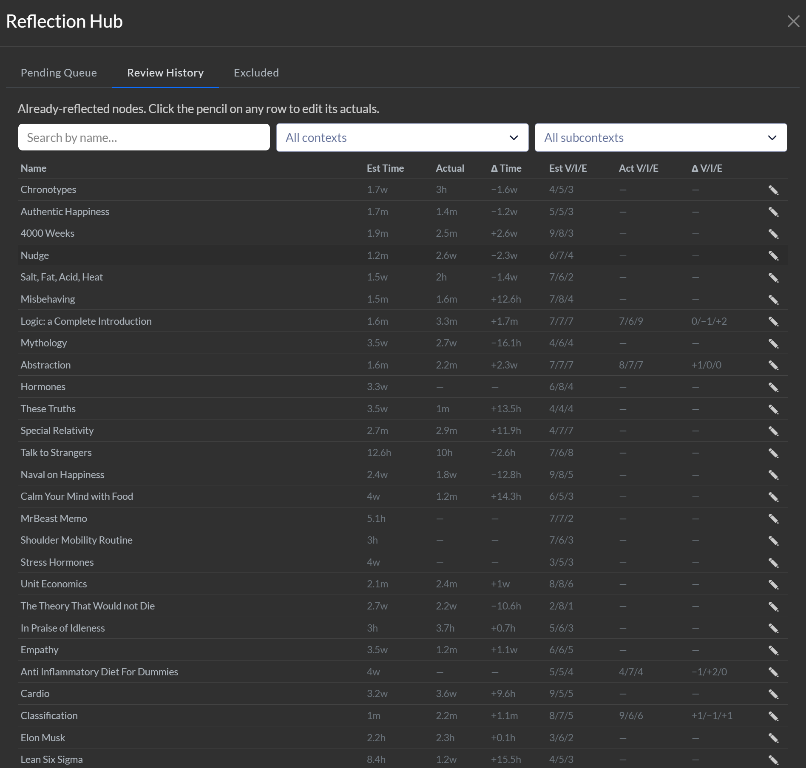
   
  <em> The Reflection History table. </em>

## Excluded

This is your "Don't ask again" archive. Nodes here are quietly bypassed during your reflection cycles. If you ever want to bring an excluded node back into the loop, simply click **Restore** to return it to the pending queue.

# Analyze Tab

The Analyze tab gives you a bird's eye view of your entire network. It helps you understand how you want to spend your time, and how you actually spend it. It also helps you track progress on goals, and uncover structural characteristics of your graph.

## The Overview Strip
The overview strip shows key facts about your graph.

  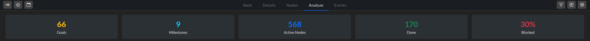
   
  <em>Sandbox overview strip</em>

## Goals
This section displays two visualizations side-by-side. The order of the goals is not arbitrary; they are ranked using the same algorithm as the [Goal Sidebar](#goals-sidebar). A gear icon next to the section title lets you control how many goals are displayed.

  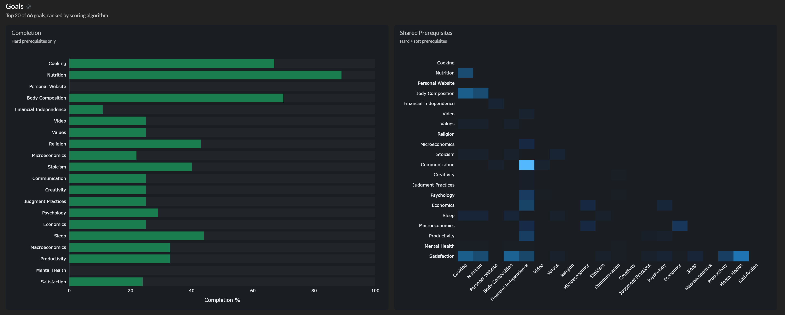
   
  <em> Goal Visualizations </em>

**Completion** (left) shows each Goal's progress. Only hard prereqs are considered (not soft or synergies). As with every chart on the Analyze Tab, there is a helpful tooltip that shows up when you mouse over a graph element.

**Shared Prerequisites** (right) is a heatmap over those same Goals, counting their shared hard and soft prerequisites. Bright cells mean two Goals draw from the same body of work — a sign they share foundational skills. You might want to work on these tasks to "double dip," or you could merge them if you think they are similar enough.

## Contexts

**Hours by Context**. One horizontal bar per context, with each segment representing a subcontext. Hover a segment for its name, node count, and estimated time.

  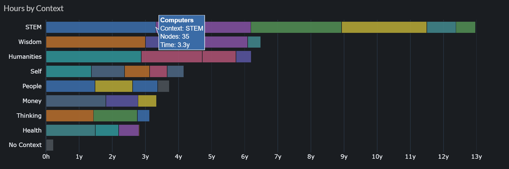
   
  <em> The context distribution of someone who loves science </em>

**Ratings by Context and Reflection Drift.** The left chart shows average Value, Interest, and Effort across all live nodes in each context. The chart on the right shows the same three dimensions, but the average change between your estimates and actual recorded values. Red cells mean you overrated the work going in; blue cells mean you underrated it.

  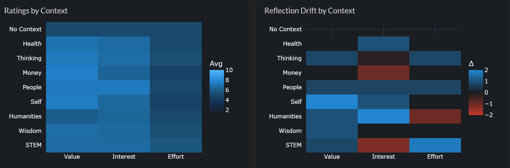
   
  <em> Ratings by Context (left) and Reflection Drift (right). </em>

## Time Estimation Accuracy

When you mark a node Done and complete a [reflection](#reflection), the actual time gets captured alongside your original estimate. These two charts compare them.

**By Node** is a scatter plot with a dashed *y = x* reference line. Each dot is one completed node. Points above the line took longer than expected, and each point below the line was completed faster than expected. Colors are node types, so you can spot whether one type drifts more than others.

**By Context** rolls those same ratios up into one box plot per context. A box to the right of the 1× line means that context's tasks routinely take longer than you expect; a box to the left means they don't take as long.

  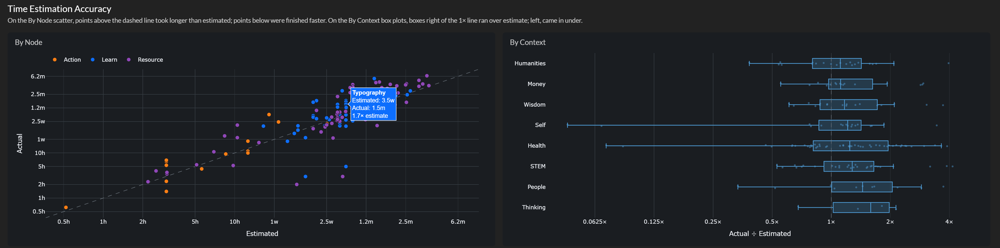
   
  <em> Estimate accuracy By Node (left) and By Context (right). </em>

## Throughput

The Throughput chart shows hours of completed work per calendar bucket, stacked by context. 

  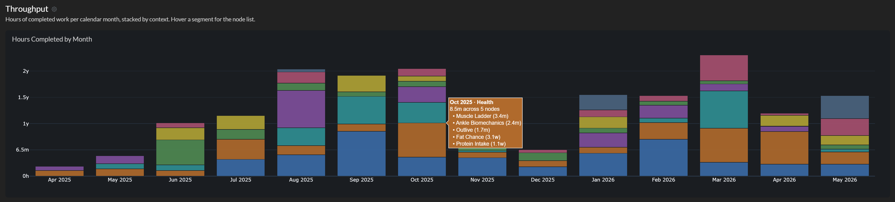
 
<em> The Throughput chart on sandbox data (I am not actually doing 2 years of work in one month). </em>

The gear icon by the title opens three controls: **Granularity** (months, quarters, or years) and **Start / End date** to clip the range. The defaults — quarterly buckets covering the full range of your time with Skill Tree -- work for most uses. Use the gear when you want to zoom in.

  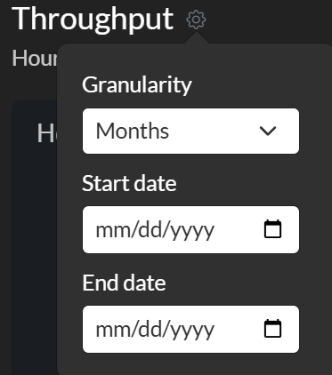
 
<em> Throughput Visualization Filters </em>

Where Hours-by-Context shows your *intent* (active time you plan to spend per context), Throughput shows your *execution* (time you actually delivered, and where). Big mismatches between the two are usually the most interesting finding.

## Graph Structure

The Graph Structure section answers two structural questions about your network.

**Bottleneck** ranks nodes by the number of nodes they unlock (through hard edges). The chart distinguishes direct unlocks from the downstream cascade. The colors of the bars show the status, allowing you to separate "high leverage and available" (not red) from "high leverage but waiting on something else" (red). A large bottleneck may not be the highest-ROI item by itself, but clearing it changes the frontier: whole new chains become eligible, and the Next Tab has more candidates to choose from.

**Hub Nodes** ranks nodes by how integrated they are — concepts with prerequisites feeding in *and* dependents flowing out. The score is calculated as the geometric mean of incoming and outgoing prerequisite edge counts (over Hard and Soft needs), plus a half-point bonus for each synergy partner (Helps edges). Because the prerequisite component drops to zero for pure roots (no prerequisites) and pure leaves (no dependents), this chart surfaces the connective concepts that tie the rest of your graph together. 

  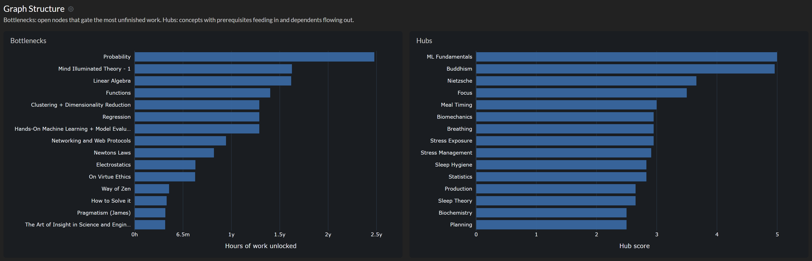
 
<em> Graph Structure</em>

Where Bottleneck asks *what unlocks the most?*, Hub asks *what is most central to my understanding?* 

# Settings

The Settings modal is where you fine-tune how the app looks and behaves. Open it using the gear icon in the top-right corner. 

| Tab | What lives here |
|---|---|
| **Appearance** | Customize node shapes and colors by type, set status colors, and define default physics parameters for the layout engine. It also houses the **Name Linter** toggle, Next tab table size, and a manual **Repair Graph** utility. |
| **Contexts** | Define your primary contexts and subcontexts. This tab also lets you choose the sorting behavior (None, Length, or Alphabetical) for your context and subcontext dropdown menus. |
| **Scoring** | Tune the priority ranking system. Select an [algorithmic profile](scoring.md#scoring-profiles), adjust individual [scoring hyperparameters](scoring.md#profile-hyperparameters) (such as intrinsic value, cascade weights, and synergies), and run performance benchmarks. |
| **Time** | Set your weekly, monthly, and yearly productive hour budgets. You can also configure default time estimates and units for new nodes, and toggle whether the app prompts you for a reflection immediately when a node is marked Done. |
| **Paths** | Specify local file system paths for Obsidian vault and Google Drive integrations, allowing the app to resolve your external links correctly. |

Feel free to experiment with alternative settings because all the major operations have a "restore to defaults" option. 

  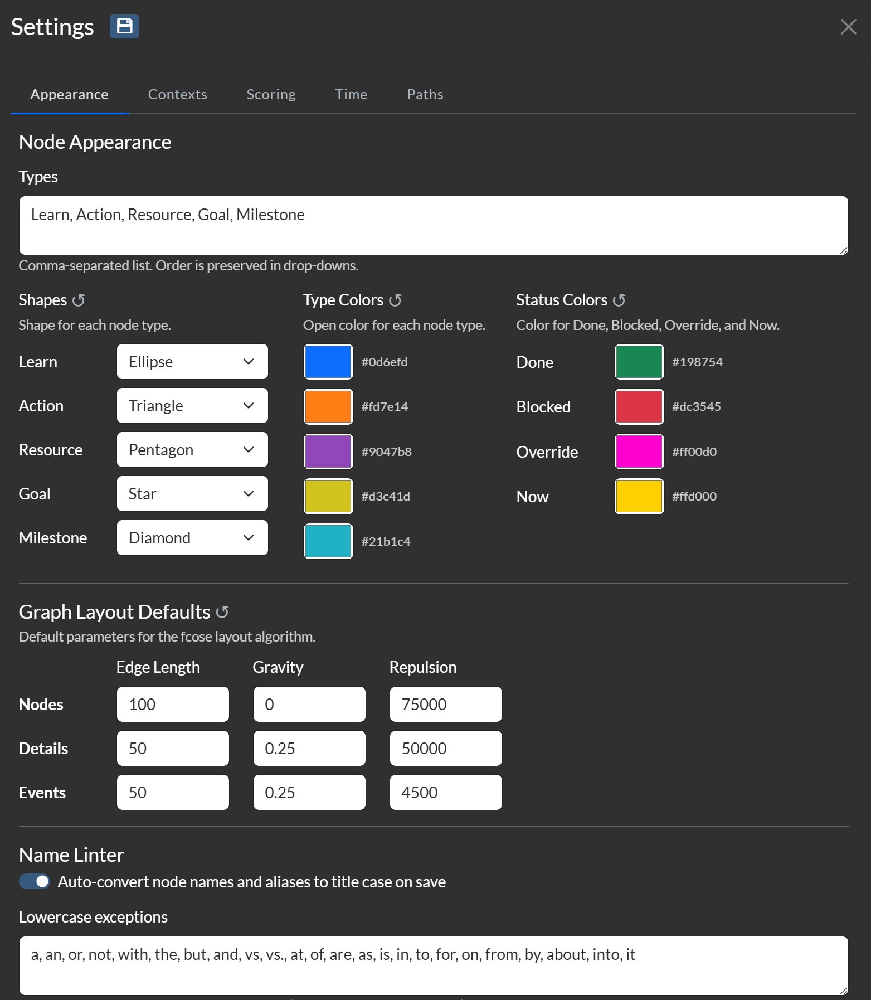
   
  <em> Settings Appearance Tab. Other tabs have a similar style. </em>

# Navigation
## Tutorial
From here, choose your route: go straight to **Modeling** for the practical guide to building your graph, or take the technical path through **Scoring** and **Time** first. 

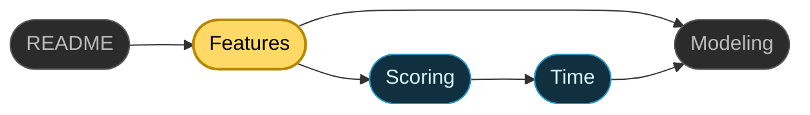

  <a href="../README.md">README</a> · <b>Features</b> · <a href="scoring.md">Scoring</a> · <a href="time.md">Time</a> · <a href="modeling.md">Modeling</a>

## Other Resources

| Resource | What's there |
|---|---|
| [app_architecture.md](app_architecture.md) | The code behind the tour: module layout, tab callbacks, the Cytoscape render pipeline, and persistence. |
