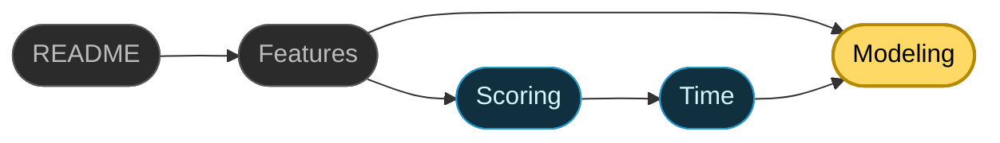

# Modeling Guide

This document covers how to build a graph that Skill Tree can rank effectively. It covers the three most important factors for your graph: **nodes**, **relationships**, and **contexts**. 
# Nodes

## Node Types
The five node types in Skill Tree are not just cosmetic labels. Each answers a distinct conceptual question, and behaves differently under the scoring algorithm. Therefore, it is important to choose the right node type. 

| Type | Core Question | "Done" Means | Time-on-Task | Algorithmic Role |
|---|---|---|---|---|
| **Learn** | What do I want to understand? | I understand it enough to use it | Reading, writing, thinking, building, etc. | Scored for priority. Competes with Resource and Action Nodes directly. |
| **Action** | What do I want to do? | I've done the action | Actually doing the practice | Scored for priority. Competes with Learn and Resource Nodes directly. |
| **Resource** | What do I want to consume? | I have absorbed the material, and feel confident that I won't promptly forget it | Reading, watching, studying, reflecting | Scored for priority. Competes with Learn and Action Nodes directly. |
| **Milestone** | What objective and measurable benchmark do I want to hit? | I hit the target | Time spent on child nodes | Excluded from scoring. Pass-through node for both ranking algorithms |
| **Goal** | What domain, area, or capacity am I developing? | All Hard children are Done | Time spent working on child nodes | Sink node; ranked in the Goals Sidebar and Analyze Tab using the inverted cascade. |

The five types are conceptually distinct, but first-time modelers often hit boundary cases where two seem to overlap. Getting these boundaries right keeps your graph faithful to your intuition and legible to the recommendation engine.

### Learn vs. Resource

When you read a book to learn something, you might wonder whether it should be a Learn node or a Resource node. I'd make two nodes actually: a Learn for the intent, and a Resource for the material that serves it. Connect them with a hard or soft edge, depending on whether the resource is essential to your understanding or merely supportive.

Take Gilbert Strang's Linear Algebra course. You would only work through that because you want to learn linear algebra, so two nodes can feel redundant. But the split reminds you that a topic has more than one path through it, and it leaves room to add other Resources later — alternative introductions, or intermediate and advanced material once you're ready.

### Goal vs. Learn 
Both Goals and Learns can act as containers. But they serve different purposes and follow different rules. They differ along three axes: scope, cost, and ranking.

**Scope.** A Goal is a broad capacity you want to develop. Strength, Eastern Philosophy, Software Engineering. A Learn is a specific topic within a domain. Functional Mobility, Buddhism, Agentic Coding.

**Cost.** A Learn has a cost of its own: the direct time and effort the task takes. A Goal does not. A Goal's cost comes entirely from its children, and only the remaining time of unfinished subtasks counts. The Goal's own effort is omitted because that effort is already counted per node when subtasks are ranked on the Next tab.

**Ranking.** Learn nodes compete with Action and Resource nodes for spots on the Next tab. Goals never appear there. Only their subtasks do. Goals are ranked separately, in the goals sidebar, by a different algorithm. To push a Goal's subtasks higher on the Next tab, give the Goal a priority boost.

### Goal vs. Milestone
The difference between a Goal and a Milestone is objectivity. A Goal is subjective. You decide whether you met it. You can mark it done whenever you like — whether you finished everything you planned or simply judge that what you've done is good enough.

A Milestone is objective. The world decides whether you hit it, with all its brutally honest feedback. It is verifiable and binary. You run the test you defined beforehand, and you either pass or fail. There is no fooling yourself.

A couple examples to show the difference. 

| Context | Goal (Capacity/Domain) | Milestone (Measurable Checkpoint) |
|---|---|---|
| **Health** | Cardiovascular Health | Run a sub-10 minute mile |
| **Money** | Financial Independence | Create a 10k emergency fund |
| **Creation** | Songwriting | Release a 10-track album on Spotify |
| **STEM** | Machine Learning | Place in the top 10% of a Kaggle competition |
| **Social** | Public Speaking | Deliver a 10-minute speech (without wetting yourself) |

Use both Goals and Milestones. Goals cluster related work across every node type — Learn, Resource, Action, and Milestone. Milestones are essential because they tell you whether the competence you think you're building is actually forming.

### Action vs. Milestone 
Both Actions and Milestones are objective, externally verifiable events. But they play different roles. An Action is the practice itself. It has a duration and effort, and finishing it means you completed some well-defined work. A Milestone is a checkpoint with no duration of its own. The difference is in the verb: you *do* an Action, but you *hit* a Milestone.

"Complete a 6-Week Squat Program" is an Action. "Squat 1.5x Bodyweight" is a Milestone.

## Node Size

Choosing the right node type is half the battle. The other half is choosing the right node **size** — its level of abstraction. For Skill Tree to rank and sequence your work well, each node should be a high-level project, typically spanning at least a couple of weeks. Skill Tree's job is to tell you which project deserves your attention this month, not to track every step within it.

### When Nodes Are Too Big
A node like *Master Cooking* or *Start a Blog* is too open-ended. It carries a massive time estimate, which compresses its ROI score ($\text{Value} / \text{Cost}$) and sinks it to the bottom of your list. Worse, it defeats the whole point of Skill Tree: helping you sequence your work.

The fix is divide and conquer — the most fundamental problem-solving technique there is. Breaking down a project helps both you and Skill Tree. An ambiguous mountain of uncertain tasks becomes a set of concrete, actionable steps. The breakdown also surfaces the elements and relationships you'll need later. And you don't have to hold any of it in your head; Skill Tree remembers it for you. By then, the hard part is over. You've discovered the elements, rated them, and related them. Now, all that is left is to decide the order, and that is the part that Skill Tree helps with.

### When Nodes Are Too Small
A thousand nodes — each a microstep — is no better. "It is useful that a subject should be divided into parts," says Seneca, "but not chopped into bits. Just as it is hard to take in what is indefinitely large, it is hard to take in what is infinitely small."

Split too finely and you spend more time on meta-work than on work. Every node has to be estimated — its attributes, and its relationships to similar nodes — and estimated accurately, or Skill Tree has nothing to go on. Therefore, keep things at a high, strategic level. Break a project into granular steps only once you've decided to work on it and marked it "now." (And you may want to do this outside of Skill Tree.)

There's also a more pragmatic reason not to over-divide. A project's value cascades through its edges, and every edge it crosses dilutes that value further. This is by design. It works beautifully when each node is a high-level chunk of work, but it backfires when you split a project beyond all reason.

The rule of thumb: if managing a task in Skill Tree — estimating time, setting ratings, linking edges — takes a noticeable fraction of the time it takes to *do* the task, the node is too small. Let Skill Tree sequence the large blocks of effort, and let your daily checklist handle the micro-tasks once a project starts.

### When Nodes Are Just Right

Here are a few principles that can help you find the sweet spot, and build a clean, heirarchical Skill Tree.

* **Workload-Based Leaf Nodes**: Each leaf should be a meaningful but manageable chunk of effort. For me that's several weeks of work.
* **The Rule of Three**: For complex or unfamiliar domains, aim for three levels of abstraction and three children per parent. That caps your tree at 27 leaves, so you never focus on more than 4% of the problem at once. The constraint aids focus, forces priority, and prevents scope creep.
* **Target Independence**: Divide goals into sub-problems that are as independent as possible. Independence lets you parallelize work or switch tasks without breaking other dependencies.
* **Be Bold**: If you know nothing about a domain, guess. Deconstruct the problem as best your intuition allows. Methodically working through even a flawed division will teach you enough to restructure the tree intelligently later.

### Leveraging Containers to Manage Abstraction
When you have a group of related topics or materials you want to track individually, don't chain them together with endless Soft or Hard links. That creates clutter and dilutes priority scores. Use a **container** instead: a single parent that groups them. A container inherits its ratings and time estimate from its children.

# Relationships
If nodes are the stages of your journey, relationships (edges) are the pathways between them. They determine how value propagates, how status changes, and what the Next tab recommends. Edges come in two categories: **directed prerequisites** (Hard and Soft Needs) and **bidirectional synergies** (Helps).

## Edge Types
Skill Tree uses three distinct edge types to model your plan:

| Edge Type | Visual Style | Blocking? | Core Question | Math Effect |
|---|---|---|---|---|
| **Hard Need** | Solid Gray | **Yes** | Can I start the target without completing the source? | Blocks target eligibility. Strongest cascade (60% by default). |
| **Soft Need** | Dashed Gray | No | Will doing the source first make the target easier or better? | Does not block. Moderate value cascade (40% by default). |
| **Helps (Synergy)** | Bidirectional Blue | No | Do these two tasks mutually reinforce and amplify each other? | Does not block, does not cascade. Supplies value through a different mechanism. |

### Edge Direction for Hard and Soft Needs
For prerequisites, edge direction is the single most important thing to get right. Arrows flow from source to target — from step one to step two. Read $A \rightarrow B$ as "A supports, leads to, or unlocks B." Get it backwards and the status cascade will lock you out of your most fundamental tasks.

### The Two Roles of Hard Edges
Hard edges are strict blockers, and they serve two purposes.

The first is logical necessity: a true structural dependency, where the target is impossible to start until the source is done. *Boil Water* ➔ *Cook Pasta*.

The second is personal preference. I could technically have started *Beyond Good and Evil* before *How to Take Smart Notes*. I just wanted the note-taking book first, so I'd retain what I read.

Either way, a hard edge says the same thing: $A$ *must* come before $B$.

### When to Use Soft Edges
Soft edges represent helpful prep work, not strict barriers. Use one when completing the source makes the target easier, faster, or higher quality — but you still want the freedom to start the target early if inspiration strikes.

Buying a sturdy tripod for your camera makes capturing a sunset landscape much easier and prevents blur. But a soft edge means you aren't blocked from shooting handheld if a beautiful scene appears on your walk.

### Synergies: Bidirectional Reinforcement
Don't treat a synergy as a weaker Soft prerequisite. The two operate on different axes. Prerequisites are about chronological order: one node should come before another. Synergies are about **mutual reinforcement**. That's why they're the only bidirectional edges in Skill Tree.

To test whether a pair qualifies, ask whether the combination is *more than the sum of its parts*. If doing both lands harder than doing each alone, it's a synergy. Then sanity-check the symmetry: you should be able to state the reinforcement in both directions and have each feel true. A synergy says $X \leftrightarrow Y$. If only one direction holds — $X$ helps $Y$, but $Y$ doesn't help $X$ — what you have is a Soft prerequisite.

The strongest synergies tend to bridge contexts. Take Gardening ↔ Biology. Each one changes how you experience the other. Biology explains why a plant wilts or thrives in a given soil; gardening gives biology a slow, living laboratory in your backyard. Neither is a prerequisite for the other, but doing both makes each richer than it would be alone.

A few patterns look like synergy but aren't:

- **Shared topic** — Covering similar content isn't enough. Group the nodes under a common parent instead.
- **Both are just interesting** — Synergies are about *relationships* between topics, not your interest in them. The app already accounts for interest through a different mechanism.
- **I want to work on these around the same time** — That's a sequencing preference. Use a hard or soft edge.

Finally, resist piling many synergies onto a single hub node. The boost has diminishing returns, so two or three genuine partners beat a fan of weak ones.

# Contexts & Subcontexts

Contexts and subcontexts are the tags you use to divide your life into distinct domains (for example, `Career`, `Health`, `Relationships`). Defining them well helps in a few ways.

First, they let you fine-tune the recommendation algorithm through context weights. Mark a context as more or less important, and Skill Tree adjusts how often it recommends work from it. A behind-the-scenes safeguard keeps this honest: Skill Tree won't recommend more from a context just because you've defined more projects there. A context you know well is easier to divide and conquer, but knowing more about it doesn't make it more important. So Skill Tree deliberately surfaces work from sparse contexts now and then, keeping you developing across all your domains.

Second, contexts let you filter your graph, so you see exactly what you want when you want it. You can scope recommendations and most visuals to just the contexts you care about. The Analyze tab also offers several visualizations of how your effort is distributed across contexts.

## Picking Your Contexts
Treat top-level contexts as the major pillars of your life, and aim for four to eight of them. Too few, and unrelated work gets lumped together. Too many, and the partitions stop meaning anything. A useful test: if you ignored one context for six months, would something important in your life clearly suffer? If not, it probably belongs as a subcontext under another pillar.

Keep your contexts as independent as possible, so each new project has a clear home. When two contexts overlap, some related ideas land in A and the rest in B. 

Don't worry about getting contexts perfect on the first try. The Context Migration feature lets you reassign nodes easily. It appears whenever you change the context list in Settings, asking how you want to reassign the now-invalid nodes.

## Using Subcontexts
Subcontexts let you organize sub-themes inside a pillar without splitting it into separate top-level domains. For example, `Health/Nutrition` and `Health/Exercise` both live under Health. They stay grouped as one life area while remaining distinguishable. Reach for a subcontext whenever a context starts to hold two clearly different kinds of work.

## Cross-Context Work
Once your contexts are set up, actively look for projects that sit at the intersection of two of them. A software tool that solves a personal health problem, or a writing project that draws on a hobby, tends to be more valuable than work living entirely inside one pillar. This is often the best place to look for synergy edges.

# Common Problems and Fixes 
After using Skill Tree for a while, I noticed patterns that made my modeling less effective. They have nothing to do with the app's features, and everything to do with how I chose to use them.

| Problem | What it Looks Like | Why it's Bad | How to Fix |
|---|---|---|---|
| **Unloved Orphans** | A node with no incoming or outgoing edges. | It receives no cascade value, so it never gets recommended and is easily forgotten. | Find a relationship for it — or delete it. (Use the **Orphans** community filter to find these.) |
| **Spiderwebs** | A dense mesh of criss-crossing edges *within a single context*. Almost unavoidable once you have a large network and view every context at once. | Visual clutter and less meaningful priority scores. | Build clean, hierarchical relationships with containers and deliberate edges. Topical relatedness doesn't deserve an edge. Use contexts and subcontexts for high-level grouping. |
| **Indefinite Actions** | An Action node representing a permanent habit (e.g., Exercise, Meditate, Read). | Action nodes are meant to be completed. A habit that is never done will sit on your list forever — or have its Done state reversed the moment you stop. | Model habits as fixed-period experiments ("6-Week Running Protocol", "Fast 3 Hours Before Bed"). When the experiment ends, mark it Done and reflect on whether to keep the habit. |

# Navigation
## Tutorial
That's the end of the tour. You now know the core features of the app, and if you read the technical documents too, how it works. All that is left to do is to try out Skill Tree. [Setup.md](setup.md) will get you started in a few minutes.

  <a href="../README.md">README</a> · <a href="features.md">Features</a> · <a href="scoring.md">Scoring</a> · <a href="time.md">Time</a> · <b>Modeling</b>

## Other Resources

| Resource | What's there |
|---|---|
| [setup.md](setup.md) | How to clone Skill Tree and run it locally — the last step before building your own graph. |
| [graph_manager.py](../graph_manager.py) | Edge creation, cycle detection, and the status cascade that the rules in this guide rely on. |
| [app_architecture.md](app_architecture.md) | How the graph you build flows through the app, from mutation to re-rank. |

