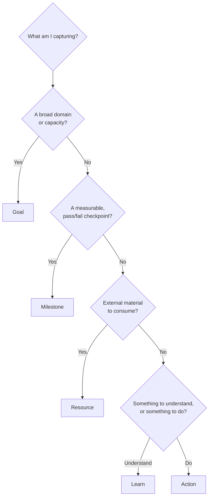
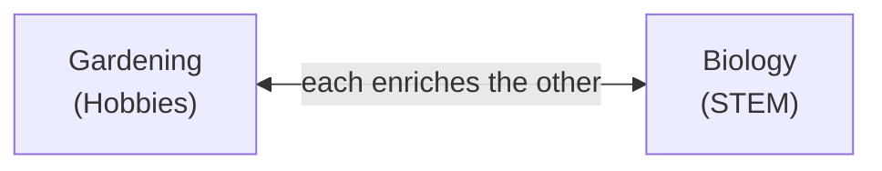

# Modeling Guide

This document covers how to build a graph that Skill Tree can rank effectively. Three things matter: **nodes**, **relationships**, and **contexts**. Relationships deserve emphasis up front, because their two families behave in categorically different ways. Directed prerequisites cascade value downstream. Bidirectional synergies do not. The tips here are what I learned building my own graph through trial and error. As a bonus, they also produce a more pleasing result — a true skill tree, rather than the dense hairball that so many large graphs become. 

# Nodes

## Node Types
The five node types in Skill Tree are not just cosmetic labels. Each answers a distinct conceptual question and behaves differently under the scoring algorithm. 

### An Overview of the Node Types

| Type | Core Question | "Done" Means | Time-on-Task | Algorithmic Role |
|---|---|---|---|---|
| **Learn** | What do I want to understand? | I understand this enough to use it | Reading, writing, thinking, building, etc. | Scored for priority. Competes with Resource and Action Nodes directly. |
| **Action** | What do I want to do? | I've done the action | Actually doing the practice | Scored for priority. The primary driver of "doing." |
| **Resource** | What do I want to consume? | I have absorbed the material, and feel confident that I won't promptly forget it | Reading, watching, studying | Scored for priority. Competes with Learn and Action Nodes directly. |
| **Milestone** | What objective and measurable benchmark do I want to hit? | I hit the target | Time spent on child nodes | Excluded from scoring. Pass-through node for other nodes |
| **Goal** | What domain, area, or capacity am I developing? | All Hard children are Done | Time spent working on child nodes | Sink node; ranked in the sidebar and Analyze tab using the inverted cascade. |

When you are unsure which type a project should be, this decision tree resolves most cases:



### Key Distinctions

The five types are conceptually distinct, but first-time modelers often hit boundary cases where two seem to overlap. Getting these boundaries right keeps your graph faithful to your intuition and legible to the recommendation engine.

#### Learn vs. Resource

When you read a book to learn something, you might wonder whether it should be a Learn node or a Resource node. I'd make both: a Learn for the intent, and a Resource for the material that serves it. Connect them with a hard or soft edge, depending on whether the resource is essential to your understanding or merely supportive.

```
Resource -> Learn
```

Take Gilbert Strang's Linear Algebra course. You would only work through it because you want to learn linear algebra, so two nodes can feel redundant. But the split reminds you that a topic has more than one path through it, and it leaves room to add other Resources later — alternative introductions, or intermediate and advanced material once you're ready.

#### Goal vs. Learn 
Both Goals and Learns can act as containers, but they serve different purposes and follow different rules in Skill Tree. 

The first distinction is scope. A Goal is a broad, often ambitious capacity you want to develop — Strength, Eastern Philosophy, Software Engineering. A Learn is a specific topic within such a domain — Compound Lifts, Buddhism, Agentic Coding. 

Scope dictates how each type estimates value and cost. A Learn's value comes from its own interest and utility, plus whatever it unlocks downstream. Learning Chords is useful on its own, for music appreciation, and it also unlocks composing your own music one day. Its cost is just the task itself — the direct time and effort. 

Goals have intrinsic and total value too, computed much as a Learn's is. But a Goal has no cost of its own. Its cost comes entirely from its children, and only the remaining time of unfinished subtasks counts. The Goal's own effort is omitted, because effort is already accounted for per node when subtasks are recommended on the Next tab.

The two types also rank differently. Learn nodes compete directly with Action and Resource nodes for spots on the Next tab. Goals never appear there — only their subtasks do. Goals are ranked separately, in the goals sidebar, by a different algorithm. To push a Goal's subtasks higher on the Next tab, give the Goal a priority boost. 

#### Goal vs. Milestone
The difference between a Goal and a Milestone is objectivity. A Goal is subjective; a Milestone is objective. You decide whether you met a Goal. The world — with all its brutally honest feedback — decides whether you hit a Milestone. You can mark a Goal done whenever you like, whether you finished everything you planned or simply judge that what you've done is good enough. A Milestone is verifiable and binary. There is no fooling yourself. You run the test you defined beforehand, and you either pass or fail. 

A couple examples to show the difference. 

| Context | Goal (Capacity/Domain) | Milestone (Measurable Checkpoint) |
|---|---|---|
| **Body** | Cardiovascular Health | Run a sub-10 minute mile |
| **Money** | Financial Independence | Create a 10k emergency fund |
| **Creation** | Songwriting | Release a 10-track album on Spotify |
| **STEM** | Machine Learning | Place in the top 10% of a Kaggle competition |
| **Social** | Public Speaking | Deliver a 10-minute speech (without wetting yourself) |

Use both Goals and Milestones. Goals cluster related work across every node type — Learn, Resource, Action, and Milestone. Milestones are essential because they tell you whether the competence you think you're building is actually forming.

#### Action vs. Milestone 
Both Actions and Milestones represent objective, externally verifiable events, but they play different roles. An Action is the practice or execution itself. It has a clear duration and effort, and finishing it means you completed some well-defined work. "Complete a 6-Week Squat Program" is an Action. A Milestone is a checkpoint or threshold with no duration of its own. "Squat 1.5x Bodyweight" is a Milestone. 

The primary difference lies in the verb: you *do* an Action, but you *hit* a Milestone. 

Because you don't *do* a Milestone directly, the algorithm leaves Milestones off the Next tab. Misclassify one as an Action and the app will keep recommending it as work, even though the real work lives in the Learn, Action, and Resource nodes beneath it. 

## Node Size

Choosing the right node type is half the battle. The other half is choosing the right node **size** — its level of abstraction. For Skill Tree to rank and sequence your work well, nodes should represent high-level projects, each typically spanning at least a couple of weeks.

Skill Tree's job is to tell you which project deserves your attention this month — not to track every step within it.

**Diagram: the same project modeled three ways — one giant monolithic node, a sprawl of tiny micro-nodes, and the clean mid-sized tree that sits between them.**

### When Nodes Are Too Big
A single node that says *Master Cooking* or *Start a Blog* is too open-ended. A monolithic node should carry a massive time estimate, which compresses its ROI score ($\text{Value} / \text{Cost}$) and sinks it to the bottom of your suggestion list. Worse, it defeats the whole point of Skill Tree, which is to help you sequence your work.

Breaking a large project into smaller components is the most fundamental problem-solving technique there is. Divide and conquer empowers both you and Skill Tree. It helps you because an ambiguous mountain of uncertain tasks becomes a set of concrete, actionable steps. Working through that breakdown also surfaces the elements and relationships you will need to understand later. And you don't have to hold any of it in your head. Skill Tree's unassailable memory and scoring can carry it for you. You have already done the hard part: you figured out what matters, how the pieces relate, and what each is worth in value, interest, effort, and time. Choosing the order, by comparison, is the easy job — and that is the job you hand to Skill Tree. Tell it what you truly believe, and it will help you work on what truly matters.

### When Nodes Are Too Small
A thousand nodes — each a microstep in a project — is no better. "It is useful that a subject should be divided into parts," says Seneca, "but not chopped into bits. Just as it is hard to take in what is indefinitely large, it is hard to take in what is infinitely small."

Too many nodes, and you spend more time on meta-work than on work. Every project you create has to be estimated — its attributes, and its relationships to similar projects — and estimated accurately, or Skill Tree has nothing to go on. Keep things at a high, strategic level. Break a project into granular steps only once you have decided to work on it and marked it "now."

There is also a less elegant, more pragmatic reason not to over-divide. A project's value cascades through its edges, and each edge it crosses dilutes that value further. This is by design. It works beautifully when each node is a high-level chunk of work, but it backfires when you split a project beyond all reason.

In essence, if managing a task in Skill Tree — estimating time, setting ratings, linking edges — takes a noticeable fraction of the time it takes to actually *do* the task, the node is too small. Keep Skill Tree focused on sequencing larger blocks of effort, and let your daily checklist handle the micro-tasks once the project starts.

### When Nodes Are Just Right
The sweet spot applies **divide and conquer** to build a clean, hierarchical tree of relatively independent elements.

[the four bullets — Workload-Based Leaf Nodes, Rule of Three, Target Independence, Divide to Learn — unchanged]

### Leveraging Containers to Manage Abstraction
When you have a group of related topics or materials you want to track individually, don't chain them together with endless Soft or Hard links. That creates clutter and dilutes priority scores. Use a **container** instead, grouping them under a single parent. A container is a node that inherits its ratings or time estimate from its children — the nodes that point to it.

# Relationships
If nodes are the stages of your journey, relationships (edges) are the pathways connecting them. They dictate how value propagates, how status changes, and ultimately, what the Next tab recommends. Crucially, edges are divided into two categories: **directed prerequisites** (Hard and Soft Needs) and **bidirectional synergies** (Helps relationships). 

## Edge Types
Skill Tree uses three distinct edge types to model your plan:

| Edge Type | Visual Style | Blocking? | Core Question | Math Effect |
|---|---|---|---|---|
| **Hard Need** | Solid Gray | **Yes** | Can I start the target without completing the source? | Blocks target eligibility. Strongest cascade (60% by default). |
| **Soft Need** | Dashed Gray | **No** | Will doing the source first make the target easier or better? | Does not block. Moderate value cascade (40% by default). |
| **Helps (Synergy)** | Bidirectional Blue | **No** | Do these two tasks mutually reinforce and amplify each other? | Does not block. Does not cascade. Uses a different mechanism of supplying value. |

### Edge Direction for Hard and Soft Needs
For directed prerequisites, edge direction is the single most important thing to get right. Arrows always flow from source to target, from step one to step two. The relationship defined here ($A \rightarrow B$) can be read as "A supports, leads to, or unlocks B." If you get this backwards, the status cascade will lock you out of your more fundamental tasks. 

### The Two Roles of Hard Edges
Hard edges act as strict blockers, serving two distinct purposes. The first is logical necessity, representing a true structural dependency where the target is physically impossible to start without completing the source (such as *Boil Water* ➔ *Cook Pasta*). The second is personal preference. While I could've technically started *Beyond Good and Evil* before reading *How to Take Smart Notes*, I just wanted to read the note-taking book first, so I could retain what I read. Either way, the purpose of a hard edge is the same: to say that $A$ *must* come before $B$.

### When to Use Soft Edges
Soft edges represent helpful prep work rather than strict logical barriers. You should use a soft edge when completing the source node will make the target easier, faster, or higher quality — but you still want the flexibility to start the target early if inspiration strikes. 

For example, buying a sturdy tripod makes capturing sharp landscape photos at sunset much easier and prevents blur. But a soft edge ensures you aren't blocked from shooting handheld if a beautiful scene appears on your walk.

### Synergies: Bidirectional Reinforcement
Do not treat synergy edges as a weaker version of a Soft prerequisite. They operate on an entirely different axis. Prerequisites are about chronological order, establishing that one node should precede another. Synergies, in contrast, are about **mutual reinforcement**. This is why synergies are the only bidirectional edges in Skill Tree.

To decide whether a pair genuinely qualifies, ask whether the combination is *more than the sum of its parts* — if doing both lands harder than doing each alone, it's a synergy. Next, sanity-check the symmetry: you should be able to state the reinforcement in both directions and have each feel true. Recall that a synergy edge says that $X \leftrightarrow Y$. If only one direction holds (X helps Y, but Y doesn't help X), what you actually have is a Soft prerequisite. 

The strongest synergies tend to bridge contexts. A good example is Gardening ↔ Biology: each one materially changes how you experience the other — biology explains why a plant wilts or thrives in a given soil, and gardening gives biology a slow, living laboratory in your backyard. Neither node is a prerequisite for the other, but doing both turns each into something richer than it would be on its own. 



*A true synergy reads the same in both directions, and the strongest ones bridge two contexts. Neither node gates the other.*

A few patterns that look like synergy but aren't:

- **Shared topic** — You don't need a synergy edge just because both nodes cover similar content. Group them under a common parent instead.
- **Both are just interesting** — Synergies are about the relationships between topics themselves, not your interest in them. The app already considers your personal interest through a different mechanism, so you don't need to encode that here.
- **I want to work on these around the same time** — that's a sequencing preference; use hard or soft edges instead.

Also resist piling many synergies onto a single "hub" node; the boost has diminishing returns, so two or three genuine partners beat a fan of weak ones.

# Contexts & Subcontexts

Contexts and subcontexts are the tags you use to divide your life into distinct domains (for example, `Career`, `Health`, `Relationships`). Defining them well helps in a few ways.

First, they let you fine-tune the recommendation algorithm through context weights. Mark a context as more or less important, and Skill Tree adjusts how often it recommends work from it. A behind-the-scenes trick also keeps the algorithm honest: it won't recommend more from a context just because you've defined more projects there. A context you know well is naturally easier to divide and conquer, but knowing more about it doesn't make it more important. So Skill Tree deliberately surfaces work from sparse contexts now and then, keeping you developing across all your domains.

Second, contexts let you filter your graph, so you see exactly what you want when you want it. You can scope recommendations and most visuals to just the contexts you care about. The Analyze tab also offers several visualizations of how your effort is distributed across contexts.

## Picking Your Contexts
Treat top-level contexts as the major pillars of your life and aim for somewhere between four and eight of them. Too few and unrelated work gets lumped together; too many and the partitions stop meaning anything. A useful test: if you imagined ignoring one of your contexts for six months, would something important in your life clearly suffer? If not, it probably belongs as a subcontext under another pillar instead.

I recommend keeping your contexts as independent as possible, so each new project has a clear home. With two overlapping contexts, some related ideas land in A and the rest in B. Aim for pragmatic classification here, not philosophical elegance.

Don't worry about getting contexts perfect on the first try. A Context Migration feature lets you reassign nodes easily. It appears whenever you change the context list in Settings, asking how you want to reassign the now-invalid nodes.

## Using Subcontexts
Subcontexts let you organize sub-themes inside a pillar without splitting it into separate top-level domains. For example, `Health/Nutrition` and `Health/Exercise` both live under Health, so they stay grouped as one life area while still being distinguishable from each other. Reach for a subcontext whenever you notice a context starting to contain two clearly different kinds of work. 

## Cross-Context Work
Once your contexts are set up, actively look for projects that sit at the intersection of two of them. A software tool that solves a personal health problem, or a writing project that draws on a hobby, tends to be more valuable than work that lives entirely inside one pillar. This is often the best place to look for synergistic edges. 

# Common Problems and Fixes 
After using Skill Tree for a while, I noticed patterns that made my modeling less effective. They have nothing to do with the app's features, and everything to do with how I chose to use them.

| Problem | What it Looks Like | Why it's Bad | How to Fix |
|---|---|---|---|
| **Unloved Orphans** | A node with no incoming or outgoing edges. | Because it does not receive cascade value, it will never get recommended, and it is easily forgotten. | Find a relationship for your orphan — or kill it. (Use the **Orphans** community filter to find these). |
| **Spiderwebs** | A dense mesh of criss-crossing edges within a single context | Visual clutter; less meaningful priority scores | Build clean, hierarchical relationships using containers and thoughtful edges. Topical relatedness does not deserve an edge. Use contexts and subcontexts for high-level grouping. |
| **Indefinite Actions** | An Action node representing a permanent habit (e.g., Exercise, Meditate, Read). | Action nodes are meant to be completed. A habit, one that is truly never done, will either sit on your list indefinitely, or may have its Done state reversed (if you ever stop doing the habit) | Model starting and stopping habits as fixed-period experiments (e.g., "6-Week Running Protocol", or "Fast 3 hours before bed"). After completing the experiment, mark it as Done, and reflect on whether you want to keep the habit. |

**Diagram: a tangled "spiderweb" of criss-crossing edges within one context, beside the same nodes reorganized into a clean hierarchy under a container.**

# Navigation
## Tutorial


[README](../README.md) · [Features](features.md) · [Scoring](scoring.md) · [Time](time.md) · **Modeling**

## Other Resources

| Resource | What's there |
|---|---|
| [graph_manager.py](../graph_manager.py) | Edge creation, cycle detection, and the status cascade that the rules in this guide rely on. |
| [app_architecture.md](app_architecture.md) | How the graph you build flows through the app, from mutation to re-rank. |


