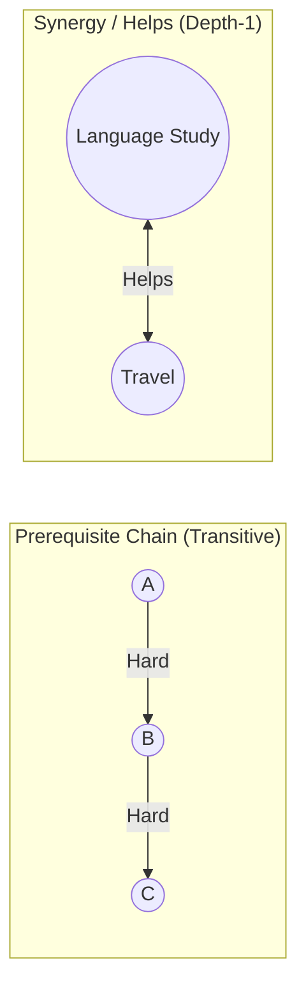

# Modeling Guide

This document covers how to make a graph that Skill Tree can rank effectively. This requires choosing the right **node types** and specifying the correct *relationships** between them. As an added bonus, these tips will produce a more visually pleasing graph that resembles a true skill tree rather than a "dense hairball" that encumbers many large graphs. 

# Nodes

## Choosing the Right Type of Node
The five node types in Skill Tree are not just cosmetic labels. Each answers a distinct conceptual question and behaves differently under the scoring algorithm. 

### An Overview of the Node Types

| Type | Core Question | "Done" Means | Time-on-Task | Algorithmic Role |
|---|---|---|---|---|
| **Learn** | What do I want to understand? | I understand this enough to use it | Reading, writing, thinking, building, etc. | Scored for priority. Competes with Resource and Action Nodes directly. |
| **Action** | What do I want to do? | I've done the action | Actually doing the practice | Scored for priority. The primary driver of "doing." |
| **Resource** | What do I want to consume? | I have absorbed the material, and feel confident that I won't promptly forget it | Reading, watching, studying | Scored for priority. Competes with Learn and Action Nodes directly. |
| **Milestone** | What objective and measureable benchmark do I want to hit? | I hit the target | Time spent on child nodes | Excluded from scoring. Pass-through node for other nodes |
| **Goal** | What domain, area, or capacity am I developing? | All Hard children are Done | Time spent working on child nodes | Sink node; ranked in the sidebar and Analyze tab using the inverted cascade. |

### Key Distinctions

While the five node types are conceptually distinct, first-time modelers often struggle with boundary cases where nodes seem to overlap. Understanding the subtle boundaries between the node types ensures that your graph accurately reflects your intuition and interfaces correctly with the recommendation engine.

### Goal vs. Learn 
Although both Goals and Learns can be containers, they serve different purposes, and operate under different rules in Skill Tree. 

The first major distinction is scope. A Goal represents a broad, often ambitious capacity that you want to develop. Examples include Strength, Eastern Philosophy, and Software Engineering. A Learn node, on the other hand, represents a specific topic within each discpline, such as Compound Lifts, Buddhism, or Agentic Coding. 

This difference in scope dictates how the two node types estimate value and cost. A Learn node's value is determined by its own interest and utility, plus whatever it unlocks next in your tree. Learning Chords, for instance, is useful in its own right (for music appreciation), but it also unlocks the ability to compose your own music one day. And the cost of learning Chords is simply the cost of the task itself, its direct time and difficulty. 

Goals have instrisic and total value too, computed in a simliar way as learn nodes, but they don't have their own cost. Costs are soley derived from child nodes. And crucially, only the remaining time of unfinished subtasks are considered; the goal's own difficulty is omitted from the cost calculation entirely, as effort is implicitly considered on a per-node basis when subtasks are recommended on the Next Tab.

Learn and Goal nodes also use different algorithms for ranking. Learn nodes compete directly alongside Action and Resource nodes for spots on the Next Tab's suggestion table. Goals never show up here (only their subtasks do). Instead, they are ranked in the goals sidebar using a different algorithm. If you want a goal's subtasks to surface higher on the Next Tab's suggestion table, you can assign it a priority boost. 

### Goal vs. Milestone
The difference between a Goal and a Milestone is objectivity. A Goal is subjective, while a milestone is objective. In short, *you* decide if you met your goal, but the world -- and all its brutally honest feedback mechanisms -- decide if you met your a Milestone. For a goal, you can mark it done whenever you want; maybe you finish all the work you had planned, or you just feel that what you've done is good enough already. Milestones, in constrast, are objective, verifiable, and binary. There is no fooling yourself. You just run the test that you defined beforehand, and you either pass or fail. 

A couple examples to show the difference. 

| Context | Goal (Capacity/Domain) | Milestone (Measurable Checkpoint) |
|---|---|---|
| **Body** | Cardiovascular Health | Run a sub-10 minute mile |
| **Money** | Financial Independence | Create a 10k emergency fund |
| **Creation** | Songwriting | Release a 10-track album on Spotify |
| **STEM** | Machine Learning | Place in the top 10% of a Kaggle competition |
| **Social** | Public Speaking | Deliver a 10-minute speech (without wetting yourself) |

**You should use both Goals and Milestones.** Goals help you cluster a bunch of related work together using all node types: Learn, Resource, Action -- and of course: Milestones. Milestones are essential because they provide feedback about whether you are developing the competence that you think you are through these other activities.

### Action vs. Milestone 
Both Actions and Milestones represent objective, externally verifiable events, but they serve different purposes. An Action represents the practice or execution itself. It has a clear duration and difficulty, and completing it means you finished some clearly-defined work. For example, "Complete a 6-Week Squat Program" is an Action. A Milestone, in contrast, is a checkpoint or threshold of achievement that has no duration of its own. For example, "Squat 1.5x Bodyweight" is a Milestone. 

The primary difference lies in the verb: you *do* an Action, but you *hit* a Milestone. 

Because you don't *do* a Milestone directly, the algorithm excludes Milestones from the Next tab suggestions list. If you incorrectly classify a Milestone as an Action, the app will try to recommend it to you as something to work on next, even though the actual work will be composed of Learn, Action, or Resource nodes, depending on the nature of the milestone. 

## Node Size

It is not enough to choose the right *type* of node, you must also choose the right *size.* That is to say, for Skill Tree to be maximally useful, you must define projects at the right **level of abstraction.**

I believe nodes should represent **high-level ideas** that typically span several weeks of work. You can Divide and Conquer ideas once you officially decide what to work on. You don't have to lay out every step of your plan in Skill Tree -- only the major components. Remember that Skill Tree is fundamentally about choosing the *order* of your projects.

Here are the key guidelines I use for finding the right level of abstraction.

### 1. Too Big
A single node that says *Master Cooking* or *Start a Blog* is open-ended and not very helpful. Monstrous nodes will sit in your queue forever. They also bypass the scoring engine's ability to sequence prerequisites. To resolve this, keep your nodes bounded to a reasonable project horizon. If a project exceeds several weeks of work, break it down into distinct phases or smaller, independent project iterations.

### 2. Too Small
As Seneca wisely observed:
> "It is useful that a subject should be divided into parts, but not chopped into bits. Just as it is hard to take in what is indefinitely large, it is hard to take in what is infinitely small."

A thousand nodes—each representing a single recipe step, reading a single chapter, or writing a specific function—is chopped into infinitely small bits that will quickly overwhelm your canvas and dilute your priority scores. If you spend more time managing a task in Skill Tree (estimating time, setting ratings, linking edges, updating state) than it takes to actually *do* the task, the node is too small. Keep the app focused on strategic sequencing of larger blocks of effort. Do not perform your detailed project breakdowns inside Skill Tree. Instead, prioritize a high-level node (e.g., "Draft Research Paper" or "Read *Why We Sleep*") in Skill Tree, and let your standard daily checklist, calendar, or project board handle the micro-tasks once the project is active.

### 3. The Sequencing Test (Prerequisites & Dependencies)
Ask yourself: *Does this node contain parts that must be executed in a strict order, or parts that have different prerequisites?*
* **Split if**: Part B depends on Part A (e.g., "Set up database" must come before "Write backend API"). These require separate nodes connected by a Hard prerequisite edge so the recommendation engine can sequence them correctly.
* **Keep combined if**: The steps share the same dependencies, unlock the same downstream goals, and can be done in any order or arbitrary sequence. Keeping them combined avoids visual clutter.

### 4. Leverage Containers for Grouping
If you have a collection of related resources or topics that you still want to track individually, do not chain them together with endless Soft/Hard links. Instead, use a **container** (a Learn or Goal node with Inherit Time and/or Inherit Ratings enabled). This rolls their metrics up into a single parent node while keeping the children as clean, discrete items. 

# Relationships

> I think the order of the sections isn't quite right. I need to talk about creating edges before decluttering them. 

## De-cluttering: From "Dense Hairball" to Clean Hierarchy

One of the most common mistakes when starting with Skill Tree is creating a **dense hairball** — drawing edges between every node that is vaguely related. This clutters the visual canvas, increases cognitive load, and degrades the effectiveness of priority scoring.

TODO: this picture isn't the most illustrative of what I mean. I do not want to suggest that there can't be relationships among children, and there is simply not enough nodes on the left visual. 

```mermaid
graph TD
    %% Hairball Antipattern
    subgraph Hairball ["The Dense Hairball (Antipattern)"]
        A((Node A)) --> B((Node B))
        A --> C((Node C))
        B --> C
        B --> D((Node D))
        C --> D
        A --> D
        C -.->|Helps| E((Node E))
        D -.->|Helps| E
        A -.->|Helps| E
    end

    %% Clean Tree Pattern
    subgraph CleanTree ["The Clean local-Tree (Preferred)"]
        Parent((Parent Container))
        Child1((Child A)) --> Parent
        Child2((Child B)) --> Parent
        Child3((Child C)) --> Parent
    end
    
    style Hairball fill:#4a1515,stroke:#ff6b6b,stroke-width:2px
    style CleanTree fill:#154a15,stroke:#6bff6b,stroke-width:2px
```

## The Hairball Pitfall
* **Visual Chaos**: Dash Cytoscape will struggle to layout a dense web aesthetically, resulting in overlapping nodes and unreadable text.
* **Priority Dilution**: The scoring engine discounts value geometrically per hop. In a highly interconnected mesh, downstream value leaks through multiple pathways, causing priority scores to flatten out and make everything look equally urgent.
* **Redundant Blocks**: Over-using Hard prerequisites will accidentally lock major portions of your graph, preventing the app from recommending work you are actually ready to do.

## The Minimal Edge Principle
To keep your graph clean, responsive, and readable, apply the **Minimal Edge Principle**:
> [!NOTE]
> **Draw an edge ONLY if:**
> 1. One node is a strict logical prerequisite for another (**Hard**).
> 2. You have a strong, deliberate sequencing preference (**Soft**).
> 3. Doing two nodes together yields a multiplicative, cross-domain breakthrough (**Helps**).
> 
> *If they are just related by topic, group them in the same Context/Subcontext or under a parent container instead.*

## Pruning Strategies

### 1. Transitive Reduction (Prune Shortcut Edges)
If $A \to B$ and $B \to C$, a third edge $A \to C$ is redundant. The Hard status cascade and the priority value cascade already flow from $C \to B \to A$. Extra shortcut edges only add visual noise and do not alter eligibility.
* **Identify**: Look for triangles in your graph where a direct shortcut spans across intermediate steps.
* **Action**: Delete the shortcut edge.

### 2. Leverage Containers Instead of Peer Links
If you have five books (Resources) about the same topic (Learn), do not draw Soft or Hard edges connecting the books in a chain unless they must be read in a strict sequence. Instead:
1. Set the parent Learn node to **Inherit Time** and **Inherit Ratings** (making it a container).
2. Draw a Hard edge from each Resource up to the parent Learn.
3. The parent Learn's value will cascade down to the Resources, and they will compete fairly on the Next tab based on their individual lengths and difficulties.

### 3. Use Contexts for Thematic Grouping
If you have a group of nodes related to `Tax Planning` and `Investing`, do not link them all with Soft edges. Set their Context to `Wealth` and Subcontext to `Taxes` or `Investing`. The app's **Density Normalization** and filters will manage them as a group without needing visual lines.

---

# 3. How to Structure Edges Effectively

Edges determine how status propagates and how value cascades to calculate priority. 

## Hard vs. Soft: The Sequencing Test

| Edge Type | Visual Style | Blocking? | Core Question | Math Effect |
|---|---|---|---|---|
| **Hard Need** | Solid Gray | **Yes** | Can I start the target without completing the source? | Blocks target eligibility. Strongest cascade ($d_H = 0.60$). |
| **Soft Need** | Dashed Gray | **No** | Will doing the source first make the target easier/better? | Does not block. Moderate value cascade ($d_S = 0.40$). |

### The Two Roles of Hard Edges
1. **Logical Dependency**: `Calculus` $\to$ `Real Analysis`. You literally cannot comprehend the target without the source.
2. **Sequencing Commitment**: `Supervised Learning` $\to$ `Deep Learning`. You *could* study deep learning first, but you've decided to force yourself to build the foundation first. Hard edges enforce this personal discipline.

### When to use Soft Edges
Use a Soft edge when the source provides a valuable head-start, but you don't want to lock yourself out of the target if you decide to jump ahead. 
* *Example*: `UX Design` $\to$ `Build Personal Website`. Studying UX first will yield a better website, but if you get inspired to write code today, you shouldn't be blocked.

## Edge Direction: The "Leads To" Rule
Direction is the most common error when building a graph.
> [!CAUTION]
> **Arrow Direction: Source $\to$ Target**
> Read the arrow as **"leads to,"** **"comes before,"** or **"unlocks."**
> The node you do *first* is the **Source** (tail). The node you do *second* is the **Target** (head).
> *Correct*: `Warmup (Source) ➔ Work Set (Target)`.
> *Incorrect*: `Work Set ➔ Warmup` (this blocks your warmup until your work set is done!).

## Synergy (Helps) vs. Prerequisites
Do not treat `Helps` as a weaker Soft edge. It is on an entirely different axis:
* **Hard/Soft Edges**: Gated sequencing and forward-chained value.
* **Helps Edges**: Bidirectional, non-transitive mutual reinforcement. Doing both yields a reward greater than the sum of their parts.

### Guidelines for Synergy (Helps)
* **Use Cross-Context Synergies**: The algorithm explicitly rewards cross-context synergies (e.g., `Rhetoric (Humanities) ↔ Writing (STEM)`) depending on your profile (Explorer and Creator multiply these).
* **Do Not Chain Synergies**: Synergies are strictly depth-1. If $A \leftrightarrow B$ and $B \leftrightarrow C$, $A$ does not help $C$ (e.g., `Cooking ↔ Chemistry ↔ Pharmacology` — Cooking doesn't help you understand Pharmacology).
* **Use Sparingly**: Synergies are powerful. Overusing them dilutes their impact and makes the math behave like a flat web. Aim for about **1 synergy edge for every 5-6 nodes** in your graph.

---

# 4. A 0-to-1 Graph Building Blueprint

If you are staring at a blank canvas, follow this blueprint to build a clean, functional graph from scratch.

## Step 1: Set the Pillars (Goals)
Start by identifying 3 to 7 primary areas of focus in your life or work. Create these as **Goal** nodes (the yellow stars). 
* Do not connect them to each other.
* Assign them to distinct contexts (e.g., `Health`, `Career`, `Intellect`, `Relationships`).

## Step 2: Map the Topics (Learns & Resources)
Under each Goal, identify the topics you need to master and the materials you need to consume.
* Create **Learn** nodes for topics (e.g., `Machine Learning Basics`).
* Create **Resource** nodes for books, courses, or guides (e.g., `Andrew Ng's ML Course`).
* Draw Hard edges from the Resources to the Learns they support, and from those Learns to the parent Goal.

## Step 3: Define the Execution (Actions & Milestones)
Add the concrete, actionable tasks you will execute.
* Create **Action** nodes for tasks or practice cycles (e.g., `Code 3 ML models from scratch`).
* Create **Milestone** nodes for measurable targets (e.g., `Complete Kaggle competition in top 20%`).
* Link Actions to the Learns they practice or Milestones they target.

## Step 4: Connect the Dots (Selective Edges)
Now, step back and connect the components:
* Add **Hard Needs** where a topic or resource is strictly required before starting another.
* Add **Soft Needs** for helpful, sequence-modulating relationships.
* Add **Helps** (synergy) edges between cross-context pairs that multiply each other's value.

## Step 5: Calibrate and Tune
Switch to the **Next** tab:
1. Mark up to 3 Goals as priorities in the sidebar.
2. Review the top recommended suggestions.
3. If a suggestion feels out of place, right-click it and select **Explain** to see which downstream Goal or synergy is pulling it up. Adjust sliders or prune edges as necessary.

---

# Graph "Smells" (Common Antipatterns)

Just like code smells, certain graph structures indicate modeling errors. Watch out for these:

| Smell | What it Looks Like | Why it's Bad | How to Fix |
|---|---|---|---|
| **The Spiderweb** | A dense mesh of Soft and Helps edges crisscrossing a single context. | Flattened priority scores; visual clutter. | Delete non-essential edges. Rely on Subcontexts to group them instead. |
| **The Forgotten Leaf** | A node with no incoming or outgoing edges of any type. | It will never receive cascade value and is easily forgotten. | Link it to its parent Goal or Learn, or delete it if it's no longer relevant. (Use the **Orphans** community filter to find these). |
| **The Indefinite Action** | An Action node representing a permanent habit (e.g., "Exercise forever"). | Standard actions are meant to be completed. A forever-action will sit on your list indefinitely or mess up the Done state. | Model habits as fixed-period experiments (e.g., "6-Week Running Protocol") or toggle the **Habit Mode** in the node editor to handle recurring routines. |
| **The Reverse Prereq** | An arrow pointing from a complex task to a simple one. | Blocks the simple task until the complex one is Done. | Invert the edge direction. The simpler, foundational task should be the source. |

---
This guide is a living document. As you refine your workflow and discover new modeling techniques, update it to reflect your team's practices.
