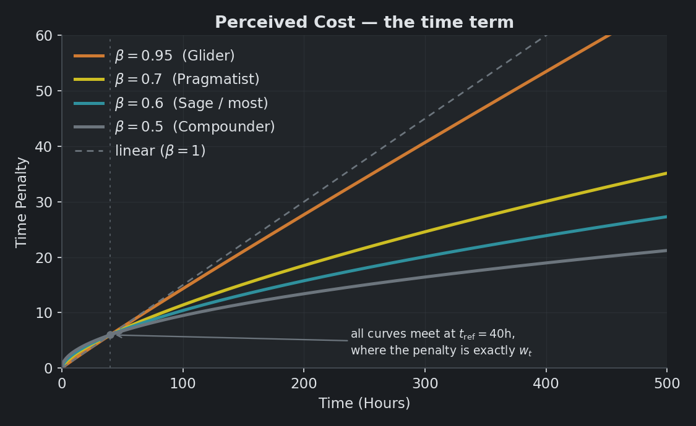
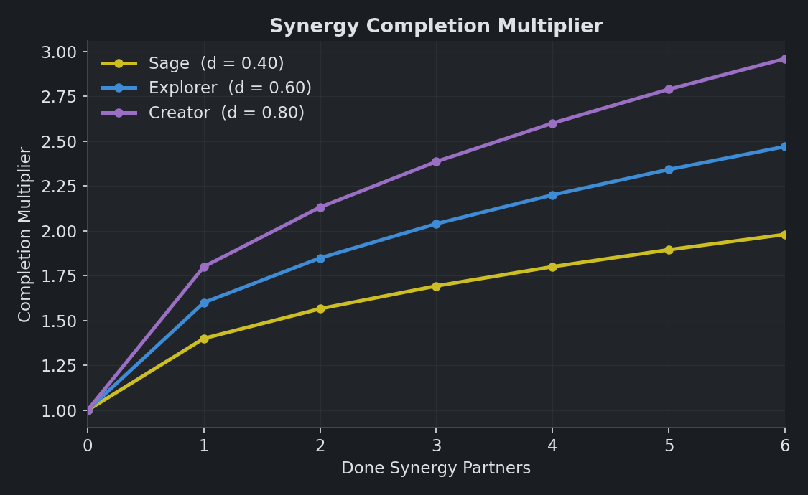
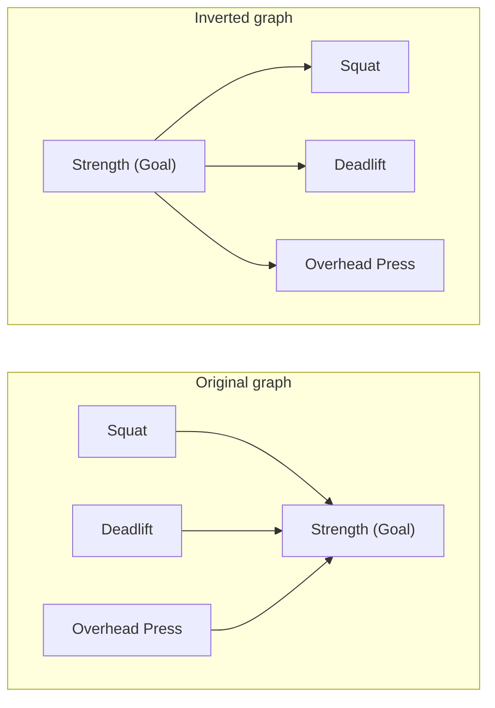

# Priority Scoring
## Overview

The priority score answers the app's central question: *what should I work on next?*

Not every node competes for that answer. Only **eligible** nodes do -- open *Learn*, *Action*, and *Resource* nodes that hold hours of their own. Goals and Milestones are each set aside for a different reason. Goals get their own ranking, while Milestones are transparent checkpoints that pass value through without competing. Containers that inherit their time are set aside too, for the reason given in [Containers Are Not Recommended](#containers-are-not-recommended). Eligibility is defined precisely in [Eligibility and the Status Cascade](#eligibility-and-the-status-cascade).

Every eligible node starts with a **base priority score**: a return-on-investment ratio of value over cost. Goal-priority boost and context weight adjust it. The suggestion list balances repetition across contexts and subcontexts while displaying underlying merit on a 0-100 scale.

The sections that follow build the score one piece at a time: intrinsic value, perceived cost, the cascade and synergies that combine into total value, and the multipliers that finish the ranking.

## Intrinsic Value

Intrinsic value ($IV$) measures how much a node is worth on its own, before its relationships to other nodes are considered. It comes from two of the user's 1–10 ratings. **Value** $V(n)$ is how important or useful the project is. **Interest** $I(n)$ is how much the user actually wants to do it. The two are kept separate because they often diverge: a project can be valuable but dull, or fun but trivial. The scoring profile sets how much each counts, through the weights $w_V$ and $w_I$.

$$ \text{IV}(n) = w_V \cdot V(n)^{\gamma} + w_I \cdot I(n)^{\gamma} $$

The exponent $\gamma$ decides how sharply the ratings separate. At $\gamma = 1$ the formula is a plain weighted sum, and a 10 counts exactly twice a 5. Sage uses $\gamma = 2$, where a 10 counts four times a 5.

The exponent is a preference transform, not objective utility. With equal weights, 10/1 yields intrinsic value 101 while 7/7 yields 98. One exceptional rating can outweigh two strong ratings.

Rate the node's own benefit where possible. Relationships explicitly represent downstream leverage. Including that leverage in the rating too can overstate it; different nodes whose meanings overlap are not automatically deduplicated.

A node with an **inherited** value mode has $\text{IV}(n) = 0$, regardless of any ratings stored for it. Such a node is a pure structural conduit: it derives its standing from its children rather than its own ratings. The cascade still flows through it, but it adds nothing on its own.

## Perceived Cost

Perceived cost is how *expensive* a node feels to complete, in terms of time and energy. It draws on two inputs: **difficulty** and **time**. The user sets the difficulty rating $D(n)$ directly. A point, range, or three-point time estimate collapses into the single value $t(n)$, as covered in [time.md](time.md).

$$ \text{Cost}(n) = 1 + w_e \cdot D(n) + w_t \cdot \left(\frac{t(n)}{t_{\text{ref}}}\right)^{\beta} $$

A leading constant, two weights, a reference scale, and an exponent shape the cost. The $1$ keeps the denominator positive even when $D$ and $t$ are both zero, as they are for a container. The weights $w_e$ and $w_t$ are linear scalars, set by the scoring profile.

The reference $t_{\text{ref}}$ is a fixed constant of 40 hours. That is roughly the size of a substantial project. Time is divided by it before the exponent applies. The division gives $w_t$ a plain reading: it is the time penalty of a project that takes exactly 40 hours. A 40-hour project always costs $w_t$, whatever $\beta$ happens to be.

The exponent $\beta \in (0, 1]$ is a sublinear damper. It makes long projects feel proportionally less expensive than their raw hours suggest. That matches how people perceive effort. At the Sage default $\beta = 0.60$, a 400-hour project carries about $15.85\times$ the time penalty of a 4-hour project, not $100\times$.

Separating out $t_{\text{ref}}$ matters more than it looks. Without it the formula is $w_t \cdot t^\beta$. There $\beta$ quietly does two jobs at once. It sets the curvature of the penalty. It also sets the magnitude, because $t^\beta$ shrinks everywhere as $\beta$ falls. On a real graph, lowering $\beta$ from $0.85$ to $0.45$ shrank the whole time term by about $5.7\times$. The intent of such a change is to stop time from dominating. The actual effect was to shrink the denominator until *difficulty* dominated instead. With the reference in place, $\beta$ changes only the shape of the curve. $w_t$ alone sets its height.

$t_{\text{ref}}$ is deliberately hardcoded rather than measured from the graph. A reference taken from the live median would make every node's cost depend on the whole graph. Long projects would get quietly cheaper as work is completed. The scoring cache would also no longer be sound.

*The exponent $`\beta`$ bends the time penalty sublinearly. A lower $`\beta`$ bends harder. Every curve meets at the reference.*

The Goal ranker in the Analyze tab uses the same formula, with the same $w_t$ and $\beta$. Its cost is a Goal's entire remaining hard-prerequisite subtree rather than one node's estimate. Subtrees run about $33\times$ larger than single nodes. So the Goal ranker normalizes against its own reference of 1300 hours. Without a separate reference the same knob would mean two different things in the two places.

## The DAG Cascade

Each distinct downstream beneficiary contributes through its strongest Hard/Soft route. Let $W(n,d)$ be the maximum product of edge discounts over paths from n to d. The self weight is 1; unreachable nodes contribute 0.

$$ W(n,d)=\max_{p:n\leadsto d}\prod_{e\in p}d_e $$
$$ \text{TV}_{\text{dag}}(n)=\sum_d W(n,d)\,\text{IV}(d) $$

For A -> B -> D and A -> C -> D with all Hard edges, D contributes once at $d_H^2$. B and C still contribute their own value. Capping summed weights would leave duplicate credit below the cap. Strongest-path propagation removes it at every magnitude.

Discounts retain their per-hop meaning. Strongest does not always mean shortest. Ties prefer fewer hops, then a Hard first hop. Inserting a zero-work container still adds a discount hop, so this is not invariant to every graph rewrite.

## Remaining Required Work

Let $R(n,d)$ sum Node.time over d and its unique unfinished Hard prerequisites, excluding n. Done work and inherited-time containers contribute no hours. Hard co-prerequisites on other branches are included; optional Soft prerequisites are excluded. The self contribution has $R(n,n)=0$.

$$ q(n,d)=\frac{1}{1+(R(n,d)/H)^\delta} $$

`future_work_half_credit_hours` ($H$) is the required workload at which a benefit retains half its credit; zero disables the discount. `future_work_exponent` ($\delta$) shapes this curve independently of the immediate time-cost exponent beta. Neither is density alpha or a node count.

Profiles start at H=1300 hours. Future exponents start at 0.60 for Sage, Explorer and Creator; 0.50 for Compounder; 0.70 for Pragmatist; and 0.95 for Glider. Both controls appear in Scoring settings. These are calibration preferences, not predicted deadlines or probabilities.

At Sage's starting settings, 40 remaining hours retains 89% of a benefit's credit; 400 retains 67%; 1300 retains 50%; and 4000 retains 34%. Today's own intrinsic value stays intact. Future difficulty ratings are not summed: future work uses hours only, while today's cost includes both time and difficulty.

Discounting beneficiaries individually avoids charging the entire optional downstream graph against today's task. Shared work is counted once within each beneficiary's workload; distinct benefits remain additive. This is a priority heuristic, not a full schedule or optimal portfolio calculation.

## Synergy

Synergy edges — the Helps relationship — work differently from prerequisites. They don't say "this unlocks that." They say "doing A and B is worth doing more than doing either alone."

Take Foreign Language and Travel. Time abroad cements vocabulary in a way no classroom drill can match. Modest fluency, in turn, opens up places a monolingual tourist would struggle to navigate. Each genuinely amplifies the other, so the algorithm rewards the pairing.

Synergies feed into total value in two stages. The **pair bonus** applies before either partner is done. The **completion multiplier** comes online once one of the pair is finished.

### Pair Bonus
Write $Y(n)$ for $n$'s set of synergy partners. Each partner $z \in Y(n)$ passes a fraction $d_{\text{Syn,pair}}$ of its own total value back to $n$:

$$ \text{Syn}_+(n) = d_{\text{Syn,pair}} \sum_{z \in Y(n)} c(n, z) \cdot \sum_d W(z,d)\,\text{IV}(d)\,q(n,d) $$

The effect is that synergistic projects tend to surface together, so the user can choose which to tackle first.

#### Cross-Context Coefficient
The cross-context coefficient $c(n, z)$ amplifies the pair bonus when a synergy spans two different domains.

$$ c(n, z) = \begin{cases} m_{\text{cross}} & \text{if } \text{ctx}(z) \ne \text{ctx}(n)\\ 1 & \text{otherwise} \end{cases} $$

This is a lever for exploration in the explore-versus-exploit tradeoff. Two profiles raise it above 1. Creator sets $m_{\text{cross}} = 3.0$, rewarding cross-domain connections as a source of creative inspiration. Explorer sets $m_{\text{cross}} = 2.5$, rewarding curiosity and the cross-pollination that tends to aid generalization. Every other profile leaves $m_{\text{cross}} = 1.0$, so a within-context synergy counts the same as a cross-context one.

### Completion Multiplier
The completion multiplier rewards a node once one of its synergy partners is finished. The boost is *multiplicative*, so it scales priority more aggressively than the *additive* pair bonus.

Let $k(n) = |\{z \in Y(n) : \text{status}(z) = \text{Done}\}|$ be the count of finished partners, and let $d_{\text{Syn,mul}}$ be the profile's completion-multiplier weight. Then:

$$ \mu_Y(n) = 1 + d_{\text{Syn,mul}} \cdot \sqrt{k(n)} $$

The square root is a diminishing-returns guard. Without it, every Done partner would add the same fixed boost. With it, each adds less than the one before. The first Done partner delivers most of the realized "doing both" payoff; a second or third tops it up by shrinking amounts.

*The $`\sqrt{k}`$ guard flattens the multiplier as Done partners accumulate, so the first delivers most of the payoff.*

### Synergies are Depth-1 Relationships
Synergies do not chain or cascade the way Hard and Soft edges do. They are depth-1 relationships: only the immediate synergy partners of $n$ contribute to its score, not the partners of those partners.

There are good conceptual and algorithmic reasons for this. First, not every chain $A \leftrightarrow B \leftrightarrow C$ is meaningful. Take Cooking $\leftrightarrow$ Chemistry $\leftrightarrow$ Pharmacology. Chemistry sharpens your cooking, because you understand why acids, heat, and time matter. Chemistry also deepens your grasp of Pharmacology, since drug mechanisms are fundamentally chemical. But it doesn't follow that Cooking helps Pharmacology, or the reverse. Each link is real, yet the relation isn't transitive: the endpoints don't actually inform each other.

The second reason is performance. Helps edges are bidirectional and can form cycles, so cascading along them would either fail to terminate or fall back on path-enumeration that defeats memoization — the problem flagged in the [DAG cascade section](#the-dag-cascade). Keeping synergies at depth 1 sidesteps that entirely.

## Total Value

$$ \text{TV}(n)=\mu_Y(n)\,\text{IV}(n)+\sum_{d\ne n}W(n,d)\,\text{IV}(d)\,q(n,d)+\text{Syn}_+(n) $$

Each synergy partner supplies a distinct additive channel with its own strongest DAG routes. Completion-work discounts are relative to today's candidate n, including benefits reached through a partner. Synergy never recurses through another synergy edge. The Done-partner multiplier applies only to n's intrinsic value.

### Attribution

Scoring and Explain share contribution records: beneficiary, structural weight, remaining required hours, retained credit, and adjusted contribution. Separate Self, Hard, Soft, and Synergy channel amounts keep composition totals exact. Via labels identify the largest contribution channel. Contributors plus the Done-synergy kick equal Total Value.

Aggregated structural weight may exceed one when distinct synergy channels reinforce the same beneficiary. Ordinary DAG paths are deduplicated within each channel.

## Base Score

$$ P_{\text{base}}(n) = \frac{\text{TV}(n)}{\text{Cost}(n)} $$

The base score is return on investment in the literal sense: value per unit of cost. High value over low cost rises to the top. The rest of the algorithm adjusts this base ratio.

## Goal Priority Boost

The user may mark up to three Goals as priorities — their #1, #2, and #3 most important objectives. Marking a Goal as a priority boosts the priority score of every Hard prerequisite in its subtree. This nudges the algorithm toward the work that drives what the user has said matters most. The boost follows Hard edges only; Soft and Helps connections don't carry it.

Let $\Pi = (g_1, g_2, g_3)$ be the priority goals in rank order. From a single profile knob $b$ (the `goal_boost`), three rank multipliers are derived:

$$ \rho_1 = b, \quad \rho_2 = 1 + 0.66 (b - 1), \quad \rho_3 = 1 + 0.33 (b - 1) $$

Ranks 2 and 3 sit at two-thirds and one-third of the rank-1 premium, so they always stay proportionally between $1$ and $b$. The Sage default $b = 1.50$ gives $\rho_1 = 1.50$, $\rho_2 \approx 1.33$, $\rho_3 \approx 1.17$. The goal-driven Pragmatist uses an aggressive $b = 4.00$, which quadruples the unboosted score and raises ranks 2 and 3 in proportion.

When a node sits in multiple priority subtrees, **the highest applicable rank wins.** Formally, let $A_H(g_r)$ be the set of nodes that feed into $g_r$ via Hard edges. A node's boost is then

$$ \rho(n) = \max\big(\{1\} \cup \{\rho_r : n \in A_H(g_r)\}\big) $$

## Context Multipliers
Context weight applies after the goal boost. Suggestion variety applies after both.

### Context Weight
Each context carries a weight $w_c$, a user-configurable scalar that defaults to 1. It lets the user emphasize or de-emphasize a whole life area. For example: double the weight on Money during a tight quarter, or halve it on Humanities during a STEM stretch.

### Suggestion Variety

Task merit no longer depends on how many projects are stored in a context. Instead, each node is discounted for how many higher-ranked peers already speak for its context. This gives other areas a chance without making unrelated additions to the graph reduce a task's score.

The discount comes from a walk over the **pool**: every scorable node in the graph, Now nodes excluded. Take the node with the greatest adjusted merit, record its divisor, then charge its context and its `(context, subcontext)` pair one more repetition. Repeat until the pool is empty. Let `c` be the repetitions charged to the candidate's context when its turn comes, and `s` those charged to its pair:

`divisor(n) = (1+c)^a * (1+s)^b`

Settings use percentages of extra merit required after **one** earlier recommendation: `p_context` and `p_subcontext` (total). Convert with `a = log2(1+p_context/100)` and `b = log2((1+p_subcontext/100)/(1+p_context/100))`. The subcontext premium includes the context premium; it is not an additional penalty. It must be at least as large as the context premium.

Sage uses **5% / 15%**. After three earlier recommendations from one subcontext, another from that subcontext needs 32.25% extra merit; a sibling subcontext needs 10.25%. Accumulation grows gently. These percentages describe extra merit required, not a literal percentage subtraction from the score.

Profiles use context/subcontext premiums: Sage 5/15, Explorer 10/20, Compounder 0/0, Pragmatist 2/5, Creator 5/15, Glider 5/20. The non-Sage defaults are conservative policy choices, not empirically optimized values. Both zero disables the walk and restores merit ordering.

The pool is the whole graph, never the current view. Filters, the requested row count and the Details recommendation list all narrow which nodes are *shown*; none of them changes a divisor. That is what lets one number stand for a node everywhere in the app. The cost is that a filtered list still carries discounts earned against nodes the filter hides. Now nodes are outside the pool entirely: they neither earn a divisor nor spend a repetition. Valid pins bypass filters and lead the list whatever they score. Goal and container ranking remain separate.

The walk uses exact merit, then exact merit and name to break adjusted ties. `(context, None)` is a broad-area bucket; identical subcontext labels under different contexts remain distinct. Legacy uncategorized nodes are exempt.

This balances a slate, not exposure over time: an unchanged graph returns an unchanged list. It does not guarantee every context a slot or periodically rotate neglected tasks.

## Final Score

Putting it all together:

$$ P(n) = \frac{P_{\text{base}}(n) \cdot \rho(n) \cdot w_c(\text{ctx}(n))}{\text{divisor}(n)} $$

A node's final priority is its ROI ratio scaled by the goal-priority boost and context weight, then discounted for repetition. Variety is part of the score rather than a re-ordering applied to a finished list. The Next tab prints the number it sorts on, so anything that moves a row has to move its number too.

The underlying merit ranking uses the unrounded score, while the figure stored and displayed is rounded to two decimals. Rounding is lossy enough to matter: on a ~450-node graph it collapses about 440 distinct scores into roughly 170, so past about rank 30 most nodes would otherwise tie with a neighbour and fall back on list order, which carries no meaning. Ordering on the exact value keeps the displayed number readable without making the sequence arbitrary.

For display, scores are linearly rescaled against the top node of the pool.

$$ P_{\text{display}}(n) = 100 \cdot \frac{P(n)}{\max_{m \in \text{pool}} P(m)} $$

Every surface that prints a 0–100 priority divides by that same base: the Next tab, the subtask tables, and Explain. A node therefore reads the same wherever it appears. Under a filter the top row can sit below 100, because the node anchoring the scale may not be on screen. Bar *length* stays relative to the longest row shown, so the column still fills its width.

The Next column descends, since the number and the sort key are now the same quantity. Pinned rows are the exception: a pin leads the list whatever it scores, and keeps its true number rather than a rescaled one.

(The Explain feature reports both the raw and normalized score, with the repetition discount listed among the adjustments.)

## Complexity

The variety walk is a lazy-greedy over a heap of the pool. A divisor only ever grows, so a heap entry that was pushed under a smaller one is always too optimistic and is re-pushed rather than trusted. Each node is selected once and re-pushed only when its own bucket is charged in the meantime. It reuses exact scores and does not recompute graph values during the walk.

Per-source strongest-route maps replace scalar subtree sums. Per-beneficiary required-work sets and hours are cached separately. A cold route map visits its reachable DAG; subsequent candidate and synergy calculations reuse it.

Worst-case route and closure storage is quadratic. Cold preprocessing can cost O(N(N+E)); synergy aggregation additionally visits beneficiaries reachable from each partner. Sorting costs O(N log N). The old linear-time scalar-memo bound no longer applies; measure cold and warm performance on representative graphs.

GraphManager invalidates maps when scoring-relevant graph data changes. Future-work settings participate in its memo key. Explain computes the same contributions without retaining a stale cross-operation snapshot.

## Cycle Prevention

The memoized cascade depends on Hard and Soft edges forming a Directed Acyclic Graph. That property is enforced, not assumed. Every time the user creates an edge, the graph manager checks it for a cycle that would trap the scoring walk. If it finds one, the edge is rejected and a modal explains why.

Helps edges skip this check, by design. Synergies are [depth-1 relationships](#synergies-are-depth-1-relationships) with no recursion through them, so a cycle of Helps edges causes no problem.

## Scoring Profiles

The six built-in profiles are essentially hyperparameter bundles. The first table below lists every knob and its value under each profile. The second describes how each profile leans, and which knobs create that lean.

### Profile Hyperparameters
| Parameter | Symbol | Sage | Explorer | Compounder | Pragmatist | Creator | Glider |
|---|---|---|---|---|---|---|---|
| Value weight | $w_V$ | 1.00 | 0.50 | 1.60 | 2.00 | 1.00 | 1.00 |
| Interest weight | $w_I$ | 1.00 | 2.00 | 0.40 | 0.50 | 1.00 | 1.00 |
| Rating exponent | $\gamma$ | 2.00 | 2.50 | 1.50 | 2.50 | 2.00 | 1.00 |
| Hard discount | $d_H$ | 0.60 | 0.50 | 0.92 | 0.65 | 0.55 | 0.40 |
| Soft discount | $d_S$ | 0.40 | 0.35 | 0.20 | 0.02 | 0.45 | 0.25 |
| Synergy pair bonus | $d_{\text{Syn,pair}}$ | 0.10 | 0.35 | 0.02 | 0.00 | 0.60 | 0.05 |
| Synergy completion mult | $d_{\text{Syn,mul}}$ | 0.40 | 0.90 | 0.10 | 0.10 | 1.30 | 0.20 |
| Cross-context synergy mult | $m_{\text{cross}}$ | 1.00 | 2.50 | 1.00 | 1.00 | 3.00 | 1.00 |
| Difficulty weight | $w_e$ | 1.50 | 1.50 | 1.00 | 1.80 | 1.50 | 3.50 |
| Time weight | $w_t$ | 6.00 | 6.00 | 5.00 | 7.00 | 6.00 | 135.0 |
| Time exponent | $\beta$ | 0.60 | 0.60 | 0.50 | 0.70 | 0.60 | 0.95 |
| Priority goal boost | $b$ | 1.50 | 1.00 | 1.00 | 4.00 | 1.00 | 1.00 |
| Same-context premium (%) | | 5 | 10 | 0 | 2 | 5 | 5 |
| Same-subcontext total premium (%) | | 15 | 20 | 0 | 5 | 15 | 20 |
| Density exponent (Goals) | $\alpha_g$ | 0.20 | 0.50 | 0.00 | 0.05 | 0.20 | 0.35 |

$w_t$ is read against the 40-hour reference, so Glider's 135 is not a typo. It is the value that produces a very steep time penalty once time is divided by $t_{\text{ref}}$.

A **Custom** profile is also available, exposing every parameter for fine tuning.

### Two Knobs That Look Like Levers But Are Not

Anyone tuning a profile should know about two parameters that do far less than their names suggest.

Scaling $w_V$ and $w_I$ together changes nothing at all. Total value is homogeneous of degree 1 in intrinsic value. Multiplying both weights multiplies every node's score by the same constant, so the ranking is identical. Only the *ratio* between them does anything.

The ratio changes the relative influence of value and interest. Its effect depends on ratings across all reachable beneficiaries, not only the candidate's own ratings. Future-work settings also change relative priority by controlling how strongly distant required work discounts downstream benefits.

The Done-synergy multiplier only differentiates scores once partners are complete. Additive synergy can influence rankings before completion. Profile differences should be assessed against current recommendations rather than a fixed target for top-ten overlap.

### The Perspective of Each Profile
| Profile | Perspective | Parameter Tweaks |
|---|---|---|
| **Sage** | The reference baseline. A balanced ranking that leans no particular direction, landing near the graph's own median on time, value and interest alike. | All other profiles are expressed as deltas off these defaults. |
| **Explorer** | Curiosity-driven. Favors what you find interesting, rewards cross-domain links, and gives sparse contexts a fair shot. | $w_I$ set to four times $w_V$, and the highest $\gamma$ of any profile so those ratings bite hard. Synergy parameters raised far enough that $m_{\text{cross}} = 2.5$ actually registers. The 10%/20% premiums encourage a wider recommendation list. $b = 1.0$ switches off the goal boost, since goals are not the point here. |
| **Compounder** | Foundational depth. Work that unlocks long prerequisite chains, whether or not it is enjoyable. | The lowest $\gamma$ of the rating-driven profiles, deliberately: this profile is about structure, so ratings should not drown out reach. $d_H = 0.92$ carries value far along *hard* chains. $d_S = 0.20$ keeps soft links from flooding value everywhere. That contrast is what selects unlock-heavy nodes, and a high $d_S$ would erase it. Zero repetition premiums let deep contexts win on merit. |
| **Pragmatist** | Goal-driven execution. What you said matters most should dominate, and distractions should not surface at all. | $w_V$ set to four times $w_I$. $d_S = 0.02$ all but removes soft prerequisites, and the additive synergy bonus is zero. $b = 4.0$ makes the priority-goal boost decisive. |
| **Creator** | Synthesis and cross-disciplinary work. Rewards pairings that blend across domains. | $d_{\text{Syn,pair}} = 0.60$ and $d_{\text{Syn,mul}} = 1.30$ are the largest of any profile. That is what gives $m_{\text{cross}} = 3.0$ real leverage. Roughly seven in ten of its top picks carry a cross-context Helps edge. |
| **Glider** | Light, varied, low-friction work. For seasons when you need to coast. | $\gamma = 1$ keeps ratings plain and linear — no need to agonise over them while coasting. Every cost knob raised so heavy work is penalized hard: $w_e = 3.5$, a very large $w_t$, and $\beta \to 0.95$ to keep the penalty close to linear in hours. Cascade and synergy contributions damped. $b = 1.0$ disables the priority-goal boost so non-priority work competes fairly. |

Profiles express different preferences; disagreement alone is not evidence of quality. Compare recommendations after structural changes before retuning profile weights.

## Worked Example

A and downstream D each have Value 5 and Interest 5 under Sage: intrinsic value 50 each. A has difficulty 5 and 40 own hours. D directly requires A and has 1300 own hours, with no other relationships.

A's cost is 1 + 1.5 * 5 + 6 * (40/40)^0.6 = 14.5. Its own value contributes 50. D contributes 0.6 * 50 * 0.5 = 15. Total value is 65, giving base priority 65/14.5 = 4.48 before context and goal adjustments.

# Goal Scoring

Goals describe capacities built from prerequisite work. They use a separate ranking of their required subtree, rather than competing with actionable tasks.

## The Edge Inversion Trick

Reverse Hard edges only to rank the required work feeding a Goal. Exclude Soft and Helps edges. The reversed cascade uses strongest-path contributions without the task-level future-work discount.

Goal value uses strongest routes on **reversed Hard edges only**. Soft and Helps relationships enter neither its numerator nor its denominator.

$$ \text{TV}'(g)=\text{IV}(g)+\sum_{d\in A_H(g)}W_H'(g,d)\,\text{IV}(d) $$

Completed prerequisite value remains part of the capacity's value; only remaining work enters cost. The task-level future-work discount is disabled because Goals already charge aggregate remaining hard work. Explain uses this same scope and the Goal ranker's cost.

## Cost For Goals

Raw $\text{TV}'(g)$ is extensive. It grows with subtree size, so on its own it would rank Goals by how big they are. The cost denominator turns it into a priority signal. Let $A_H(g)$ be the Hard-only prereq closure and define

$$ R(g) = \{n \in A_H(g) : \text{status}(n) \ne \text{Done}\} $$

as the **remaining** hard subtree (work still owed before the Goal is Done). The cost is the beta-compressed sum of that remaining time:

$$ \text{Cost}'(g) = 1 + w_t \cdot \left(\frac{\sum_{n \in R(g)} t(n)}{1300}\right)^\beta $$

The primary cost includes a difficulty term for the node's own effort. Goal cost drops it. A Goal isn't itself a unit of work, so rating its difficulty directly means little. Its real cost is the work still owed across its prereq subtree. The summed remaining time captures that, and beta compression keeps a large subtree from dominating on size alone.

## Goal Score

A Goal's priority retains rank, context weight, and its own density correction. Suggestion variety does not change Goal ranking.

$$ P_g(g) = \underbrace{\frac{\text{TV}'(g)}{\text{Cost}'(g)}}_{\text{Base Score}} \cdot \underbrace{\rho(g)}_{\text{Goal Priority}} \cdot \underbrace{w_c(\text{ctx}(g))}_{\text{Context Weight}} \cdot \underbrace{\delta_g(g)}_{\text{Goal Density}} $$

Goal density is bucketed by Goal headcount alone. Let $B_g(g) = (\text{ctx}(g), \text{subctx}(g))$ be the Goal's bucket. Let $|B_g(g)|$ be the count of **open** Goals sharing that bucket. Done Goals are excluded, since they aren't competing for sidebar attention. Then:

$$ \delta_g(g) = \frac{1}{\max(1,\, |B_g(g)|)^{\alpha_g}} $$

Goal density has its own exponent, alpha_goal: Sage 0.20, Explorer 0.50, Compounder 0, Pragmatist 0.05, Creator 0.20, and Glider 0.35. These settings are unchanged by v3 and v4. Zero disables the correction.

Why count only Goals? A heavily decomposed area produces both more leaves *and* more Goals. If Goals shared the leaf bucket count, a Goal in that area would be penalized twice: once for its own subtree size (already inflating $`\text{Cost}'(g)`$), and again for the leaves it happens to sit next to. Counting only Goals isolates the relevant question: "how crowded is the sidebar within this corner of the graph?"

> [!NOTE] Note
> The Goals sidebar and the Analyze tab's Completion chart both rank Goals by the priority ranking explained here.

## Milestone Transparency

A Milestone marks an achievement, not the effort to reach it. "10 strict pull-ups" is a line you cross, not a thing you practice. The practice lives in the capacity nodes that lead up to it.

This creates a problem for Goal ranking. A Milestone often sits mid-tree, between a Goal and the real work beneath it. If it carried its own value and time ratings, those numbers would enter the Goal's ROI as though the checkpoint were itself a body of work.

So the app treats every Milestone as transparent: its own value and time are set to zero, so it contributes nothing of its own to the score. Prerequisite value still cascades up through it, discounted by the usual per-hop factor. The milestone adds no value, but it still sits in the chain like any other node, so passing through it costs one discount hop. The work beneath it still counts toward cost.

# Containers Are Not Recommended

A node with `time_mode = inherited` draws its time estimate from its hard prerequisites rather than holding hours of its own. Such a node is never recommended on the Next tab.

The reason is that two rules point at the same set of nodes. Time inheritance draws from a node's hard prerequisites. Eligibility requires every hard prerequisite to be Done. So at the exact moment such a node becomes rankable, every hour it inherited has already been spent. There is nothing left to work on, only a box to tick.

Ranking it anyway produces a bad recommendation twice over. Its cost carries no time term at all, so it undercuts the whole pool on price. Its total value still collects the full cascade from everything it unlocks. Value of a subtree divided by the cost of nothing puts it near the top of the list: on a ~450-node graph, such a node landed in the top five the moment it unblocked.

The exclusion keys on **time alone**, deliberately. A node with inherited *ratings* but its own hours is a different case: it has real work to do and merely draws its worth from what it unlocks, so it keeps competing normally.

Excluded nodes are left out of the list, not out of the graph. Cascade still flows through them untouched, so they remain connective tissue. The Details tab surfaces containers in its own list, which is where "this umbrella topic matters" belongs.

# Eligibility and the Status Cascade

Both scoring algorithms above consult three independent state fields on each node:

| Field | Values | Source | Effect on scoring |
|---|---|---|---|
| Status | Open, Blocked, Done | The user's Done-flips, plus the graph's structure | Decides which nodes are eligible to be scored, and what counts as remaining work in the Goal ranking. |
| Dormant | 0 or 1 | User-set, or cleared when an Event triggers | A Dormant node is left out of scoring until its Event fires. |
| Now | 0 or 1 | User-set | Still scored, so its breakdown shows in Explain. But it doesn't compete for the top $n$ slots in the Next tab. |

Status is the most algorithmically substantive of the three. The rest of this section concentrates on it: its formal definition, the cascade that maintains it, and the invariants that cascade depends on. Dormant and Now sit outside that machinery, and are covered at the end.

## The Status Function

The user directly controls only one of the three values: Done, via the toggle on each node. Blocked and Open are derived from the graph's structure.

$$ \text{status}(n) = \begin{cases} \text{Done} & \text{user marked Done} \\ \text{Blocked} & \text{at least one hard need not done} \\ \text{Open} & \text{otherwise} \end{cases} $$

Goals are exempt from this function. Their status is user-controlled and never recomputed. This keeps their "yellow star" look on the canvas, which makes Goals easy to spot. It also lets the user decide for themselves when a Goal is met.

## Status Cascade

Marking a node Done can unblock the nodes that depended on it. A node is Blocked while any of its hard prereqs is unfinished. Complete the last one, and the node becomes Open.

The app doesn't recompute the whole graph on every flip. It walks forward instead. Starting at the node you just changed, it visits each Hard dependent and rechecks its status. If that status changed, the walk continues to that node's own dependents. If it didn't, the walk stops there.

Two properties keep the walk computationally light:
- **Hard Edges form a DAG.** Cycle prevention at edge-insert time guarantees the walk always terminates.
- **Short-circuit on no-change.** If a node's recomputed status matches what it already had, the cascade stops.

In short, the cascade proceeds only as far as it needs to.

## Done is Final

Once a node is Done, the cascade will never silently flip it back to Open. A Done node moves only when the user un-completes a hard prereq that was itself Done. Even then it goes to Blocked, not Open, and the app warns before the change.

## Startup Safety Net

On every app launch, the graph manager walks every non-Goal node. It re-derives each status from the current Hard prereqs, corrects any drift, and logs what it fixed. Drift can only happen if you add nodes directly with SQL, bypassing the app's safety mechanisms. The Appearance tab in Settings also offers a manual status repair, if you'd rather not restart the app.

## Dormant and Now Nodes

The status function covers the three lifecycle values: Open, Blocked, and Done. Two extra flags also affect what the scoring algorithm sees. Neither is part of the cascade, because neither needs to be. Dormant and Now don't ripple through the graph the way status does, so nothing has to keep them consistent.

**Dormant** nodes are excluded from every read path in the scoring pipeline. When an Event triggers a Dormant node, the flag clears. The status cascade then runs to settle whether the newly-live node is Open or Blocked.

**Now** nodes still cascade and still receive a final score, which the Explain modal uses. But the Next tab keeps them out of the Suggestions ranking, surfacing them in a separate Now panel instead.

# Symbol Glossary

Every symbol used above, collected for reference.

## Edges

| Symbol | Description | Directed |
|---|---|---|
| $E_H$ | Hard prerequisites — the source must be Done before the target can be worked on | Yes |
| $E_S$ | Soft prerequisites — the source is helpful but not strictly required for the target | Yes |
| $E_Y$ | Helps relationships — mutual synergy between two nodes | No |

The full edge set is $E = E_H \cup E_S \cup E_Y$. An edge $A \to B$ means $A$ is a prerequisite for $B$.

## Node Attributes

| Symbol | Range | Meaning |
|---|---|---|
| $V(n)$ | $\{1, \ldots, 10\}$ | Value rating |
| $I(n)$ | $\{1, \ldots, 10\}$ | Interest rating |
| $D(n)$ | $\{1, \ldots, 10\}$ | Difficulty (Effort) rating |
| $t(n)$ | $\ge 0$ | Point estimate for time, in hours |
| $\text{status}(n)$ | $\{\text{Open}, \text{Blocked}, \text{Done}\}$ | Lifecycle state |
| $\text{ctx}(n)$ | string or null | Context |
| $\text{subctx}(n)$ | string or null | Subcontext, a sub-area within a context |

## Adjacency Maps

| Symbol | Definition | Meaning |
|---|---|---|
| $H_{\text{out}}(n)$ | $\{m : (n, m) \in E_H\}$ | Nodes $n$ unlocks via Hard |
| $S_{\text{out}}(n)$ | $\{m : (n, m) \in E_S\}$ | Nodes $n$ unlocks via Soft |
| $H_{\text{in}}(n)$ | $\{m : (m, n) \in E_H\}$ | Hard prereqs of $n$ |
| $S_{\text{in}}(n)$ | $\{m : (m, n) \in E_S\}$ | Soft prereqs of $n$ |
| $Y(n)$ | $\{m : \{n, m\} \in E_Y\}$ | Synergy partners (symmetric) |

## Derived Quantities

| Symbol | Meaning | Defined in |
|---|---|---|
| $\text{IV}(n)$ | Intrinsic value | [Intrinsic Value](#intrinsic-value) |
| $\text{Cost}(n)$ | Perceived cost | [Perceived Cost](#perceived-cost) |
| $\text{TV}_{\text{dag}}(n)$ | Unique strongest-route value before future-work discount | [The DAG Cascade](#the-dag-cascade) |
| $\text{Syn}_+(n)$ | Synergy pair bonus | [Pair Bonus](#pair-bonus) |
| $\mu_Y(n)$ | Synergy completion multiplier | [Completion Multiplier](#completion-multiplier) |
| $\text{TV}(n)$ | Total value | [Total Value](#total-value) |
| $P_{\text{base}}(n)$ | Base score (ROI) | [Base Score](#base-score) |
| $\rho(n)$ | Goal-priority boost | [Goal Priority Boost](#goal-priority-boost) |
| $w_c$ | Context weight | [Context Weight](#context-weight) |
| `a`, `b` | Repetition exponents | [Suggestion Variety](#suggestion-variety) |
| $P(n)$ | Final score | [Final Score](#final-score) |

Profile hyperparameters ($w_V$, $w_I$, $d_H$, $d_S$, $d_{\text{Syn,pair}}$, $d_{\text{Syn,mul}}$, $m_{\text{cross}}$, $w_e$, $w_t$, $\beta$, $b$, $\alpha_g$, and suggestion premiums) are listed in [Profile Hyperparameters](#profile-hyperparameters).

## Versioned Settings

Schema v4 retires task alpha and adds suggestion premiums. Existing named profiles receive their new defaults; Custom receives Sage defaults unless explicit premiums are stored. Reads do not write settings. Goal density and future-work settings are preserved.

Schema v3 intentionally changes cascade and Goal scope and adds future-work controls. V1 bundles without a rating exponent retain 1; v2 bundles without one retain 2. The old task time-cost coefficient is rescaled only for v1, never again for v2/v3. Reads migrate in memory; saving stamps the version.

V2's Goal reference was an intentional retune: one shared coefficient cannot preserve both old task and Goal curves with different reference scales. V3 leaves immediate cost and density defaults unchanged.

# Navigation
## Tutorial
Next on the technical path is **Time**, which explains the time estimate $t(n)$ that the scoring math here takes as a given. After that, both routes converge on **Modeling**.

  <a href="../README.md">README</a> · <a href="features.md">Features</a> · <b>Scoring</b> · <a href="time.md">Time</a> · <a href="modeling.md">Modeling</a>

## Other Resources

| Resource | What's there |
|---|---|
| [scoring.py](../scoring.py) | The functions behind this document: `build_adjacency`, `total_value`, `score_nodes`, `explain_score`. |
| [graph_manager.py](../graph_manager.py) | The state gateway that runs the status cascade and caches scores. |
| [app_architecture.md](app_architecture.md) | Where scoring sits in the app. The layering, the state gateway, and the mutation-to-rerank flow. |
