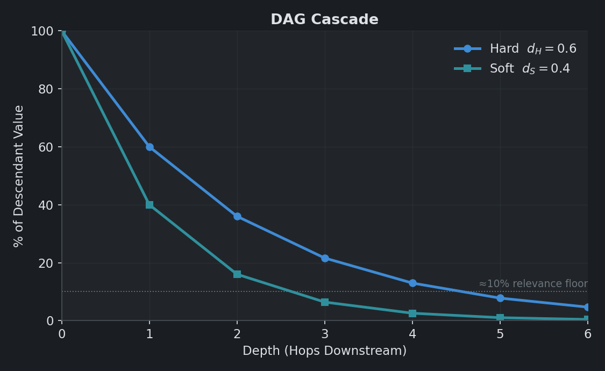
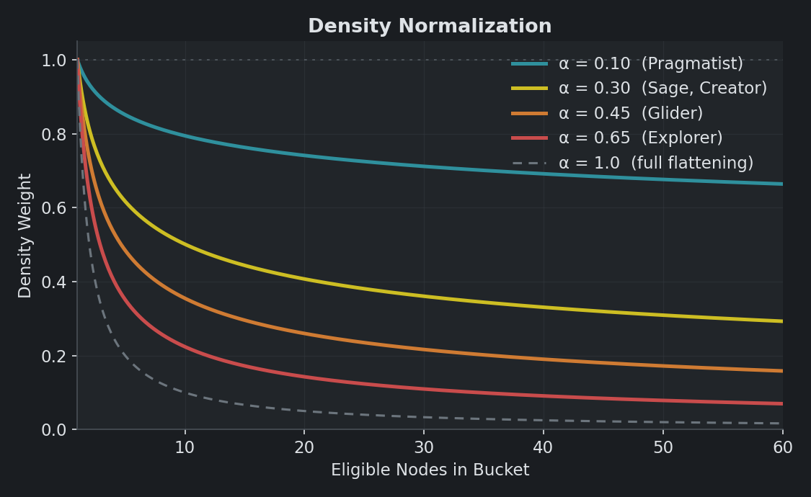
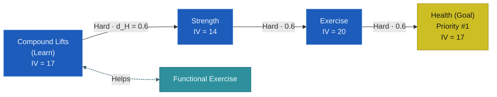
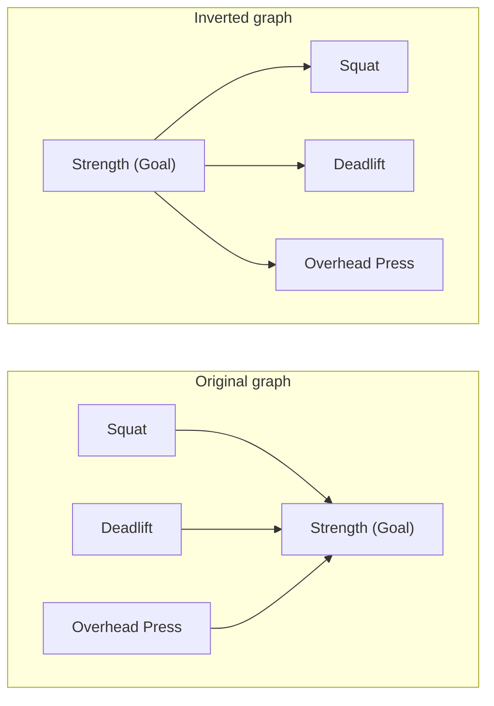

# Priority Scoring
## Overview

The priority score answers the app's central question: *what should I work on next?*

Not every node competes for that answer. Only **eligible** nodes do -- open *Learn*, *Action*, and *Resource* nodes that hold hours of their own. Goals and Milestones are each set aside for a different reason. Goals get their own ranking, while Milestones are transparent checkpoints that pass value through without competing. Containers that inherit their time are set aside too, for the reason given in [Containers Are Not Recommended](#containers-are-not-recommended). Eligibility is defined precisely in [Eligibility and the Status Cascade](#eligibility-and-the-status-cascade).

Every eligible node starts with a **base priority score**: a return-on-investment ratio of value over cost. Three multipliers then adjust it — the goal-priority boost, context weight, and density normalization. The adjusted scores are rescaled to 0–100 and sorted into the Next tab's suggestion list.

The sections that follow build the score one piece at a time: intrinsic value, perceived cost, the cascade and synergies that combine into total value, and the multipliers that finish the ranking.

## Intrinsic Value

Intrinsic value ($IV$) measures how much a node is worth on its own, before its relationships to other nodes are considered. It comes from two of the user's 1–10 ratings. **Value** $V(n)$ is how important or useful the project is. **Interest** $I(n)$ is how much the user actually wants to do it. The two are kept separate because they often diverge: a project can be valuable but dull, or fun but trivial. The scoring profile sets how much each counts, through the weights $w_V$ and $w_I$.

$$ \text{IV}(n) = w_V \cdot V(n)^{\gamma} + w_I \cdot I(n)^{\gamma} $$

The exponent $\gamma$ decides how sharply the ratings separate. At $\gamma = 1$ the formula is a plain weighted sum, and a 10 counts exactly twice a 5. Sage uses $\gamma = 2$, where a 10 counts four times a 5.

That exponent is not cosmetic, and the reason lies in the cascade. Total value sums intrinsic value across a node's descendants. A sum of many similar terms is governed by how *many* terms it has, not how large each one is. Ratings also cluster: on a real graph they span about $5\times$ end to end while subtree sizes span more than $40\times$. Averaging over a subtree then halves what spread the ratings had left, from $0.37$ to $0.23$ relative to the mean.

The result at $\gamma = 1$ is that total value behaves close to a descendant count. Measured on a ~450-node graph, a node unlocking eight projects rated 9/9 scored only $3.3\times$ a node unlocking eight rated 2/2. At $\gamma = 2$ that gap widens to $9.4\times$, which is the intended reading: unlocking *valuable* work should beat unlocking *plentiful* work.

A power was chosen over subtracting a baseline from each rating. Both widen the spread by similar amounts, but subtraction sends every rating at or below the baseline to exactly zero, so a single pessimistic rating can erase a node from the cascade entirely. A power never reaches zero: a 1 still contributes.

A node with an **inherited** value mode has $\text{IV}(n) = 0$, regardless of any ratings stored for it. Such a node is a pure structural conduit: it derives its standing from its children rather than its own ratings. The cascade still flows through it, but it adds nothing on its own.

## Perceived Cost

Perceived cost is how *expensive* a node feels to complete, in terms of time and energy. It draws on two inputs: **difficulty** and **time**. The user sets the difficulty rating $D(n)$ directly. A point, range, or three-point time estimate collapses into the single value $t(n)$, as covered in [time.md](time.md).

$$ \text{Cost}(n) = 1 + w_e \cdot D(n) + w_t \cdot \left(\frac{t(n)}{t_{\text{ref}}}\right)^{\beta} $$

A leading constant, two weights, a reference scale, and an exponent shape the cost. The $1$ keeps the denominator positive even when $D$ and $t$ are both zero, as they are for a container. The weights $w_e$ and $w_t$ are linear scalars, set by the scoring profile.

The reference $t_{\text{ref}}$ is a fixed constant of 40 hours. That is roughly the size of a substantial project. Time is divided by it before the exponent applies. The division gives $w_t$ a plain reading: it is the time penalty of a project that takes exactly 40 hours. A 40-hour project always costs $w_t$, whatever $\beta$ happens to be.

The exponent $\beta \in (0, 1]$ is a sublinear damper. It makes long projects feel proportionally less expensive than their raw hours suggest. That matches how people perceive effort. At the Sage default $\beta = 0.60$, a 400-hour project carries about $4\times$ the time penalty of a 4-hour project, not $100\times$.

Separating out $t_{\text{ref}}$ matters more than it looks. Without it the formula is $w_t \cdot t^\beta$. There $\beta$ quietly does two jobs at once. It sets the curvature of the penalty. It also sets the magnitude, because $t^\beta$ shrinks everywhere as $\beta$ falls. On a real graph, lowering $\beta$ from $0.85$ to $0.45$ shrank the whole time term by about $5.7\times$. The intent of such a change is to stop time from dominating. The actual effect was to shrink the denominator until *difficulty* dominated instead. With the reference in place, $\beta$ changes only the shape of the curve. $w_t$ alone sets its height.

$t_{\text{ref}}$ is deliberately hardcoded rather than measured from the graph. A reference taken from the live median would make every node's cost depend on the whole graph. Long projects would get quietly cheaper as work is completed. The scoring cache would also no longer be sound.

*The exponent $`\beta`$ bends the time penalty sublinearly. A lower $`\beta`$ bends harder. Every curve meets at the reference.*

The Goal ranker in the Analyze tab uses the same formula, with the same $w_t$ and $\beta$. Its cost is a Goal's entire remaining hard-prerequisite subtree rather than one node's estimate. Subtrees run about $33\times$ larger than single nodes. So the Goal ranker normalizes against its own reference of 1300 hours. Without a separate reference the same knob would mean two different things in the two places.

## The DAG Cascade

A project isn't only worth its own ratings. If completing it unlocks a chain of other valuable projects, that downstream value should flow back and lift its priority. The DAG cascade is how the algorithm formalizes this. Walking forward along Hard and Soft edges from $n$, every descendant contributes a discounted portion of its intrinsic value back to $n$'s total. Each hop scales that contribution by a per-hop discount factor: $d_H$ for Hard edges, and $d_S$ for Soft.

$$ \text{TV}_{\text{dag}}(n) = \text{IV}(n) + d_H \sum_{m \in H_{\text{out}}(n)} \text{TV}_{\text{dag}}(m) + d_S \sum_{m \in S_{\text{out}}(n)} \text{TV}_{\text{dag}}(m) $$

Here $H_{\text{out}}(n)$ is the set of nodes $n$ unlocks through a Hard edge, and $S_{\text{out}}(n)$ the nodes it unlocks through a Soft edge. A node's total cascade value is its own intrinsic value, plus the sum over its Hard children (each discounted by $d_H$, and recursively containing its own cascade), plus the analogous sum over its Soft children. The recursion unwinds into a discounted sum over the whole reachable subtree.

The discount factors satisfy $0 < d_S < d_H < 1$ by convention. Hard edges carry a stronger per-step signal because a hard prerequisite is *essential* to its dependent, while a soft prerequisite is merely *helpful*. Both factors are less than 1, so contributions decay geometrically with depth. The further away a descendant sits, the less of its value reaches $n$.

That decay is intentional, not just an artifact of multiplying factors below 1. A payoff far down the road is worth less to today's decision than the same payoff one hop away — just as a dollar today is worth more than a dollar tomorrow. The further off a reward is, the more has to go right before you reach it: each intervening project might stall, shift, or turn out unnecessary. Confidence fades too, since ratings on distant projects are more likely to drift before you get there.

Why Hard and Soft only, and not Helps? Two reasons, one is for correctness, and one is for performance. First, Hard and Soft edges are directed and acyclic (DAG), so the recursion above always terminates. Second, the DAG property means each node's $\text{TV}_{\text{dag}}$ can be memoized: computed once and reused for every ancestor that asks. Helps edges, in contrast, are bidirectional and can form cycles, so they get a separate, depth-limited treatment in the next section. 

### Example
A descendant $k$ hops away contributes its intrinsic value scaled by the product of edge discounts along the path. For a single chain of all-Hard or all-Soft edges, that's $d_H^k$ or $d_S^k$. The plot below traces both for the default (Sage) profile, with $d_H = 0.6$ and $d_S = 0.4$.

*Per-hop discounts decay geometrically. Hard value clears the 10% floor about two hops deeper than Soft.*

The hard chain stays relevant four or five hops out. At depth 4 a descendant still contributes about 13% of its intrinsic value, and about 8% at depth 5. Soft chains, in contrast, are effectively gone past depth 3.

## Synergy

Synergy edges — the Helps relationship — work differently from prerequisites. They don't say "this unlocks that." They say "doing A and B is worth doing more than doing either alone." 

Take Foreign Language and Travel. Time abroad cements vocabulary in a way no classroom drill can match. Modest fluency, in turn, opens up places a monolingual tourist would struggle to navigate. Each genuinely amplifies the other, so the algorithm rewards the pairing. 

Synergies feed into total value in two stages. The **pair bonus** applies before either partner is done. The **completion multiplier** comes online once one of the pair is finished.

### Pair Bonus 
Write $Y(n)$ for $n$'s set of synergy partners. Each partner $z \in Y(n)$ passes a fraction $d_{\text{Syn,pair}}$ of its own total value back to $n$:

$$ \text{Syn}_+(n) = d_{\text{Syn,pair}} \sum_{z \in Y(n)} c(n, z) \cdot \text{TV}_{\text{dag}}(z) $$

The effect is that synergistic projects tend to surface together, so the user can choose which to tackle first. 

#### Cross-Context Coefficient
The cross-context coefficient $c(n, z)$ amplifies the pair bonus when a synergy spans two different domains. 

$$ c(n, z) = \begin{cases} m_{\text{cross}} & \text{if } \text{ctx}(z) \ne \text{ctx}(n)\\ 1 & \text{otherwise} \end{cases} $$

This is a lever for exploration in the explore-versus-exploit tradeoff. Two profiles raise it above 1. Creator sets $m_{\text{cross}} = 2.0$, rewarding cross-domain connections as a source of creative inspiration. Explorer sets $m_{\text{cross}} = 1.5$, rewarding curiosity and the cross-pollination that tends to aid generalization. Every other profile leaves $m_{\text{cross}} = 1.0$, so a within-context synergy counts the same as a cross-context one.

### Completion Multiplier
The completion multiplier rewards a node once one of its synergy partners is finished. The boost is *multiplicative*, so it scales priority more aggressively than the *additive* pair bonus. 

Let $k(n) = |\{z \in Y(n) : \text{status}(z) = \text{Done}\}|$ be the count of finished partners, and let $d_{\text{Syn,mul}}$ be the profile's completion-multiplier weight. Then:

$$ \mu_Y(n) = 1 + d_{\text{Syn,mul}} \cdot \sqrt{k(n)} $$

The square root is a diminishing-returns guard. Without it, every Done partner would add the same fixed boost. With it, each adds less than the one before. The first Done partner delivers most of the realized "doing both" payoff; a second or third tops it up by shrinking amounts.

*The $`\sqrt{k}`$ guard flattens the multiplier as Done partners accumulate, so the first delivers most of the payoff.*

### Synergies are Depth-1 Relationships
Synergies do not chain or cascade the way Hard and Soft edges do. They are depth-1 relationships: only the immediate synergy partners of $n$ contribute to its score, not the partners of those partners. 

There are good conceptual and algorithmic reasons for this. First, not every chain $A \leftrightarrow B \leftrightarrow C$ is meaningful. Take Cooking $\leftrightarrow$ Chemistry $\leftrightarrow$ Pharmacology. Chemistry sharpens your cooking, because you understand why acids, heat, and time matter. Chemistry also deepens your grasp of Pharmacology, since drug mechanisms are fundamentally chemical. But it doesn't follow that Cooking helps Pharmacology, or the reverse. Each link is real, yet the relation isn't transitive: the endpoints don't actually inform each other. 

The second reason is performance. Helps edges are bidirectional and can form cycles, so cascading along them would either fail to terminate or fall back on path-enumeration that defeats memoization — the problem flagged in the [DAG cascade section](#the-dag-cascade). Keeping synergies at depth 1 sidesteps that entirely.

## Total Value

Total value combines three pieces.

$$ \text{TV}(n) = \underbrace{\mu_Y(n) \cdot \text{IV}(n)}_{\text{boosted intrinsic}} + \underbrace{\big(\text{TV}_{\text{dag}}(n) - \text{IV}(n)\big)}_{\text{cascade from descendants}} + \underbrace{\text{Syn}_+(n)}_{\text{synergy pair bonus}} $$

Read it as three additive terms. The first is $n$'s own intrinsic value, scaled by the synergy multiplier $\mu_Y$. The second is the pure cascade portion: the recursive $\text{TV}_{\text{dag}}$ with $\text{IV}(n)$ subtracted out, so it isn't double-counted. The third is the synergy pair bonus.

The multiplier $\mu_Y$ applies *only* to intrinsic value, not to the cascade or the pair bonus. This is intentional. Completing a synergy partner makes the surviving node more valuable on its own merits: the "doing both" payoff has been realized. But it doesn't retroactively change what the node inherits from its descendants or its other partners.

### Attribution

The Explain modal answers "where did this score come from?" It decomposes a node's TV into per-descendant contributions, so the user can see which downstream work is driving the recommendation.

Mathematically, the key fact is that the additive part of TV is linear in descendant intrinsic values. For any descendant $D$, its contribution to $n$'s TV is exactly $W(D) \cdot \text{IV}(D)$. Here $W(D)$ is the sum, over all paths from $n$ to $D$, of the product of edge discounts along each path. Computing every $W(D)$ takes a single topological pass over the reachable Hard-and-Soft subgraph. Diamonds collapse naturally, because each $D$'s weight accumulates the contribution from every path that reaches it.

The synergy completion multiplier is the one piece of TV that isn't linear in IV. It's a node-level scalar applied to $n$'s own IV alone. So it's pulled out of the attribution sum and reported separately, as $\text{IV}(n) \cdot (\mu_Y(n) - 1)$. With that carve-out, the identity holds exactly:

$$ \text{TV}(n) = \text{IV}(n) \cdot (\mu_Y(n) - 1) + \sum_D W(D) \cdot \text{IV}(D) $$

This is what makes the contributor percentages in the Explain modal add up.

## Base Score

$$ P_{\text{base}}(n) = \frac{\text{TV}(n)}{\text{Cost}(n)} $$

The base score is return on investment in the literal sense: value per unit of cost. High value over low cost rises to the top. The rest of the algorithm adjusts this base ratio.

## Goal Priority Boost

The user may mark up to three Goals as priorities — their #1, #2, and #3 most important objectives. Marking a Goal as a priority boosts the priority score of every Hard prerequisite in its subtree. This nudges the algorithm toward the work that drives what the user has said matters most. The boost follows Hard edges only; Soft and Helps connections don't carry it.

Let $\Pi = (g_1, g_2, g_3)$ be the priority goals in rank order. From a single profile knob $b$ (the `goal_boost`), three rank multipliers are derived:

$$ \rho_1 = b, \quad \rho_2 = 1 + 0.66 (b - 1), \quad \rho_3 = 1 + 0.33 (b - 1) $$

Ranks 2 and 3 sit at two-thirds and one-third of the rank-1 premium, so they always stay proportionally between $1$ and $b$. The Sage default $b = 1.50$ gives $\rho_1 = 1.50$, $\rho_2 \approx 1.33$, $\rho_3 \approx 1.17$. The goal-driven Pragmatist uses an aggressive $b = 2.00$, which doubles the rank-1 boost and raises ranks 2 and 3 in proportion. 

When a node sits in multiple priority subtrees, **the highest applicable rank wins.** Formally, let $A_H(g_r)$ be the set of nodes that feed into $g_r$ via Hard edges. A node's boost is then 

$$ \rho(n) = \max\big(\{1\} \cup \{\rho_r : n \in A_H(g_r)\}\big) $$

## Context Multipliers
Two final adjustments apply after the goal boost, both multiplicative. Each reflects a context-level concern, not a per-node one.

### Context Weight
Each context carries a weight $w_c$, a user-configurable scalar that defaults to 1. It lets the user emphasize or de-emphasize a whole life area. For example: double the weight on Money during a tight quarter, or halve it on Humanities during a STEM stretch. 

### Density Normalization
This is a counterweight to context size. Without it, a heavily decomposed context (say, 60 nodes) would crowd out a sparser one (say, 5 nodes) on headcount alone, even if the sparse context has higher per-node value. Density normalization corrects for that. Let $B(n) = (\text{ctx}(n), \text{subctx}(n))$ be a node's (context, subcontext) bucket, and let $|B(n)|$ be the count of [eligible](#eligibility-and-the-status-cascade) nodes in it. Then 

$$ \delta(n) = \frac{1}{\max(1,\, |B(n)|)^\alpha} $$

Bucket population is counted across the **whole graph**, not across whatever subset is currently being scored. This matters because callers routinely score a subset: the Next tab drops nodes already marked *Now* and applies the user's filters before scoring. Counting the subset would make every surviving node's density multiplier depend on the active filter, so a filter would re-sort the rows it kept rather than merely hiding rows. Measured on a ~450-node graph, a "minimum value 6" filter moved a surviving node by up to 101 places. A bucket's size is a property of the graph, so it is measured against the graph.

The exponent $\alpha \in [0, 1]$ controls how aggressively dense buckets are damped. At $\alpha = 0$ the term vanishes, so there's no normalization. At $\alpha = 1$, a bucket's combined weight equals its single-node weight — full flattening, so a dense context never wins by sheer attrition. The Sage default $\alpha = 0.30$ damps heavily decomposed contexts without erasing their edge. The intent is to keep the user well-rounded: even if STEM holds the biggest projects, smaller contexts still get a fair chance to surface their best candidates.

A note on buckets. Nodes with no subcontext, written `(context, None)`, share one bucket within their context. They represent broadly applicable work within a major life area — relationships, science, entertainment.

*Density weight falls as a bucket grows, damping crowded contexts. A higher $`\alpha`$ damps harder; $`\alpha = 1`$ flattens a bucket to its single-node weight.*

## Final Score

Putting it all together:

$$ P(n) = P_{\text{base}}(n) \cdot \rho(n) \cdot w_c(\text{ctx}(n)) \cdot \delta(n) $$

A node's final priority is its ROI ratio, scaled by the goal-priority boost, the context weight, and the density correction. The multipliers compound. A node in a small, weighted-up, priority-goal subtree can stack all three and surface aggressively. A node in a large, weighted-down, non-priority context gets pushed deep down the list.

Nodes are **ordered** by the unrounded score, while the figure stored and displayed is rounded to two decimals. Rounding is lossy enough to matter: on a ~450-node graph it collapses about 440 distinct scores into roughly 170, so past about rank 30 most nodes would otherwise tie with a neighbour and fall back on list order, which carries no meaning. Ordering on the exact value keeps the displayed number readable without making the sequence arbitrary.

For display on the Next tab, scores are linearly rescaled against the top eligible node.

$$ P_{\text{display}}(n) = 100 \cdot \frac{P(n)}{\max_{m \in \text{eligible}} P(m)} $$

The top-ranked node always shows 100. Every other project shows its share of that. 

(The Explain feature reports both the raw and normalized score.)

## Complexity

The whole pipeline is engineered to stay fast, even on large graphs. End-to-end, it runs in $O(N + E + N \log N)$ time.

Stage by stage:

| Stage | Cost | Note |
|---|---|---|
| Adjacency build | $O(N + E)$ | One pass over nodes and edges |
| Memoized $\text{TV}_{\text{dag}}$ over all nodes | $O(N + \lvert E_H\rvert + \lvert E_S\rvert)$ amortized | DAG property means each node is computed once, no matter how many ancestors reach it |
| Synergy contribution | $O(\lvert Y(n)\rvert)$ per node, $O(\lvert E_Y\rvert)$ total | Depth-1 only, so each Helps edge is touched twice across the graph |
| Ranking sort | $O(N \log N)$ | Standard comparison sort on the final priority scores |

That speed comes almost entirely from memoizing the cascade. An earlier version lumped all edge types together, so it couldn't memoize. Without memoization, the path count explodes with even modest diamond structure. A scoring pass took minutes on a typical graph, and the Next tab was unusable. The DAG split lets every $\text{TV}_{\text{dag}}$ be computed once and reused. On a representative ~750-node, ~1000-edge graph, the same pass now runs in 5–8 ms, roughly ten thousand times faster. It scales comfortably beyond that. 

## Cycle Prevention

The memoized cascade depends on Hard and Soft edges forming a Directed Acyclic Graph. That property is enforced, not assumed. Every time the user creates an edge, the graph manager checks it for a cycle that would trap the scoring walk. If it finds one, the edge is rejected and a modal explains why.

Helps edges skip this check, by design. Synergies are [depth-1 relationships](#synergies-are-depth-1-relationships) with no recursion through them, so a cycle of Helps edges causes no problem.

## Scoring Profiles

The six built-in profiles are essentially hyperparameter bundles. The first table below lists every knob and its value under each profile. The second describes how each profile leans, and which knobs create that lean.

### Profile Hyperparameters
| Parameter | Symbol | Sage | Explorer | Compounder | Pragmatist | Creator | Glider |
|---|---|---|---|---|---|---|---|
| Value weight | $w_V$ | 1.00 | 0.50 | 1.60 | 2.00 | 1.00 | 1.00 |
| Interest weight | $w_I$ | 1.00 | 2.00 | 0.40 | 0.50 | 1.00 | 1.00 |
| Rating exponent | $\gamma$ | 2.00 | 2.50 | 1.50 | 2.50 | 2.00 | 1.00 |
| Hard discount | $d_H$ | 0.60 | 0.50 | 0.92 | 0.65 | 0.55 | 0.40 |
| Soft discount | $d_S$ | 0.40 | 0.35 | 0.20 | 0.02 | 0.45 | 0.25 |
| Synergy pair bonus | $d_{\text{Syn,pair}}$ | 0.10 | 0.35 | 0.02 | 0.00 | 0.60 | 0.05 |
| Synergy completion mult | $d_{\text{Syn,mul}}$ | 0.40 | 0.90 | 0.10 | 0.10 | 1.30 | 0.20 |
| Cross-context synergy mult | $m_{\text{cross}}$ | 1.00 | 2.50 | 1.00 | 1.00 | 3.00 | 1.00 |
| Difficulty weight | $w_e$ | 1.50 | 1.50 | 1.00 | 1.80 | 1.50 | 3.50 |
| Time weight | $w_t$ | 6.00 | 6.00 | 5.00 | 7.00 | 6.00 | 135.0 |
| Time exponent | $\beta$ | 0.60 | 0.60 | 0.50 | 0.70 | 0.60 | 0.95 |
| Priority goal boost | $b$ | 1.50 | 1.00 | 1.00 | 4.00 | 1.00 | 1.00 |
| Density exponent (scored) | $\alpha$ | 0.30 | 0.65 | 0.00 | 0.10 | 0.30 | 0.45 |
| Density exponent (Goals) | $\alpha_g$ | 0.20 | 0.50 | 0.00 | 0.05 | 0.20 | 0.35 |

$w_t$ is read against the 40-hour reference, so Glider's 135 is not a typo. It is the value that produces a very steep time penalty once time is divided by $t_{\text{ref}}$.

A **Custom** profile is also available, exposing every parameter for fine tuning.

### Two Knobs That Look Like Levers But Are Not

Anyone tuning a profile should know about two parameters that do far less than their names suggest.

Scaling $w_V$ and $w_I$ together changes nothing at all. Total value is homogeneous of degree 1 in intrinsic value. Multiplying both weights multiplies every node's score by the same constant, so the ranking is identical. Only the *ratio* between them does anything.

Even that ratio is a weak lever. A node's own intrinsic value is a median of just 39% of its total value. The other 61% arrives through the cascade, which is scored with the same two weights on descendants. Swinging the ratio to 4:1 moves the top ten by about one position.

The cross-context multiplier $m_{\text{cross}}$ is nearly inert on its own. It scales the synergy pair bonus, so it can only matter when $d_{\text{Syn,pair}}$ is large enough for that bonus to register. Raising $m_{\text{cross}}$ to 3.0 while leaving $d_{\text{Syn,pair}}$ at the Sage default leaves the top ten untouched. Creator raises both together, which is why the pairing works there.

A third, $d_{\text{Syn,mul}}$, is inert for a different reason: it is real, but it only fires once a synergy partner is **Done**. On a graph early in its life almost nothing is finished, so $\mu_Y = 1$ nearly everywhere. On a ~450-node graph with 14 completed nodes, just 7 nodes had a Done synergy partner — so the multiplier applied to 1% of the graph. It is worth setting correctly for later, but it will not differentiate a profile until a good deal of work has been marked complete. Creator's character comes from its large $d_{\text{Syn,pair}}$ and $m_{\text{cross}}$, not from its $d_{\text{Syn,mul}}$.

The parameters that genuinely re-sort the list are $\gamma$, $d_S$, $d_H$, the synergy pair bonus, $\alpha$, and $b$.

### The Perspective of Each Profile
| Profile | Perspective | Parameter Tweaks |
|---|---|---|
| **Sage** | The reference baseline. A balanced ranking that leans no particular direction, landing near the graph's own median on time, value and interest alike. | All other profiles are expressed as deltas off these defaults. |
| **Explorer** | Curiosity-driven. Favors what you find interesting, rewards cross-domain links, and gives sparse contexts a fair shot. | $w_I$ set to four times $w_V$, and the highest $\gamma$ of any profile so those ratings bite hard. Synergy parameters raised far enough that $m_{\text{cross}} = 2.5$ actually registers. A high $\alpha = 0.65$ damps dense contexts hard, so obscure work surfaces. $b = 1.0$ switches off the goal boost, since goals are not the point here. |
| **Compounder** | Foundational depth. Work that unlocks long prerequisite chains, whether or not it is enjoyable. | The lowest $\gamma$ of the rating-driven profiles, deliberately: this profile is about structure, so ratings should not drown out reach. $d_H = 0.92$ carries value far along *hard* chains. $d_S = 0.20$ keeps soft links from flooding value everywhere. That contrast is what selects unlock-heavy nodes, and a high $d_S$ would erase it. $\alpha = 0$ lets deep contexts win on merit. |
| **Pragmatist** | Goal-driven execution. What you said matters most should dominate, and distractions should not surface at all. | $w_V$ set to four times $w_I$. $d_S = 0.02$ all but removes soft prerequisites, and the synergy terms go to zero. $b = 4.0$ makes the priority-goal boost decisive. |
| **Creator** | Synthesis and cross-disciplinary work. Rewards pairings that blend across domains. | $d_{\text{Syn,pair}} = 0.60$ and $d_{\text{Syn,mul}} = 1.30$ are the largest of any profile. That is what gives $m_{\text{cross}} = 3.0$ real leverage. Roughly seven in ten of its top picks carry a cross-context Helps edge. |
| **Glider** | Light, varied, low-friction work. For seasons when you need to coast. | $\gamma = 1$ keeps ratings plain and linear — no need to agonise over them while coasting. Every cost knob raised so heavy work is penalized hard: $w_e = 3.5$, a very large $w_t$, and $\beta \to 0.95$ to keep the penalty close to linear in hours. Cascade and synergy contributions damped. $b = 1.0$ disables the priority-goal boost so non-priority work competes fairly. |

The profiles are tuned to disagree. Across a roughly 450-node graph, any two of them share about 2 of their top 10 suggestions, and no pair shares more than 6. Switching profile is meant to hand you a genuinely different list, not a reshuffle of the same one.

## Worked Example

To tie the pieces together, here is one node carried through the full priority pipeline under the **Sage** profile.

*Compound Lifts* is a Learn node with $V = 9$, $I = 8$, $D = 5$, and a blended time estimate $t \approx 83$ h. It has one outgoing Hard edge into the chain *Strength* → *Exercise* → *Health* (intrinsic values $14$, $20$, $17$), and one Helps edge to *Functional Exercise*. With no incoming Hard edges, it's eligible. Assume **Health is Priority Goal #1**.

The steps below walk it through the pipeline in order.

**Intrinsic value** — with $\gamma = 2$, $`\text{IV} = w_V V^\gamma + w_I I^\gamma = (1)(9^2) + (1)(8^2) = 81 + 64 = 145`$.

**Cascade** — each Hard hop discounts by $d_H = 0.6$. The descendants' intrinsic values are computed the same way, from their own ratings:

| Hop | Node | Ratings | IV | Weight | Contribution |
|---|---|---|---|---|---|
| 1 | Strength | $V=8, I=6$ | $100$ | $0.6$ | $60.0$ |
| 2 | Exercise | $V=9, I=9$ | $162$ | $0.6^2 = 0.36$ | $58.3$ |
| 3 | Health | $V=8, I=8$ | $128$ | $0.6^3 = 0.216$ | $27.6$ |

Summing the contributions gives the cascade term $`\text{TV}_{\text{dag}} - \text{IV} \approx 145.9`$, so $`\text{TV}_{\text{dag}} \approx 145 + 145.9 = 290.9`$.

**Synergy** — no partner is Done, so $`k = 0`$ and $`\mu_Y = 1 + d_{\text{Syn,mul}} \sqrt{k} = 1 + (0.40)(0) = 1`$. Taking *Functional Exercise*'s own total value as $`\approx 300`$, the pair bonus is $`\text{Syn}_+ = d_{\text{Syn,pair}} \cdot c \cdot \text{TV}_{\text{dag}}(\text{partner}) = (0.10)(1)(300) = 30`$.

**Total value** — $`\text{TV} = \mu_Y \cdot \text{IV} + (\text{TV}_{\text{dag}} - \text{IV}) + \text{Syn}_+ = (1)(145) + 145.9 + 30 \approx 321`$.

**Perceived cost** — $`\text{Cost} = 1 + w_e D + w_t (t / t_{\text{ref}})^\beta = 1 + (1.5)(5) + (6)(83/40)^{0.60} = 1 + 7.5 + 9.3 \approx 17.8`$.

**Base score** — $`P_{\text{base}} = \text{TV} / \text{Cost} = 321 / 17.8 \approx 18.0`$. This number is meaningful only *relative* to other nodes' base scores — it is not a percentage and is not bounded to $`[0, 1]`$.

**Goal boost** — *Compound Lifts* sits in Health's Hard-prereq subtree and Health is Priority #1, so $`\rho = b = 1.5`$. Then $`P_{\text{base}} \cdot \rho = 18.0 \times 1.5 \approx 27.0`$.

**Context adjustment** — assume Health/Exercise is a dense bucket of $`\approx 19`$ eligible nodes and $`w_c = 1`$. Then $`\delta = 1 / 19^{0.30} \approx 0.41`$, giving $`27.0 \times (1) \times 0.41 \approx 11.2`$.

**Display** — the Next tab rescales against the top eligible node, $`P_{\text{display}} = 100 \cdot P / \max`$. If the top node's adjusted score is $`\approx 25`$, *Compound Lifts* displays as $`100 \times (11.2 / 25) \approx \mathbf{45}`$; the Explain modal shows both the raw ($`11.2`$) and normalized ($`45`$) figures.

Two things stand out. The cascade supplies about 146 of the 321 total-value points, so the node ranks substantially for *what it unlocks* as well as for its own ratings. And the multipliers compound: the goal boost lifts a cascade-strong node further, though density normalization can temper it in a crowded bucket — as it does here, pulling 18.0 down to 11.2.

Raw scores are much larger than they were before $\gamma$ was raised above 1, because squaring the ratings inflates every intrinsic value. Only the ordering and the normalized 0–100 figure carry meaning, so the change in magnitude is cosmetic.

# Goal Scoring

The primary algorithm is wrong for Goals, because **Goals are sinks.** They have many incoming edges but few outgoing ones. Run the primary algorithm on a Goal and its forward cascade collapses to $\text{TV}_{\text{dag}}(g) = \text{IV}(g)$. Every Goal would then rank by its own value and interest sliders alone, ignoring every node that feeds into it. The meaningful question for a Goal is the inverse. How much prereq work does it subsume, and what is that worth per unit of time?

## The Edge Inversion Trick

To rank a Goal by the work feeding into it, invert the graph: reverse every Hard and Soft arrow, and leave the Helps edges alone, since synergies are already symmetric. A Goal's prerequisites are now its forward dependents, so running the ordinary `total_value` on the flipped graph makes the standard cascade walk the entire prereq subtree.

This is the key insight: **a Goal's value is the ordinary forward cascade, run on reversed arrows.** Not a single line of the value computation changes — same intrinsic value, same Hard and Soft discounts, same synergy. Only the edge directions flip. The result, written $\text{TV}'(g)$, sums over a Goal's incoming Hard and Soft prerequisites instead of its outgoing dependents:

$$ \text{TV}'(g) = \text{IV}(g) + d_H \sum_{m \in H_{\text{in}}(g)} \text{TV}_{\text{dag}}'(m) + d_S \sum_{m \in S_{\text{in}}(g)} \text{TV}_{\text{dag}}'(m) + \text{Syn}_+'(g) $$

The value numerator is the *only* part reused verbatim. The cost denominator and the density correction are both re-derived below, because a sink behaves differently from a leaf. A leaf's cost is its own effort. A Goal's cost is the effort of everything it subsumes.

## Cost For Goals

Raw $\text{TV}'(g)$ is extensive. It grows with subtree size, so on its own it would rank Goals by how big they are. The cost denominator turns it into a priority signal. Let $A_H(g)$ be the Hard-only prereq closure and define

$$ R(g) = \{n \in A_H(g) : \text{status}(n) \ne \text{Done}\} $$

as the **remaining** hard subtree (work still owed before the Goal is Done). The cost is the beta-compressed sum of that remaining time:

$$ \text{Cost}'(g) = 1 + w_t \cdot \left(\sum_{n \in R(g)} t(n)\right)^\beta $$

The primary cost includes a difficulty term for the node's own effort. Goal cost drops it. A Goal isn't itself a unit of work, so rating its difficulty directly means little. Its real cost is the work still owed across its prereq subtree. The summed remaining time captures that, and beta compression keeps a large subtree from dominating on size alone.

## Goal Score

Like the primary ranking, a Goal's priority is a base score adjusted by the same family of multipliers: rank, context weight, and a density correction. Rank and context weight carry over directly. Only the density correction is re-fit, because Goal populations are far smaller.

$$ P_g(g) = \underbrace{\frac{\text{TV}'(g)}{\text{Cost}'(g)}}_{\text{Base Score}} \cdot \underbrace{\rho(g)}_{\text{Goal Priority}} \cdot \underbrace{w_c(\text{ctx}(g))}_{\text{Context Weight}} \cdot \underbrace{\delta_g(g)}_{\text{Goal Density}} $$

The Goal density correction mirrors the leaf-node $\delta$, but bucketed by Goal headcount alone. Let $B_g(g) = (\text{ctx}(g), \text{subctx}(g))$ be the Goal's bucket. Let $|B_g(g)|$ be the count of **open** Goals sharing that bucket. Done Goals are excluded, since they aren't competing for sidebar attention. Then:

$$ \delta_g(g) = \frac{1}{\max(1,\, |B_g(g)|)^{\alpha_g}} $$

The exponent $\alpha_g$ is smaller than the leaf-node $\alpha$, because Goal populations are about an order of magnitude smaller. A heavily decomposed scored-node bucket sits around 20-40. A heavily decomposed Goal bucket maxes out around 4-5. The Sage default of $\alpha_g = 0.20$ damps a 5-Goal bucket by about 28%, which is in the same correctional ballpark as the leaf-level $\delta$ at its typical sizes. Profiles that already lean explore-y ($\alpha = 0.40$ for Explorer and Glider) bump $\alpha_g$ to $0.30$. Goal-driven profiles (Pragmatist, Compounder) drop it to $0.15$, letting already-priority subtrees dominate. Setting $\alpha_g = 0$ disables the correction entirely.

Why a Goal-only bucket count, rather than the full scored-node count from the leaf-level $`\delta`$? A heavily decomposed area produces both more leaves *and* more Goals. If Goals shared the leaf bucket count, a Goal in that area would be penalized twice: once for its own subtree size (already inflating $`\text{Cost}'(g)`$), and again for the leaves it happens to sit next to. Counting only Goals isolates the relevant question: "how crowded is the sidebar within this corner of the graph?"

> [!NOTE] Note
> The Goals sidebar and the Analyze tab's Completion chart both rank Goals by the priority ranking explained here.

## Milestone Transparency

A Milestone marks an achievement, not the effort to reach it. "10 strict pull-ups" is a line you cross, not a thing you practice. The practice lives in the capacity nodes that lead up to it.

This creates a problem for Goal ranking. A Milestone often sits mid-tree, between a Goal and the real work beneath it. If it carried its own value and time ratings, those numbers would enter the Goal's ROI as though the checkpoint were itself a body of work.

So the app treats every Milestone as transparent: its own value and time are set to zero, so it contributes nothing of its own to the score. Prerequisite value still cascades up through it, discounted by the usual per-hop factor. The milestone adds no value, but it still sits in the chain like any other node, so passing through it costs one discount hop. The work beneath it still counts toward cost.

# Containers Are Not Recommended

A node with `time_mode = inherited` draws its time estimate from its hard prerequisites rather than holding hours of its own. Such a node is never recommended on the Next tab.

The reason is that two rules point at the same set of nodes. Time inheritance draws from a node's hard prerequisites. Eligibility requires every hard prerequisite to be Done. So at the exact moment such a node becomes rankable, every hour it inherited has already been spent. There is nothing left to work on, only a box to tick.

Ranking it anyway produces a bad recommendation twice over. Its cost carries no time term at all, so it undercuts the whole pool on price. Its total value still collects the full cascade from everything it unlocks. Value of a subtree divided by the cost of nothing puts it near the top of the list: on a ~450-node graph, such a node landed in the top five the moment it unblocked.

The exclusion keys on **time alone**, deliberately. A node with inherited *ratings* but its own hours is a different case: it has real work to do and merely draws its worth from what it unlocks, so it keeps competing normally.

Excluded nodes are left out of the list, not out of the graph. Cascade still flows through them untouched, so they remain connective tissue. They are also left out of the density bucket counts, since a node that cannot be recommended should not shrink a rival's multiplier. The Details tab surfaces containers in its own list, which is where "this umbrella topic matters" belongs.

# Eligibility and the Status Cascade

Both scoring algorithms above consult three independent state fields on each node:

| Field | Values | Source | Effect on scoring |
|---|---|---|---|
| Status | Open, Blocked, Done | The user's Done-flips, plus the graph's structure | Decides which nodes are eligible to be scored, and what counts as remaining work in the Goal ranking. |
| Dormant | 0 or 1 | User-set, or cleared when an Event triggers | A Dormant node is left out of scoring until its Event fires. |
| Now | 0 or 1 | User-set | Still scored, so its breakdown shows in Explain. But it doesn't compete for the top $n$ slots in the Next tab. |

Status is the most algorithmically substantive of the three. The rest of this section concentrates on it: its formal definition, the cascade that maintains it, and the invariants that cascade depends on. Dormant and Now sit outside that machinery, and are covered at the end.

## The Status Function

The user directly controls only one of the three values: Done, via the toggle on each node. Blocked and Open are derived from the graph's structure.

$$ \text{status}(n) = \begin{cases} \text{Done} & \text{user marked Done} \\ \text{Blocked} & \text{at least one hard need not done} \\ \text{Open} & \text{otherwise} \end{cases} $$

Goals are exempt from this function. Their status is user-controlled and never recomputed. This keeps their "yellow star" look on the canvas, which makes Goals easy to spot. It also lets the user decide for themselves when a Goal is met.

## Status Cascade

Marking a node Done can unblock the nodes that depended on it. A node is Blocked while any of its hard prereqs is unfinished. Complete the last one, and the node becomes Open.

The app doesn't recompute the whole graph on every flip. It walks forward instead. Starting at the node you just changed, it visits each Hard dependent and rechecks its status. If that status changed, the walk continues to that node's own dependents. If it didn't, the walk stops there.

Two properties keep the walk computationally light:
- **Hard Edges form a DAG.** Cycle prevention at edge-insert time guarantees the walk always terminates.
- **Short-circuit on no-change.** If a node's recomputed status matches what it already had, the cascade stops. 

In short, the cascade proceeds only as far as it needs to.

## Done is Final

Once a node is Done, the cascade will never silently flip it back to Open. A Done node moves only when the user un-completes a hard prereq that was itself Done. Even then it goes to Blocked, not Open, and the app warns before the change. 

## Startup Safety Net

On every app launch, the graph manager walks every non-Goal node. It re-derives each status from the current Hard prereqs, corrects any drift, and logs what it fixed. Drift can only happen if you add nodes directly with SQL, bypassing the app's safety mechanisms. The Appearance tab in Settings also offers a manual status repair, if you'd rather not restart the app.

## Dormant and Now Nodes

The status function covers the three lifecycle values: Open, Blocked, and Done. Two extra flags also affect what the scoring algorithm sees. Neither is part of the cascade, because neither needs to be. Dormant and Now don't ripple through the graph the way status does, so nothing has to keep them consistent.

**Dormant** nodes are excluded from every read path in the scoring pipeline. When an Event triggers a Dormant node, the flag clears. The status cascade then runs to settle whether the newly-live node is Open or Blocked.

**Now** nodes still cascade and still receive a final score, which the Explain modal uses. But the Next tab keeps them out of the Suggestions ranking, surfacing them in a separate Now panel instead.

# Symbol Glossary

Every symbol used above, collected for reference.

## Edges

| Symbol | Description | Directed |
|---|---|---|
| $E_H$ | Hard prerequisites — the source must be Done before the target can be worked on | Yes |
| $E_S$ | Soft prerequisites — the source is helpful but not strictly required for the target | Yes |
| $E_Y$ | Helps relationships — mutual synergy between two nodes | No |

The full edge set is $E = E_H \cup E_S \cup E_Y$. An edge $A \to B$ means $A$ is a prerequisite for $B$.

## Node Attributes

| Symbol | Range | Meaning |
|---|---|---|
| $V(n)$ | $\{1, \ldots, 10\}$ | Value rating |
| $I(n)$ | $\{1, \ldots, 10\}$ | Interest rating |
| $D(n)$ | $\{1, \ldots, 10\}$ | Difficulty (Effort) rating |
| $t(n)$ | $\ge 0$ | Point estimate for time, in hours |
| $\text{status}(n)$ | $\{\text{Open}, \text{Blocked}, \text{Done}\}$ | Lifecycle state |
| $\text{ctx}(n)$ | string or null | Context |
| $\text{subctx}(n)$ | string or null | Subcontext, a sub-area within a context |

## Adjacency Maps

| Symbol | Definition | Meaning |
|---|---|---|
| $H_{\text{out}}(n)$ | $\{m : (n, m) \in E_H\}$ | Nodes $n$ unlocks via Hard |
| $S_{\text{out}}(n)$ | $\{m : (n, m) \in E_S\}$ | Nodes $n$ unlocks via Soft |
| $H_{\text{in}}(n)$ | $\{m : (m, n) \in E_H\}$ | Hard prereqs of $n$ |
| $S_{\text{in}}(n)$ | $\{m : (m, n) \in E_S\}$ | Soft prereqs of $n$ |
| $Y(n)$ | $\{m : \{n, m\} \in E_Y\}$ | Synergy partners (symmetric) |

## Derived Quantities

| Symbol | Meaning | Defined in |
|---|---|---|
| $\text{IV}(n)$ | Intrinsic value | [Intrinsic Value](#intrinsic-value) |
| $\text{Cost}(n)$ | Perceived cost | [Perceived Cost](#perceived-cost) |
| $\text{TV}_{\text{dag}}(n)$ | Cascade value over the Hard/Soft subtree | [The DAG Cascade](#the-dag-cascade) |
| $\text{Syn}_+(n)$ | Synergy pair bonus | [Pair Bonus](#pair-bonus) |
| $\mu_Y(n)$ | Synergy completion multiplier | [Completion Multiplier](#completion-multiplier) |
| $\text{TV}(n)$ | Total value | [Total Value](#total-value) |
| $P_{\text{base}}(n)$ | Base score (ROI) | [Base Score](#base-score) |
| $\rho(n)$ | Goal-priority boost | [Goal Priority Boost](#goal-priority-boost) |
| $w_c$ | Context weight | [Context Weight](#context-weight) |
| $\delta(n)$ | Density normalization | [Density Normalization](#density-normalization) |
| $P(n)$ | Final score | [Final Score](#final-score) |

Profile hyperparameters ($w_V$, $w_I$, $d_H$, $d_S$, $d_{\text{Syn,pair}}$, $d_{\text{Syn,mul}}$, $m_{\text{cross}}$, $w_e$, $w_t$, $\beta$, $b$, $\alpha$, $\alpha_g$) are listed in [Profile Hyperparameters](#profile-hyperparameters).

# Navigation
## Tutorial
Next on the technical path is **Time**, which explains the time estimate $t(n)$ that the scoring math here takes as a given. After that, both routes converge on **Modeling**.

  <a href="../README.md">README</a> · <a href="features.md">Features</a> · <b>Scoring</b> · <a href="time.md">Time</a> · <a href="modeling.md">Modeling</a>

## Other Resources

| Resource | What's there |
|---|---|
| [scoring.py](../scoring.py) | The functions behind this document: `build_adjacency`, `total_value`, `score_nodes`, `explain_score`. |
| [graph_manager.py](../graph_manager.py) | The state gateway that runs the status cascade and caches scores. |
| [app_architecture.md](app_architecture.md) | Where scoring sits in the app. The layering, the state gateway, and the mutation-to-rerank flow. |
