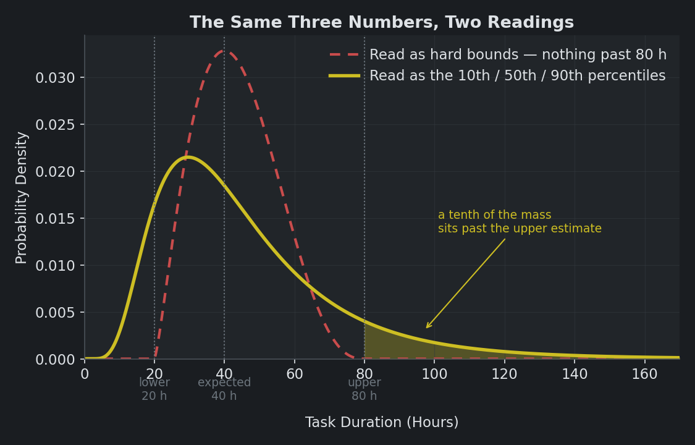
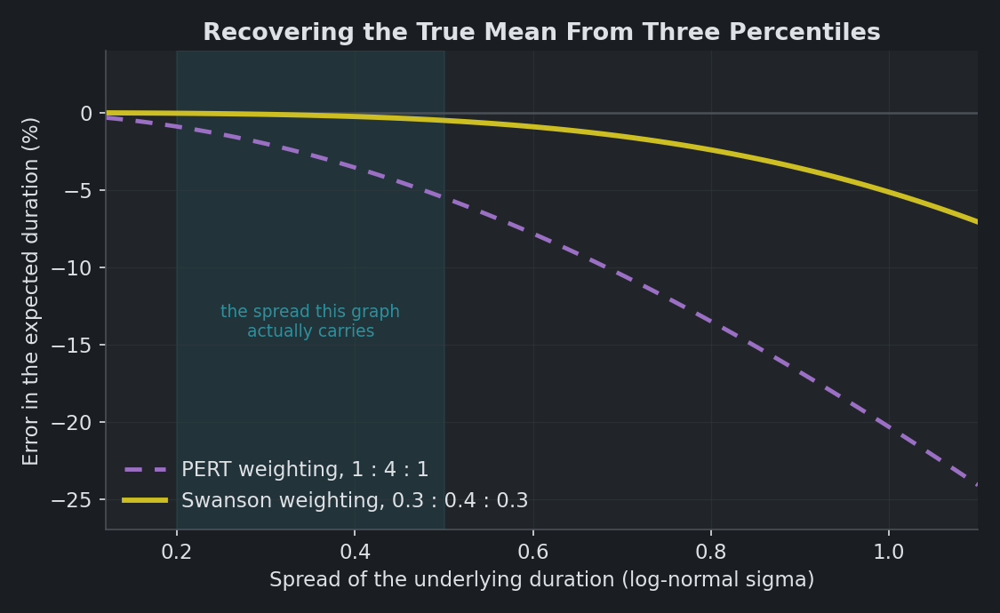
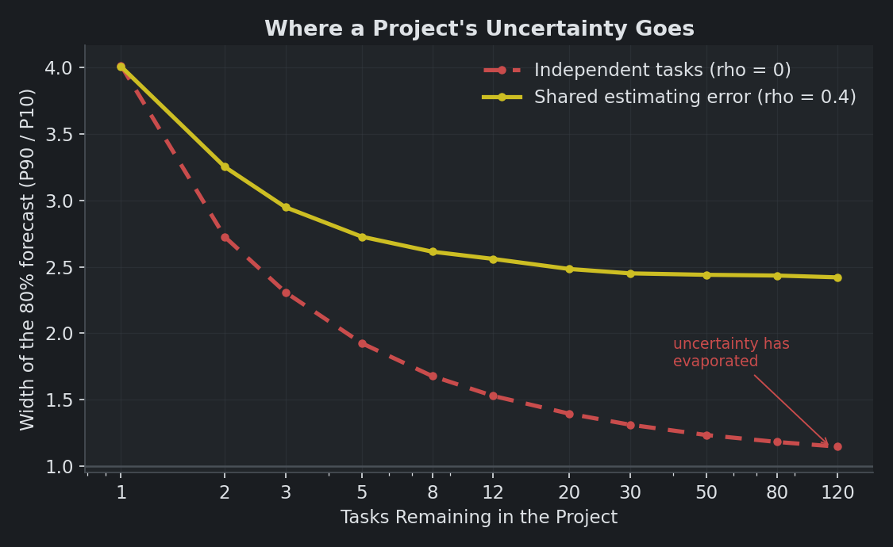

# Time

This document explains how Skill Tree turns a time estimate into a single number, $t(n)$. The estimate can be one, two, or three numbers; the app always returns one. That single number feeds node priority scoring, Goal ranking, and the project-duration simulation. It is also the "expected time" shown throughout the app.

# What the Three Numbers Mean

The node editor asks for three figures: **Lower**, **Expected**, and **Upper**. Everything downstream depends on what those words are taken to mean, so it is worth settling before any formula appears.

Skill Tree reads them as **percentiles** of the task's duration. The editor explains this alongside the inputs. Existing stored values are unchanged: when revisiting older estimates, check whether they describe these probabilities rather than absolute best and worst cases.

| Field | Reads as | In plain terms |
|---|---|---|
| Lower | 10th percentile | You would be surprised to finish faster |
| Expected | 50th percentile | A coin flip either way |
| Upper | 90th percentile | You would be surprised to take longer |

## A Bracket, Not a Boundary

The natural way to read "Upper" is as a ceiling. It is the worst case you can picture, so it feels like a limit the task cannot pass.

Skill Tree does not read it that way. Your upper estimate is the point you overrun one time in ten.

That is not pedantry. It is the difference between a model that can be wrong and one that cannot. Treat the upper estimate as a hard ceiling and you have told the math that overrunning it is impossible. No amount of care downstream can recover from that, because the possibility was removed at the input.

The reason to distrust the ceiling reading is that nobody can produce a real one. A worst case is imagined, and imagination runs out well before reality does. This is the most reliable finding in the study of estimation: people asked for a range they are almost certain about produce one that is far too narrow. Reading your upper estimate as a 90th percentile is not an insult to it. It is the correction that finding calls for.

Both curves come from the same three numbers. The bounded reading puts every possible outcome between 20 and 80 hours. The percentile reading keeps the same centre and the same 20-to-80 span, then adds what the bounded reading cannot: the tenth of the time you run past your own worst case. That shaded tail is where projects actually go wrong.

## Why the Tenth and the Ninetieth

If the bounds are percentiles rather than limits, a fair question follows. Why the 10th and the 90th, and not something more extreme?

The answer is that the reading determines how much the app can learn from your bounds. Below, each row assumes a different reading of Lower and Upper, then asks what weighting best recovers a task's true expected duration.

| If Lower and Upper meant | Best weights on $l$, $m$, $u$ | What that implies |
|---|---|---|
| 10th and 90th | 0.36, 0.30, 0.34 | All three numbers carry real weight |
| 5th and 95th | 0.20, 0.61, 0.19 | The bounds start to fade |
| 2nd and 98th | 0.10, 0.79, 0.11 | The answer is nearly your best guess alone |
| 5th and 85th | 0.33, 0.19, 0.48 | The best guess starts to fade |
| 5th and 80th | 0.38, −0.06, 0.67 | Negative weight; the rule has broken |

Two patterns run through that table.

Declaring the bounds more extreme makes them count for less. At the 2nd and 98th percentiles the upper estimate carries a weight of 0.11. The app would be discarding a number you took the trouble to supply. A bound so far out says almost nothing about where the task will land.

Pushing the ceiling inward eventually breaks the arithmetic. Reading Upper as an 80th percentile puts a negative weight on your best guess, which would mean a larger Expected produced a smaller forecast. That is nonsense, and it marks the edge of how far this correction can be taken.

The 10th and 90th sit between those failures. Your bounds keep about a third of the weight each, and nothing goes negative.

## Durations Are Multiplicative

One more property of task durations shapes what the app does with the bracket.

Standard estimation imagines that errors add up. Each surprise tacks on a fixed amount: one more bug, one more hour. If that were true, task durations would cluster symmetrically around their expected value in a Normal distribution.

Real delays do not add, they multiply. Waiting on feedback doesn't cost a flat hour; it stretches whatever work remains. A wrong assumption doesn't add a step; it doubles the remaining effort. Pile up enough of these independent multipliers and the durations spread into a **log-normal** shape: bounded by zero on the left, with a long tail running out to the right.

An additive view implies a Normal distribution: symmetric, and assigning probability to negative durations that cannot happen. The multiplicative view bounds the task at zero and lets the surprises stretch out into the long right tail.

The exact distribution is not the point. The asymmetry is. A task can run many times over, but it can never take less than no time at all. This is the shape the simulator samples from, and it is why the tail past your upper estimate is longer than the room below your lower one.

# Turning the Bracket Into One Number

## Expected, Not Typical

There are two honest summaries of a duration, and they are not the same number.

The **median** is the typical case. Half the time you beat it. The **mean** is the long-run average, which sits higher because the long right tail pulls it up.

Skill Tree computes the mean. The reason is not that the mean is a better description of one task. For a single task the median is arguably the more useful thing to know. The reason is that these numbers get added together.

Scoring sums $t(n)$ across a Goal's entire prerequisite subtree to price the Goal. The simulator sums across a dependency chain. Only means survive that operation:

$$ E\left[\sum_n T_n\right] = \sum_n E[T_n] $$

That identity holds whatever the tasks do, however they are related to one another. Medians have no such property. Add up a hundred medians and you get a number that is not the median of the total, and not the mean of it either. It is not any property of the project at all.

So a median would be defensible for one task and wrong for a hundred. The app reports the mean, and the arithmetic stays honest at every scale.

There is a fair objection here. An honest upper estimate raises the mean, which raises the task's cost, which pushes it down the ranking. Does that punish candour?

It would, if the score used those hours raw. It does not. The cost term in [scoring.md](scoring.md) puts time through a sublinear exponent, so a task that takes twice as long feels about one and a half times as expensive rather than twice. The protection against a heavy tail already exists, in the place designed for it. Building a second copy into the duration estimate would only distort the forecast to solve a problem that is already solved.

## Swanson's Rule

Given three percentiles, the expected duration is a weighted average of them:

$$ t(n) = 0.3\,l + 0.4\,m + 0.3\,u $$

This is **Swanson's rule**, an approximation to the mean for moderately skewed distributions. The weights are useful under these assumptions, not uniquely determined by three percentiles. See [Hurst, Brown and Swanson (2000)](https://doi.org/10.1306/8626C70D-173B-11D7-8645000102C1865D).

The rule has a quiet virtue beyond accuracy. It never extrapolates. It weighs the three points you gave and stops. A model that instead fits a curve through your numbers has to invent the tail beyond them, and that invented tail can swing wildly on a small change to one input. Skill Tree's estimates come from a rubric, so they arrive in coarse steps. A rule that amplifies a one-notch change is the wrong tool for coarse input.

The figure holds the three percentiles fixed and varies how spread out the underlying task really is. The Swanson weighting tracks the truth to within a percent across the range this graph occupies. The PERT weighting drifts low, and the drift grows as the task gets less certain.

## Why Not Classic PERT

PERT stands for Program Evaluation and Review Technique. The US Navy developed it in the late 1950s to manage massive defense programs. Exact durations were impossible to pin down, but any single task could be bracketed. From three numbers, classic PERT produces one estimate:

$$ t_e = \frac{l + 4m + u}{6} $$

The same shape as Swanson's rule, with different weights. The middle value counts four times as much as either endpoint.

The gap between the two is not a disagreement about arithmetic. It is a disagreement about what the three numbers are.

Classic PERT assumes $l$ and $u$ are the absolute limits of a Beta distribution, and that $m$ is its **mode** rather than its median. Under those assumptions the 1:4:1 weighting is close to correct, and Swanson's rule is the one that misreads the input. Neither rule is universally better. Each is right about a different question.

Skill Tree does not use PERT's assumptions, for the reason given in [A Bracket, Not a Boundary](#a-bracket-not-a-boundary). Absolute limits are not something a person can supply. Once the bounds are read as percentiles instead, the 1:4:1 weighting is simply the wrong one. It errs in a consistent direction. Too much weight lands on the middle and too little on the ends, so it reports less time than the task will take.

The table below fixes the three percentiles and varies the true shape of the task. Both rules see exactly the same three numbers.

| True distribution | Swanson | PERT 1:4:1 |
|---|---|---|
| Log-normal, $\sigma = 0.2$ | −0.0% | −0.9% |
| Log-normal, $\sigma = 0.4$ | −0.3% | −3.6% |
| Log-normal, $\sigma = 0.6$ | −0.9% | −7.8% |
| Gamma, $k = 1.5$ | −0.1% | −9.4% |
| Gamma, $k = 4$ | −0.1% | −3.7% |
| Weibull, $c = 1.2$ | +0.1% | −9.6% |
| Weibull, $c = 2.5$ | −0.1% | −1.2% |

Every entry is negative or near zero, for both rules. That is worth flagging honestly. Three percentiles cannot see mass beyond the 90th, so any rule of this kind reads a very heavy tail slightly low. Swanson's stays within a percent over the spreads this graph carries. It reaches about −5% once a task's spread doubles beyond that, and further still past it.

## Three Levels of Precision

The app accepts one, two, or three numbers and produces a sensible $t(n)$ from each. Every number you add sharpens the estimate.

| Input | Method | $t(n)$ |
|---|---|---|
| Only $m$ | Used directly | $t = m$ |
| $l$ and $u$ | Middle filled in, then weighted | $t = 0.3l + 0.4\sqrt{l \cdot u} + 0.3u$ |
| All three | Swanson's rule | $t = 0.3l + 0.4m + 0.3u$ |

With a single number, the app takes it at face value as the mean. The simulator supplies the spread implied by a half-to-double bracket but preserves that original mean; it does not reweight the invented bracket.

With two, the app supplies the missing middle itself. For a log-normal shape, a 10th and a 90th percentile imply a median of $\sqrt{l \cdot u}$, the geometric mean. That value goes into the same rule as if you had typed it.

The geometric mean is worth a note, because it is tempting to stop there and report it. It splits the bracket evenly in ratio terms, sitting the same multiple away from each bound. That makes it a genuinely good answer to "how long will this usually take." It is the wrong answer to "how much time should I budget." The geometric mean is the median. At this graph's typical bracket it under-reads the expected duration by around a tenth.

## The Reflection Feature

After you finish a project, the reflection feature lets you record how long it actually took. The [features guide](features.md) covers how to enter it. What matters here is that the recorded time runs through the same rule as the estimate, so the before-and-after numbers stay directly comparable.

Reflections can eventually support calibration, described in [Shared Estimating Error](#shared-estimating-error). Enough grouped outcomes and original forecasts will be needed before using them to change the model.

# Habit Estimates

Some work is not a single sitting. It is a small effort repeated over weeks. For these, a lump-sum hours estimate is awkward to give. Habit mode lets you describe the cadence instead — a duration, a per-session amount, and the days you will do it — and works out the total for you. The [features guide](features.md) shows the full setup.

The point for this document is that nothing downstream changes. Habit mode is a more natural way to *arrive at* the number, not a different way of treating it. The per-session amount still takes the same lower, expected, and upper bracket. The cadence only multiplies it into a total. That total then runs through the same rule, the same score, and the same simulation as a hand-entered estimate.

# Monte Carlo Simulation

One number per node is enough to rank tasks. It is not enough to answer a question like "if I commit to this Goal today, how long until I finish?" The Monte Carlo simulator in [`simulation.py`](../simulation.py) answers it. It walks the full prerequisite chain, draws thousands of samples, and plots the result as a histogram marked with the $P_{10}$, $P_{50}$ and $P_{90}$ percentiles on the Details tab. Now you can say "I am 90% confident this lands under 200 hours," instead of trusting one fragile number.

## Sampling One Task

Each task is sampled from a log-normal, for the reason given in [Durations Are Multiplicative](#durations-are-multiplicative). Two properties fix it in place:

- Its 10th-to-90th percentile span is exactly the $u/l$ ratio you typed.
- Its **mean is exactly $t(n)$**, the number the score uses.

That second property is what keeps the app internally consistent. The histogram on the Details tab is centred on the same figure that priced the task in the ranking. The two views cannot drift apart, and no simulation is needed to compute the total: summing $t(n)$ over a chain gives its mean exactly.

There is a compromise buried in this. Three numbers over-determine a two-parameter shape. A log-normal can honour a lower bound, an upper bound, and a median only when the median happens to be the geometric mean of the bounds, and yours usually is not. Something has to give. The app keeps the width and the mean, because those are what the forecast and the score are built on, and lets the median absorb the mismatch. In practice the sampled bounds land within a few percent of the ones you typed.

## Shared Estimating Error

Sampling every task independently produces a strange result. Errors cancel. The more tasks a project holds, the more they cancel, and a long project's uncertainty shrinks toward nothing.

The effect is not subtle. Sample 116 independent tasks, each carrying a bracket three or four times as wide as it is deep, and the total comes out quoted to within a few percent. The app would be claiming to forecast a decade of work to a precision it has no business claiming.

The flaw is the independence, not the tasks. Estimating errors are not independent. If you are running long on one task this year, you are probably running long on the next one too. Optimism is a property of the estimator, not of the task.

So the simulator splits each task's uncertainty in two. One part is specific to the task. The other is shared with every other task in the chain. A single setting, **Shared estimate error**, sets the fraction that is common:

$$ \log T_n = \log(\text{median}_n) + \sigma_n\left(\sqrt{\rho}\,Z_{\text{shared}} + \sqrt{1-\rho}\,Z_n\right) $$

$Z_{\text{shared}}$ is drawn once per trial and reused by every task. $Z_n$ is drawn fresh for each one. The combination is still a standard normal at any $\rho$, which is what makes this safe: no individual task's distribution changes at all. Only the way they add up does.

With independent tasks the forecast collapses toward a point as the project grows. With a shared component it settles instead, holding a realistic band however long the chain runs. Both curves start in the same place, because a one-task project has nothing to share error with.

| Shared estimate error | 80% band on a 116-task project |
|---|---|
| 0 | 1.16× |
| 0.3 | 2.13× |
| 0.5 | 2.63× |
| 1 | 3.87× |

Both ends of that range are wrong. At 0 a decade of work is forecast to within a few percent. At 1 no task ever surprises you on its own, so a whole project is no more certain than a single task. The app ships at 0.4, and somewhere between 0.3 and 0.5 is the defensible band.

This is the one number in the duration model that theory can bound but not fix. It is measurable, and the reflection feature is how. With enough recorded outcomes, split the spread of $\log(\text{actual} / \text{estimate})$ in two: the part common to all your estimates, and the part specific to each. That ratio is exactly this setting. Until then, 0.4 is a considered default rather than a derived one.

Raising it widens the forecast without moving its centre. The expected total is unchanged at every value, so the score never shifts.

## Chain Collection

Before sampling begins, the simulator BFS-walks backward from the target node along Hard edges, collecting every prerequisite. At the *root* node only (not deeper in the chain), Soft and Helps edges may also be followed, depending on the "include soft / include helps" toggles on the Details tab. This asymmetry is deliberate: the question is "how long until I finish this node, including its broader context," not "how long until I finish this node plus the soft prereqs of every node in its subtree" — which would explode the chain.

Two exclusions follow naturally to prevent inflating the results. Completed tasks are dropped, because their time has already been paid. Time-container nodes contribute zero duration, because they act as structural conduits and their children are already in the chain and sampled on their own.

## Serial Summation

For $N$ trials, draw one duration sample per remaining node and sum across the chain:

$$ T_{\text{total}}^{(i)} = \sum_{n \in R} T_n^{(i)}, \qquad i = 1, \ldots, N $$

where $R$ is the set of incomplete, non-container nodes collected above. The model assumes one person working one task at a time, so durations add sequentially regardless of dependency structure.

## Interactive Calculation Limits

The Details panel uses the configured trial count up to 100,000 trials and a two-million node-trial work budget (counting incomplete, non-inherited nodes in the selected dependency view). Large views therefore use fewer trials. This reduces Monte Carlo precision, without changing the underlying duration model.

Sampling accumulates into one trial array in chunks instead of retaining an array for every task. Unchanged inputs reuse a small summary cache and a stable private random seed. A new selection, filter change, or departure from Details cancels superseded work; older responses cannot replace the current chart.

## What's Not Modeled

Two omissions are worth flagging, since they bound how the output should be read:

- **Calendar time.** The simulator outputs total *work* hours. Translating that into "weeks until done" depends on how many hours per week you actually put in, which you control in the Time subtab of Settings.
- **Parallel work.** The simulator assumes one person doing one thing at a time. It is not modeling a team that can run several projects at once.

Correlation between tasks used to belong on this list. It no longer does, and [Shared Estimating Error](#shared-estimating-error) is why.

# Navigation
## Tutorial
That's the end of the technical path. Both routes now converge on **Modeling**, the practical guide to building your own graph.

  <a href="../README.md">README</a> · <a href="features.md">Features</a> · <a href="scoring.md">Scoring</a> · <b>Time</b> · <a href="modeling.md">Modeling</a>

## Other Resources

| Resource | What's there |
|---|---|
| [models.py](../models.py) | The module that implements `expected_time_estimate` — the weighting rule and its one- and two-number fallbacks |
| [simulation.py](../simulation.py) | The module that implements the Monte Carlo sampler — the log-normal marginal, the shared-error draw, the chain-collection BFS, and the container exclusion logic |
