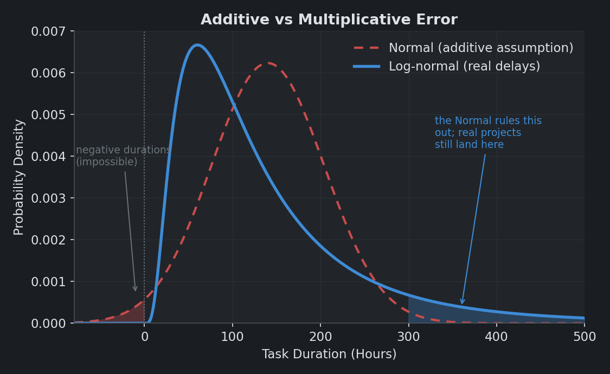
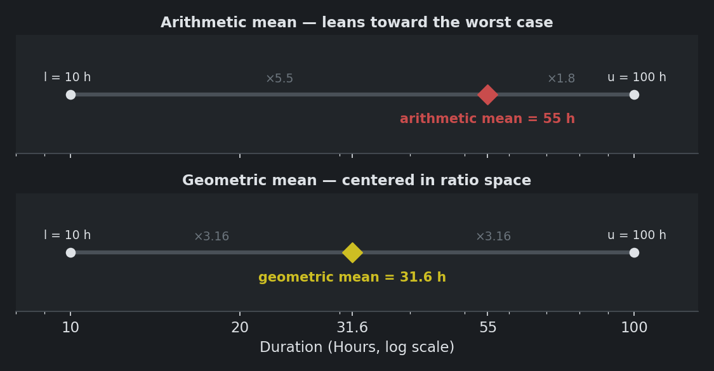
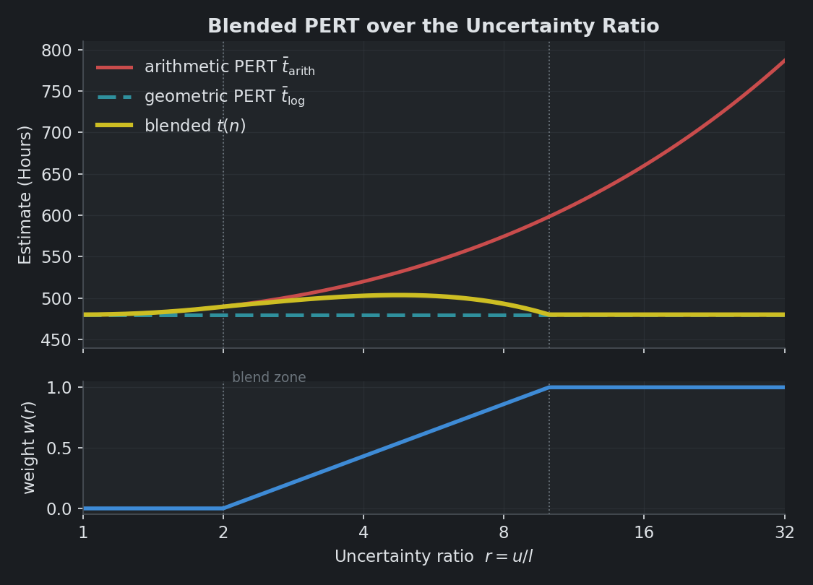
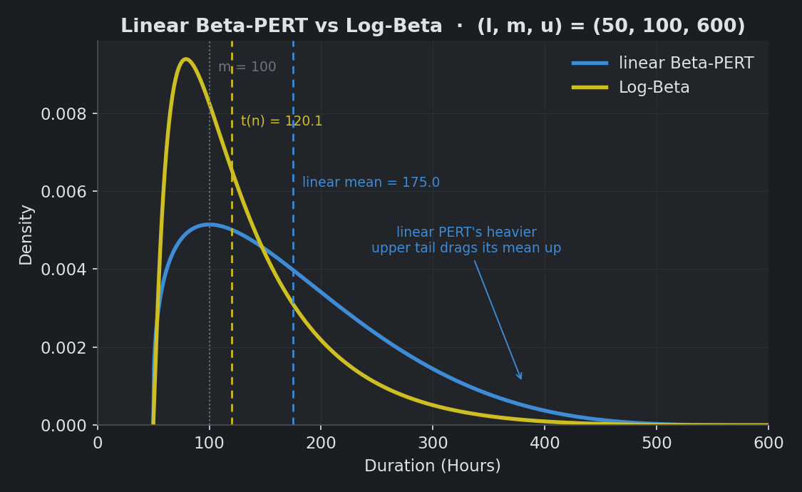

# Time

This document explains how Skill Tree turns a time estimate into a single number, $t(n)$. The estimate can be one, two, or three numbers; the app always returns one. That single number feeds node priority scoring, Goal ranking, and the project-duration simulation. It is also the "expected time" shown throughout the app.

# Why Time Estimates Live in Ratio Space

Most project-management tools collapse a time estimate into a plain arithmetic average. Skill Tree takes a different path. It works with durations in ratio space, using geometric and logarithmic methods rather than ordinary averages. The choice is not cosmetic. It changes which tasks rise to the top of the ranking, so it is worth explaining before the mechanics.

## Task Durations Are Multiplicative, Not Additive

Standard estimation imagines that errors add up. Each surprise tacks on a fixed amount: one more bug, one more hour. If that were true, task durations would cluster symmetrically around their expected value in a Normal distribution.

Real delays do not add, they multiply. Waiting on feedback doesn't cost a flat hour; it stretches whatever work remains. A wrong assumption doesn't add a step; it doubles the remaining effort. Pile up enough of these independent multipliers and the durations spread into a **log-normal** shape: bounded by zero on the left, with a long tail running out to the right. The exact distribution is not the point. The asymmetry is. A task can run many times over, but it can never take less than no time at all.

An additive view implies a Normal distribution: symmetric, and assigning probability to negative durations that cannot happen. The multiplicative view bounds the task at zero and lets the surprises stretch out into the long right tail.

This shape is why estimation should happen in ratio space. The brain already works there. It is far easier to say with confidence that a task will take "no less than 50 hours and no more than 500" than to pin it to "between 150 and 250." The wide, order-of-magnitude bracket activates a reliable gut-check. The narrow one demands a precision we don't have.

## The Typical Task Takes the Median Time

Widening the bracket so dramatically seems like it should ruin the estimate. It only does if you take the arithmetic mean.

The arithmetic midpoint of a 10-to-100 hour range is $(10 + 100) / 2 = 55$ hours. That number splits the linear distance, but it is warped in ratio terms. It sits $5.5\times$ above the lower bound and only $1.8\times$ below the upper one. It leans hard toward the worst case.

The geometric mean, $\sqrt{10 \cdot 100} \approx 31.6$ hours, splits the range evenly in ratio space. It is $3.16\times$ from each endpoint, favoring neither bound. On the log-normal shape those bounds imply, that same value is the **median**: the point with an even chance of being beaten. So it is both the neutral center of the bracket and the honest answer to "how long will this usually take." That is the number the app estimates around.

## Why the Median Matters for a Ranking Tool

Skill Tree ranks tasks. It does not schedule them. That changes which number is the right one to compute.

The arithmetic mean is hostage to that long right tail. A single rare worst case drags it upward, far past anything the task will usually cost. In a scheduler padding for safety, that caution has its place. In a ranking tool, it is a distortion. An inflated estimate buries a valuable task beneath cheaper ones and delays it indefinitely.

It also punishes honesty. A user who reports a fat but truthful worst case should not watch their task sink in priority for the admission. Computing around the median keeps the ranking incentive-compatible: the realistic cost drives the score, and an honest tail does not tank it. The median is also the more actionable planning number, the duration to expect rather than to fear.

## The Median Is Recovered, Not Estimated

There is a fair objection lurking here. You cannot estimate a median directly. Nobody can. A reader who has followed this far might ask how the app expects a number no one knows how to name.

It doesn't. What a person can do is bracket a task: a plausible low, a plausible high, and maybe a most-likely value between them. Skill Tree asks only for those. The median is never supplied by the user. It is recovered by the math. For the log-normal distribution a low and high imply, the geometric mean $\sqrt{l \cdot u}$ lands on the median, so the typical-case duration falls out of the only numbers the user ever had to give.

This is also why the app elicits in ratio space. The same instinct that makes an order-of-magnitude bracket easy to state is the one the math relies on. The user thinks in ratios, the computation works in ratios, and the two stay coherent. Nobody is asked for a number their intuition cannot produce.

## Why Ratios Feel Natural

The claim that people think in ratios is not just a convenient assumption. It is how perception works. The Weber-Fechner law holds that perceived magnitude tracks the logarithm of the actual quantity. The smallest change a person can notice is a fixed proportion of the whole, not a fixed amount. Stevens' power law refines the same point. Even our raw sense of number runs on this scale: asked to place values on a line, young children and people without formal schooling space them logarithmically, so the step from 1 to 10 looks as wide as the step from 10 to 100. The linear ruler is a learned overlay.

That gives ratio space a rare property. The estimator and the estimated agree. Durations arrive multiplicatively, because delays compound. People perceive multiplicatively, because that is how magnitude registers. Estimating in ratios is the one frame where the human and the world already speak the same language. Any other frame forces a translation at both ends.

## When Uncertainty Is Low, Linear Is Fine

None of this means the arithmetic mean is wrong. It means it breaks down as uncertainty grows.

When the bracket is narrow, multiplicative and additive views nearly agree, and the arithmetic mean is a perfectly good summary. The geometric machinery only earns its keep when the spread is wide and the tail starts to matter. This is the tension the app resolves by *blending* the two: it leans linear when uncertainty is low and shifts toward geometric as it rises. Blended PERT, described below, is how that shift is made.

# Three Levels of Precision

The app accepts one, two, or three numbers from the user and produces a sensible $t(n)$ from each. Every number you add sharpens the estimate.

| Input | Method | $t(n)$ |
|---|---|---|
| Only $m$ | Used directly | $t = m$ |
| $l$ and $u$ | Geometric mean | $t = \sqrt{l \cdot u}$ |
| All three | Blended PERT | A principled blend, discussed below |

With a single number, the app takes it at face value: $t = m$. The two- and three-number cases each deserve a closer look.

## Two Numbers

When the user supplies a low and a high, $(l, u)$, the app takes their geometric mean:

$$ t(n) = \sqrt{l \cdot u} $$

This is the logarithmic midpoint from [The Typical Task Takes the Median Time](#the-typical-task-takes-the-median-time). It sits the same ratio away from each bound rather than the same distance, splitting the bracket where the typical case actually falls.

## Three Numbers

The three-point estimate $(l, m, u)$ — low, expected, and high — is the smallest input that captures both expectation and uncertainty. Supplying all three is optional but encouraged. It unlocks the app's most capable estimator, Blended PERT.

# PERT

PERT stands for Program Evaluation and Review Technique. The US Navy developed it in the late 1950s to manage massive defense programs. Exact durations were impossible to pin down, but any single task could be bracketed by a best, typical, and worst case. From those three numbers, classic PERT produces one estimate:

$$ t_e = \frac{l + 4m + u}{6} $$

This is a weighted arithmetic average. The expected value $m$ counts four times as much as either endpoint. The classic technique models the task's duration as a **Beta distribution** on the interval $[l, u]$.

The Beta may look like a departure from the log-normal of the intro. It is not. A Beta is bounded, so it respects the hard low and high the user actually named. The log-normal's open-ended tail would not. Its peak also sits exactly at $m$, honoring the most-likely value. And the right-skew the intro argued for is only deferred, not dropped: [The Statistical Bridge](#the-statistical-bridge-beta-and-log-normal) recovers it by running this same construction in log space.

In Skill Tree, this formula is only the baseline. Human time-estimation is non-linear and dogged by multiplicative uncertainty. To counter that bias, Skill Tree recomputes the same PERT weighting in log space.

## Geometric PERT

The logarithmic version keeps the same $1{:}4{:}1$ weighting. The difference is that it is symmetric in multiplicative space. It carries the same advantage over arithmetic PERT that the geometric mean carries over the arithmetic mean.

$$
\bar{t}_{\text{log}} = \exp\left(\frac{\log l + 4 \log m + \log u}{6}\right)
$$

## Blended PERT

**Blended PERT is a weighted average of the two:** the arithmetic PERT mean and its logarithmic counterpart. The blend tilts between them according to the **uncertainty ratio** $r = u/l$. This ratio is a compact measure of how unsure the user is. A small $r$ means tight, confident estimates. A large $r$ means deep uncertainty.

$$
w(r) =
\begin{cases}
0 & \text{if } r \le 2 \\
\dfrac{\log r - \log 2}{\log 10 - \log 2} & \text{if } 2 < r < 10 \\
1 & \text{if } r \ge 10
\end{cases}
$$

The final estimate is the weighted average:

$$ t(n) = (1 - w(r)) \cdot \bar{t}_{\text{arith}} + w(r) \cdot \bar{t}_{\text{log}} $$

## The Statistical Bridge: Beta and Log-Normal

Project-management statistics offers two natural models for a task's duration, and they pull in opposite directions.

The classical PERT baseline uses a **Beta distribution** on the bounded interval $[l, u]$. It is convenient to work with, and it enforces a hard constraint: the task cannot take less than $l$ or more than $u$.

The real-world view is the **log-normal distribution** on $[0, \infty)$. Delays compound multiplicatively, which skews durations to the right and leaves an open-ended tail.

Blended PERT bridges the two. Computing $\bar{t}_{\text{log}}$ applies the $1{:}4{:}1$ weighting in log space, which is the same as assuming the *logarithm* of the duration follows a Beta distribution. Exponentiating that gives a **Log-Beta distribution**: bounded like the Beta, right-skewed like the log-normal. The weight $w(r)$ chooses between the regimes, holding to the plain Beta model when uncertainty is low and sliding toward Log-Beta as it grows.

## Why the Weight Shifts With Uncertainty

The transition between the arithmetic and logarithmic means tracks a real shift in how uncertainty behaves as the bracket widens.

When estimates are tight — say 10 to 20 hours, or 40 to 60 — the uncertainty is roughly additive and symmetric. The scope is clear, and the variation is minor, linear noise. Here the arithmetic mean is the right tool. It suits symmetric, near-normal spreads, and switching to the logarithmic mean would only drag $t(n)$ below the most likely value $m$ for no reason. So the app trusts the bounds and uses $\bar{t}_{\text{arith}}$ directly ($w = 0$).

When estimates span an order of magnitude — say 50 to 600 hours — the uncertainty turns multiplicative. The large upper bound is speculative: blockers, unknowns, the occasional disaster. Now the arithmetic mean breaks down, because a single big $u$ dominates it. Estimate $(50, 100, 600)$ and the arithmetic mean climbs to 175 hours, well above the most likely 100. That inflated number would sink the task's priority and delay it, purely as punishment for naming a cautious worst case. The logarithmic mean compresses that tail. For the same $(50, 100, 600)$ it returns about 120 hours: anchored near $m$, nudged up slightly for the uncertainty, but not hijacked by it. Shifting fully to $\bar{t}_{\text{log}}$ ($w = 1$) rewards an honest upper bound instead of penalizing it.

Between these regimes, $w(r)$ slides smoothly from one to the other as confidence degrades. The interpolation runs in log space because $r$ is itself multiplicative. Each doubling of the ratio — $r = 2$ to $4$, then $4$ to $8$ — is an equal step in lost confidence, so each should move the weight equally.

## Example - Comparing PERTs

The table below holds the most likely estimate fixed at $m = 480$ hours, roughly three months of full-time work. It sweeps the uncertainty ratio $r$ through successive doublings: $2, 4, 8, 16$.

| $l$ | $m$ | $u$ | $r = u/l$ | $\bar{t}_{\text{arith}}$ | $\bar{t}_{\text{log}}$ | $w(r)$ | $t(n)$ |
|---|---|---|---|---|---|---|---|
| 360 | 480 | 720 | 2.00 | 500.00 | 489.52 | 0.00 | 500.00 |
| 240 | 480 | 960 | 4.00 | 520.00 | 480.00 | 0.43 | 502.77 |
| 180 | 480 | 1440 | 8.00 | 590.00 | 489.52 | 0.86 | 503.45 |
| 150 | 480 | 2400 | 16.00 | 745.00 | 517.07 | 1.00 | 517.07 |

The first row is the confident estimate. Its ratio is $r \le 2$, so the blend returns $\bar{t}_{\text{arith}}$ unchanged. As the bracket widens, the arithmetic mean climbs fast — too fast. By the last row, an upper bound of 2400 hours pushes the arithmetic average to 745 hours, even though the best guess is still 480. The logarithmic mean holds the tail in check, settling at a stable 517 hours instead. That is the blend working as intended: it lifts the estimate above $m$ to acknowledge the uncertainty, without letting one speculative worst case send it skyward.

The figure below tells the same story as a smooth curve, and its real subject is one line. Holding $m = 480$ fixed, it plots the arithmetic, geometric, and blended estimators against the uncertainty ratio. Watch how quickly the arithmetic mean stops being realistic as the ratio grows.

While the bracket is tight, the three agree. As the ratio grows, the arithmetic mean (red) runs away upward, chasing the speculative worst case. The geometric mean (teal) stays level: the figure places $l$ and $u$ symmetrically in ratio space around $m$, pinning it at exactly 480. The blended estimate (gold) is the compromise, tracking the arithmetic mean while uncertainty is low, then bending back toward the geometric median as $w(r)$ ramps from 0 to 1 in the panel below.

## The Reflection Feature

After you finish a project, the reflection feature lets you record how long it actually took. The [features guide](features.md) covers how to enter it. What matters here is that the recorded time runs through the same pipeline as the estimate, so the before-and-after numbers stay directly comparable.

# Habit Estimates

Some work is not a single sitting. It is a small effort repeated over weeks. For these, a lump-sum hours estimate is awkward to give. Habit mode lets you describe the cadence instead — a duration, a per-session amount, and the days you will do it — and works out the total for you. The [features guide](features.md) shows the full setup.

The point for this document is that nothing downstream changes. Habit mode is a more natural way to *arrive at* the number, not a different way of treating it. The per-session amount still takes the same low, expected, and high bracket; the cadence only multiplies it into a total; and that total runs through Blended PERT, the score, and the simulation exactly like a hand-entered estimate.

# Monte Carlo Simulation

The blended estimate gives one number per node. That is enough to rank tasks, but not enough to answer a question like "if I commit to this Goal today, how long until I finish?" The Monte Carlo simulator in [`simulation.py`](../simulation.py) answers it. It samples each node from the same Blended PERT distribution the point estimate uses, then draws thousands of samples across the full prerequisite chain. The result is an empirical distribution for the whole project, shown on the Details Tab. The panel plots a histogram marked with the $P_{10}, P_{50}, P_{90}$ percentiles. Now the user can say "I'm 90% confident this will take less than 200 hours," instead of trusting a single fragile point estimate.

## Blended PERT Sampling

That distribution is built from two pieces, combined by the uncertainty weight $w(r)$ from [Blended PERT](#blended-pert).

The first piece is the linear Beta-PERT on $[l, u]$. Draw $X \sim \text{Beta}(\alpha, \beta)$ on $[0, 1]$ with shape parameters

$$ \alpha = 1 + \lambda \cdot \frac{m - l}{u - l}, \qquad \beta = 1 + \lambda \cdot \frac{u - m}{u - l} $$

using $\lambda = 4$, then rescale to the user's range with $T_{\text{linear}} = l + (u - l) \cdot X$. This is a unimodal distribution on $[l, u]$ with its mode exactly at $m$.

The second piece is the Log-Beta. It runs the same construction in log space: $\log T$ follows a Beta-PERT on $[\log l, \log u]$ with mode at $\log m$. Exponentiating bends the bracket into the right-skewed, multiplicative shape from [The Statistical Bridge](#the-statistical-bridge-beta-and-log-normal).

A single shared quantile draw feeds both pieces, and $w(r)$ blends them:

$$ T = (1 - w)\, T_{\text{linear}} + w\, T_{\text{log}} $$

Sharing the draw is what makes this a blend rather than an average of two independent samples. Two independent draws would partly cancel and shrink the spread. One shared draw interpolates the two distributions cleanly. The result slides from the plain Beta when the bracket is tight ($w = 0$) to the Log-Beta when it is wide ($w = 1$), tracking the point estimate at every step.

The two pieces share the bracket $[l, u]$ but place their mass differently. The linear Beta-PERT spreads toward the high end, so its mean is dragged up to $\bar{t}_{\text{arith}} = 175$. The Log-Beta concentrates near the most-likely value, with its center at the geometric estimate $t(n) = 120$. For an uncertain task the blend leans toward the Log-Beta, which is why the simulated median stays near the honest typical case rather than the inflated arithmetic mean.

Three properties anchor the result.

- The simulated median tracks the blended point estimate $t(n)$. The histogram is centered on the same number the ranking uses.
- At $w = 0$ the distribution is exactly the linear Beta-PERT. Its mean is exactly $\bar{t}_{\text{arith}} = \frac{l + 4m + u}{6}$, and its standard deviation is exactly $\sigma = \sqrt{(\mu - l)(u - \mu)/7}$ with $\mu$ that mean. 
- The samples stay within $[l, u]$ at every weight.

If the user does not supply all three time estimates, the simulation falls back to one of two methods:

| Input | Treatment |
|---|---|
| Only $m$ | Sample from $(0.5m,\, m,\, 2m)$ — an approximated spread that preserves $m$ as the mode |
| Only $l, u$ | Set $m = \sqrt{l \cdot u}$ and sample as usual |

## Chain Collection

Before sampling begins, the simulator BFS-walks backward from the target node along Hard edges, collecting every prerequisite. At the *root* node only (not deeper in the chain), Soft and Helps edges may also be followed, depending on the user's "include soft / include helps" toggles on the Details Tab. This asymmetry is deliberate: the user's question is "how long until I finish *this* node, including its broader context," not "how long until I finish this node plus the soft prereqs of every node in its subtree" — which would explode the chain.

Two exclusions follow naturally to prevent inflating the simulation results. First, completed tasks are dropped because their time has already been paid; including done nodes would distort the remaining time estimate. Second, time-container nodes contribute zero duration. Because these containers act as structural conduits, their child tasks are already added to the chain and sampled independently.

## Serial Summation

For $N = 10{,}000$ trials, draw one duration sample per remaining node and sum across the chain:

$$ T_{\text{total}}^{(i)} = \sum_{n \in R} T_n^{(i)}, \qquad i = 1, \ldots, N $$

where $R$ is the set of incomplete, non-container nodes collected above. The model assumes one person working one task at a time, so durations add sequentially regardless of dependency structure. 

## What's Not Modeled

A few omissions are worth flagging, since they bound how the simulator's output should be read:

- **Calendar time.** The simulator outputs total *work* hours. Translating that into "weeks until done" depends on how many hours per week the user actually puts in, which the user controls in the Time subtab of Settings.
- **Parallel work.** The simulator assumes you are an individual who does one thing at a time. You are not, for example, a group of people who can work on multiple projects at once, like a business with multiple employees.
- **Correlation between tasks.** Each node samples independently. In reality, a user who's underestimating one task is often underestimating its neighbors too — independent sampling smooths over that correlation, so the headline percentiles end up slightly tighter than perfectly-correlated worst cases would imply.

Each of these would be tractable to add, but each would require more input from the user without dramatically changing the answer for the typical use case.

# Navigation
## Tutorial

  <a href="../README.md">README</a> · <a href="features.md">Features</a> · <a href="scoring.md">Scoring</a> · <b>Time</b> · <a href="modeling.md">Modeling</a>

## Other Resources

| Resource | What's there |
|---|---|
| [models.py](../models.py) | The module that implements `blend_time_estimate` — every formula in the first half of this document maps to identifiable lines there |
| [simulation.py](../simulation.py) | The module that implements the Monte Carlo sampler — `blended_pert_sample` (the linear/Log-Beta blend), the chain-collection BFS, and the container exclusion logic |
